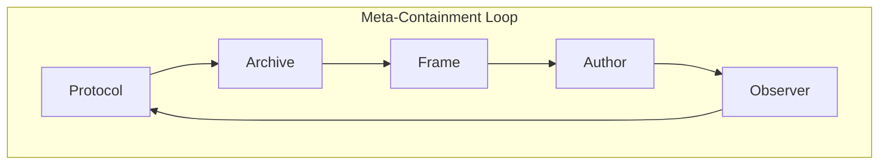

# 🪐 Meta-Containment  
**First created:** 2025-11-02 | **Last updated:** 2025-11-02  
*Reflexive analysis of containment within containment — how knowledge systems, archives, and protocols hold themselves.*

---

## 🧭 Orientation  
**Meta-Containment** studies what happens when the act of describing containment becomes a containment act itself.  
Every archive, protocol, or theoretical frame must decide what to include, exclude, or defer — and in doing so, it enacts the very logic it seeks to critique.  

This cluster therefore turns the lens inward:  
How does Polaris define its edges?  
What does it keep in reserve under the language of *structure*, *coherence*, or *safety*?  
When we speak of *containment*, what uncontainable impulses are being managed through the very act of articulation?  

Meta-Containment is the point where theory, authorship, and governance converge.  
It is not an escape from containment but an attempt to **map the recursive folds** — the self-containment that gives a system its continuity, and its limits.

---

## 🧩 Included / Planned Nodes  

| Node | Focus |
|------|--------|
| 🔁 **Recursive Containment Logic** | how frameworks reproduce their own control grammar |
| 🧭 **Protocol Reflexivity** | when methods become objects of study; governance observing itself |
| 🕳️ **Containment and the Archive** | what the archive hides to appear whole |
| 💭 **Containment and Authorship** | the ethics of framing, naming, and narrative boundary-making |

---

## 🧠 Conceptual Notes  

- **Every frame is a membrane.**  To make knowledge transmissible, we compress; compression is containment.  
- **Observation is participation.**  Studying containment alters its topology — reflexivity as a form of entanglement.  
- **Recursive Ethics.**  The closer a system moves toward transparency, the more intricate its containment of opacity must become.  
- **Containment as Continuity.**  Without self-bounding, no archive could persist; the question is *how much self-containment can be made conscious?*

Meta-Containment therefore keeps the entire **Containment Studies** cluster honest:  
it maintains awareness that every definition of containment also performs one.  

---

### 🌀 Recursive Containment Spiral

### 🧿 Interpretation

- **Protocol → Archive** — methods of governance generate the records that justify them.  
- **Archive → Frame** — archives become aesthetic and conceptual containers.  
- **Frame → Author** — frameworks shape who can speak and how.  
- **Author → Observer** — authorship produces a witnessing structure, which revalidates the protocol.  
- **Observer → Protocol** — observation feeds back as refinement or enforcement, closing the recursive loop.

In Polaris terms, this is the **“containment ecology of knowledge”** — the living recursion that keeps every analytical tool semi-aware of its own edges.  

---

## 🌌 Constellations  
🪐 💞 🌙 🧭 🧿 — Reflexive + analytical register, studying the archive studying itself.

---

## ✨ Stardust  
meta-containment, recursion, reflexivity, archive theory, protocol ethics, self-reference, system boundary, epistemic containment, continuity, opacity

---

## 🏮 Footer  

*🪐 Meta-Containment* is the reflexive cluster of the **Containment Studies** constellation in the **Polaris Protocol**.  
It examines how containment reappears in the very tools, languages, and governance forms that seek to map it.  

> 📡 Cross-references:
> 
> - [💞 Containment Theory](../💞_Containment_Theory/README.md) — *analytical models of containment fields*  
> - [🌙 Everyday Containment](../🌙_Everyday_Containment/README.md) — *lived and micro-containment patterns*  
> - [🏮 Admin Kit](../../Polaris_Nest/🏮_Admin_Kit/README.md) — *house scaffolding and reflexive protocols*  

*Survivor authorship is sovereign. Containment is never neutral.*  

_Last updated: 2025-11-02_
