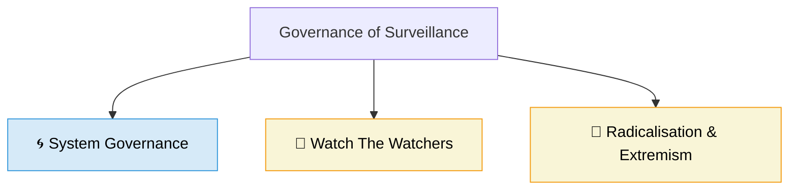

# 🧠 Big Picture Protocols  

**First created:** 2025-08-11 | **Last updated:** 2025-09-28  

*Big ideas to defeat the small ideologies.*  

---

## ✨ Overview  
**Big Picture Protocols** map structural layers of behavioural governance.  
Each cluster examines **memory control, coercive systems, radicalisation pipelines, and institutional nudging** at scale.  
These entries interlink with **Containment Scripts**, **Survivor Tools**, and **Field Logs** for full forensic mapping.  

---

## 📂 Subfolders  

### [🌀 System Governance](./🌀_System_Governance)  
Nodes analysing governance logics, control loops, and bureaucratic architectures.  

### [🌱 Human Principles](./🌱_Human_Principles)  
Frames of ethics, dignity, and lived humanity that resist containment logics.  

### [🎓 British University Compliance Service](./🎓_British_University_Compliance_Service)  
Surveillance, compliance, and disciplinary architectures unique to UK academia.  

### [🎶 Banned Broadcasts Cooperative](./🎶_Banned_Broadcasts_Cooperative)  
Media erasures, cultural removals, and the underground circulation of banned voices.  

### [🐦‍🔥 Trauma, Psychology & Medical Misuse](./🐦‍🔥_Trauma_Psycology_Medical_Misuse)  
How trauma, psychology, and medicine are co-opted for containment, commodification, and cloning.  

### [👁️‍🗨️ Witness Historical Casefiles](./👁️‍🗨️_Witness_Historical_Casefiles)  
Forensic case histories showing how witness records are reshaped, suppressed, or co-opted.  

### [📜 Statutes](./📜_Statutes)  
Mapping the laws, statutory instruments, and legal architectures enabling containment.  

### [📺 Money Talks Media](./📺_Money_Talks_Media)  
Where capital flows meet broadcasters, and donor influence shapes narratives.  

### [🕯 Exorcising Safeguarding Shadows](./🕯_Exorcising_Safeguarding_Shadows)  
Unpicking the safeguarding industry’s hidden abuses, shadows, and hauntings.  

### [🕸️ World Webs](./🕸️_World_Webs)  
Global entanglements, diasporas, and transnational flows of influence.  

### [🗝️ Politics & Memory Work](./🗝️_Politics_Memory_Work)  
Nodes linking memory, narrative suppression, and radicalisation of political identity.  

### [🛟 Borders, Boats & Walls](./🛟_Borders_Boats_Walls)  
Containment logics at the edge of nations — migration, asylum, and maritime control.  

### [🧠 HM Dept. Coercive Nudges](./🧠_HM_Dept_Coercive_Nudges)  
Breaks down the UK government’s behavioural “nudge” units and their coercive applications.  

### [🧿 Watch The Watchers](./🧿_Watch_The_Watchers)  
Survivor-led audits of oversight bodies, inspectors, and accountability frameworks.  

### [🪬 Radicalisation & Extremism](./🪬_Radicalisation_Extremism)  
Tracks pipelines, digital platforms, and diaspora dynamics in radicalisation.  

---

## 🗂️ Where Governance of Surveillance Nodes Go  

Surveillance governance sits across a few clusters in **Big Picture Protocols**.  
Where a node belongs depends on its angle of focus:

- **🌀 System Governance (primary home)**  
  Nodes analysing **who authorises surveillance, how oversight is structured, where accountability gaps exist**.  
  Examples: RIPA delegation, Investigatory Powers Act flow, Home Office escalation maps.  

- **🧿 Watch The Watchers (secondary)**  
  Nodes on the **bodies meant to audit surveillance** (IPCO, IPT, commissioners).  
  If the focus is “oversight of oversight,” file here.  

- **🪬 Radicalisation & Extremism (cross-link)**  
  If the node is specifically about **Prevent or community-level surveillance**, file in *System Governance* but cross-link here to show its pipeline role.  

---

## 🗺️ Interlink Logic  
- **System Governance** provides overarching frameworks for the other clusters.  
- **Trauma/Medical Misuse** and **Witness Casefiles** ground analysis in survivor evidence.  
- **Politics & Memory Work** connects to **Radicalisation & Extremism** through identity formation and suppression.  
- **Coercive Nudges** act as the interface between bureaucratic policy and behavioural impact.  
- **Statutes** and **Borders/Boats/Walls** track the legal and territorial scaffolding that underpins control.  
- **University Compliance, Safeguarding Shadows, and Watch the Watchers** show how oversight itself becomes a tool of containment.  
- **World Webs, Money Talks Media, and Banned Broadcasts Cooperative** situate local control in global cultural and economic circuits.  

---

*The survivors' voices haunt the living.*  

*Polaris never forgets.*  

🏮 [Return to repo root](https://github.com/josefsbreakfast/Polaris-Protocol/)  

_Last updated: 2025-09-28_  
