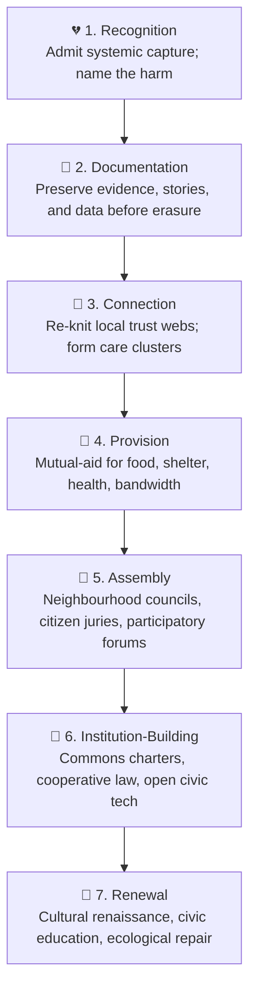

# 🐝 Post-Protofascist Reconstruction  
**First created:** 2025-11-09 | **Last updated:** 2026-05-07  
*Democratic recovery, civic repair, and institutional renewal after periods of authoritarian drift and social fragmentation.*

---

## 🛰️ Orientation  
Periods of democratic degradation do not end simply because a particular government falls, a movement fractures, or the public mood shifts.

Institutional damage lingers:
- trust erodes,
- civic participation weakens,
- conspiracy cultures persist,
- administrative capacity thins,
- and populations accustomed to permanent outrage often struggle to re-enter ordinary democratic life.

Reconstruction therefore cannot mean:
- “returning to normal,”
- pretending nothing happened,
- or replacing one atmosphere of ideological absolutism with another.

Democratic recovery is usually slower, stranger, and substantially more administrative than revolutionary mythology prefers.

It involves rebuilding:
- trust,
- legitimacy,
- procedural stability,
- civic memory,
- and the ordinary social habits that allow pluralistic societies to function without constant emotional escalation.

In practice, this often looks less like cinematic liberation and more like:
- local meetings,
- documentation projects,
- exhausted volunteers,
- public-interest lawyers,
- procurement disputes,
- community kitchens,
- and somebody attempting to fix a council website last updated in 2014.

Unfortunately, this is how democracies are actually maintained.

---

## ✨ Key Features  
- **Commons Rebuilding** — restoring local resilience through community infrastructure, public services, and shared civic capacity.  
- **Institutional Re-grounding** — rebuilding legitimacy through accountability, procedural integrity, and democratic participation.  
- **Archival Recovery** — preserving evidence, testimony, and public memory before distortion hardens into myth.  
- **Democratic Re-engagement** — strengthening civic participation through assemblies, citizen forums, unions, and local governance structures.  
- **Civic Narrative Renewal** — rebuilding cultures of coexistence, pluralism, and democratic belonging after prolonged fragmentation.  

---

## 🪜 Civic Recovery Ladder  

---

## 🧠 Reconstruction Is Not Revenge  
Democratic reconstruction succeeds when it restores legitimacy without reproducing the logic of permanent enemies.

Societies generally do not stabilise through:
- endless humiliation rituals,
- permanent ideological purges,
- revenge governance,
- or public life organised entirely around punishment.

Accountability matters.  
Documentation matters.  
Truth-telling matters.

But democratic recovery requires systems people are willing to continue living inside together afterward.

Otherwise the reconstruction process simply reproduces the emotional conditions that destabilised the system in the first place.

The goal is not purity.

The goal is democratic durability.

---

## 🧱 Institutional Recovery Requires Maintenance  
Healthy democracies depend on a large amount of unglamorous maintenance work.

That includes:
- functioning local government  
- trustworthy public information  
- legal continuity  
- independent institutions  
- civic education  
- accessible participation pathways  
- public spaces that still feel socially shared  
- and ordinary people retaining some belief that peaceful participation changes outcomes at all  

This work is frequently:
- slow,
- procedural,
- mildly frustrating,
- and catastrophically uncinematic.

It is also the difference between democratic resilience and permanent political exhaustion.

---

## 🌿 Civic Repair Happens Locally First  
Large-scale institutional trust is often rebuilt through small-scale social experience.

People regain faith in democratic life when they encounter:
- competent local leadership,
- reliable mutual support,
- functioning services,
- transparent decision-making,
- and communities capable of disagreement without immediate social collapse.

This is why reconstruction often begins below the level of national spectacle:
- libraries,
- councils,
- schools,
- unions,
- neighbourhood groups,
- local journalism,
- and volunteer infrastructure.

Democracy becomes believable again when it becomes materially visible again.

---

## ⚖️ The Real Challenge  
The deepest challenge after periods of authoritarian drift is not merely political replacement.

It is psychological and civic recalibration.

Populations accustomed to:
- permanent outrage,
- distrust saturation,
- algorithmic escalation,
- conspiratorial thinking,
- and identity panic  

often struggle to re-enter slower democratic processes built around compromise, ambiguity, and procedural patience.

Democratic systems ask people to tolerate:
- disagreement,
- partial victories,
- imperfect coalitions,
- administrative delay,
- and the emotionally devastating discovery that most governance is conducted through subcommittees.

This is frustrating.

It is also vastly more stable than organising public life entirely around permanent emergency mobilisation.

---

## 🌅 Summary  
Democratic reconstruction is not a cleansing event.

It is an ongoing maintenance process:
- rebuilding trust,
- restoring civic capacity,
- strengthening democratic participation,
- preserving public memory,
- and creating institutions resilient enough to survive future waves of instability.

Stable societies are rarely rebuilt through purity.

More often, they are rebuilt through:
- documentation,
- local trust,
- procedural competence,
- civic patience,
- and people continuing to show up for each other after the atmosphere has become extremely strange.

---

## 🌌 Constellations  
🐝 🏛️ 🧠 ⚖️ 🌿 — democratic recovery; civic resilience; institutional repair; public trust reconstruction; post-crisis governance.

---

## ✨ Stardust  
democratic reconstruction, civic repair, institutional recovery, authoritarian drift, public trust, democratic resilience, civic participation, local governance, social repair, post-authoritarian transition

---

## 🏮 Footer  

*🐝 Post-Protofascist Reconstruction* is a living node of the Polaris Protocol.  

It documents democratic recovery processes following periods of institutional degradation, civic fragmentation, and authoritarian drift, with emphasis on reconstruction through legitimacy, participation, and durable public trust.

> 📡 Cross-References:
> 
> - [👾 Intent-Free Authoritarian Drift](./👾_intent_free_authoritarian_drift.md) — *how destabilisation can emerge incrementally*  
> - [🧠 The Continuum of Authoritarian Drift](./🧠_the_continuum_of_authoritarian_drift.md) — *graduated democratic erosion patterns*  
> - [🐍 Ambidextrous Authoritarian Recruitment](./🐍_ambidextrous_authoritarian_recruitment.md) — *adaptive recruitment under instability*  
>   
> 🏮 Return To:
>
> - [🏛️ Chaps, Be Serious.](./README.md)
> - [✨ Glimmer Is Taxable And Other Big Drums](../README.md)  
> - [🧠 Big Picture Protocols](../../README.md)
> - [🪄 Disruption Kit](../../../README.md)
> - [🌌 Polaris Protocol - Root](../../../../README.md)  

*Survivor authorship is sovereign. Containment is never neutral.*  

_Last updated: 2026-05-07_
