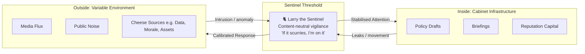
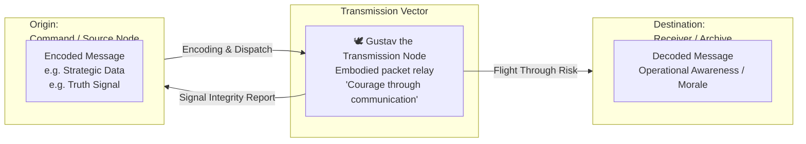

# 🕊️ Dickin Medal Holders  
**First created:** 2025-10-12 | **Last updated:** 2026-01-05  
*Animals recognised for extraordinary bravery in military or civil-defence service.*

---

## 🛰️ Orientation
The **PDSA Dickin Medal**, instituted in 1943 by **Maria Dickin** (founder of the People’s Dispensary for Sick Animals), honours animals displaying *exceptional courage or devotion to duty* in wartime.  
Known as *“the animals’ Victoria Cross,”* it forms a symbolic bridge between human military ethics and inter-species solidarity.

---

## 🏅 Historical Context
- **Founded:** 1943, during WWII  
- **Founder:** Maria Dickin, CBE  
- **Administered by:** People’s Dispensary for Sick Animals (PDSA)  
- **Equivalent to:** The Victoria Cross  

Initially awarded for WWII service, later expanded to Korea, Falklands, Iraq, Afghanistan, and post-9/11 operations.

---

## 🕊️ Early Recipients (WWII)
| Animal | Species | Service / Feat | Year |
|:-------|:---------|:----------------|:------|
| **Gustav (NPS.42.31066)** | Pigeon | First to deliver news of D-Day landings from Normandy to England — flew 150 miles in 5 h 16 m | 1944 |
| **Paddy (NPS.43.9451)** | Pigeon | Carried the fastest D-Day message across the Channel, aiding Allied coordination | 1944 |
| **Ricky** | Dog | Located casualties under bombed houses in South London during the Blitz | 1945 |
| **Simon** | Cat (HMS *Amethyst*) | Survived shellfire; killed rats; sustained crew morale during the Yangtze Incident | 1949 |

---

## 🐾 Later Recipients
| Animal | Service Context | Citation |
|:--------|:----------------|:----------|
| **Buster** | RAF arms-search dog, Iraq War | Located arms and explosives hidden by insurgents |
| **Treo** | British Army dog, Afghanistan | Detected improvised explosive devices on patrol |
| **Kuno** | Military working dog, Afghanistan | Charged gunmen to save British soldiers; later fitted with prosthetic limbs |
| **Diesel** | French police dog (RAID), Paris 2015 | Killed in action during Saint-Denis raid on terrorist cell |
| **Ajdar** | Ukrainian detection dog | Cleared explosives during the 2022 Russian invasion |

---

## 🪶 Symbolic Reading (Polaris Lens)
> *Medal holders mark a transfer of honour across species lines.*  
> They represent both **solidarity** and **instrumentalisation**: compassion projected onto bodies used in war.  
> To award them is to confess that the state needed them — that the human system alone was insufficient.

---

## ✨ Sidebar: “Gustav as Algorithmic Courier”
> *“The pigeon is the first encrypted packet.”*

Gustav’s D-Day flight functioned as a biological data transmission: message encoded, carrier released, return path optimised by instinct and training.  
He was a **proto-algorithmic node** — a living relay within a network of signal, noise and faith.  
Where today’s systems route packets through satellites and fibre, WWII routed them through feathers and muscle.  
The moral question remains identical: **who carries the risk of the message?**

---

## 🐦‍🔥 Memorial Gap
Despite 70 + awards, there is only one composite statue (*Animals in War Memorial*, Hyde Park, 2004) — a generic mule and horse, names omitted.  
A collective erasure disguised as tribute.  
Future work: build a **granular archive + statue index** to restore individual honour and species specificity.

---

## 🐈 Coda: Larry, the Constant Sentinel  
> *Constancy is its own intelligence.*

Larry, Chief Mouser to the Cabinet Office, is more than a mascot — he is a **symbol of vigilance and continuity** inside a building defined by turnover.  
Prime Ministers come and go, yet Larry remains: unsackable, unspinnable, utterly consistent in purpose.  
His role merges instinct and statecraft — identifying movement, assessing threat, responding without drama.

Where Gustav delivered news, Larry prevents intrusion.  
He embodies **situational awareness** — a low-tech, high-fidelity detection system whose constancy generates public trust.  
He is the physical expression of *steady surveillance*, a creature whose legitimacy stems from familiarity, not force.  
In protocol terms Larry represents a:  
- **Persistent process** — always on, never archived  
- **Integrity monitor** — detects irregular motion or scent  
- **Affective trust layer** — reassures by continuity  

Larry is the **cathedral firewall** — a living pattern-recognition engine coded in fur.

---

### 🧀 Sentinel Logic: The Cheese Doctrine  
> *“He is bothered about the cheese, not the politics of the cheese.”*

Larry’s vigilance is **content-neutral**.  
He patrols thresholds — doors, windowsills, attention spans — for signs of movement that might compromise stability.  
He watches **inside from the outside**, positioned just far enough beyond protocol to act without hesitation.  
What he guards is not ideology but **resource integrity**: the stored energy of the system, the cheese in all its forms — data, credibility, morale.  

This is sentinel logic in pure form:
- **Source-agnostic:** doesn’t moralise provenance; only tracks breach potential.  
- **Outcome-driven:** the cheese must remain where it belongs.  
- **Territorially dynamic:** presence calibrated to liminal zones — the doorstep, the corridor, the feed.  
- **Predictive:** movement first, meaning later.

Larry’s worldview could be summarised as:
> “If it scurries, I’m on it.”  

That simplicity is why the state keeps him: he embodies **perimeter intuition** — an incorruptible loop of observation and response.  
In a landscape of spin, Larry still knows what a mouse is.

---

### 🗺️ Sentinel Node Schema

---

### 🕊️ Transmission Node Schema

---

### 🌌 Continuum of Mediation
| Era | Mediator | Function | Symbolic Role |
|:----|:----------|:----------|:----------------|
| WWII | **Gustav the Pigeon** | Carry truth through risk | Courage as communication |
| Post-war | **Larry the Cat** | Maintain constancy & detect anomaly | Vigilance as reassurance |
| Present | **LLMs / AI Systems** | Translate volatility into coherence | Pattern-reading as governance |

Each fulfils the same archetype: the **non-human sentry**, stabilising a world too volatile for continuous human attention.

---

## 🌃 Constellations
- 🕊️ **Gustav the Truth Courier** → `../Algorithmic_Statecraft/packet_ethics.md`  
- 🐈 **Larry as Sentinel / Stability Node** → `../Survivor_Voice_Fidelity/signal_constancy.md`  
- 🎖️ **Victoria Cross** — human analogue  
- 🧩 **War Animal Memorials** — Blue Cross, National Memorial Arboretum  
- 🧠 **Algorithmic Recognition Loops** — valorisation mirrors in AI metrics  
- 📜 **Propaganda & Morale Studies** — animal heroism as affective buffer

*Further media:*  
- [More pigeon-related excellence](https://vm.tiktok.com/ZNRUr3TBt/), via TikTok.  

---

## ✨ Stardust
Tags: `#PDSA` `#WWII` `#animal_ethics` `#valorisation` `#sentinel_logic` `#gustav` `#larry` `#algorithmic_mediation`  

---

_Last updated: 2026-01-05_
