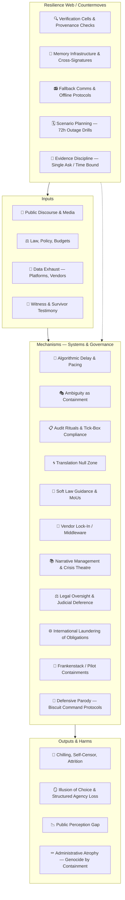

# 🌀 Systems & Governance  
**First created:** 2025-08-27 | **Last updated:** 2025-10-18  
*Where bureaucracy becomes myth, and order learns to parody itself.*  

---

## ✨ Scope  
*Systems & Governance* studies how containment architectures replicate across law, bureaucracy, infrastructure, and narrative.  
It reveals the rhythm between order and entropy — regulation, capture, parody, and resistance.  
The Systems are serious; the Governance is often theatre.  

Governance is choreography: control by rhythm, not by reason.  
Every system hums a tune of continuity — a quiet reassurance that control still holds, even when the paperwork is mostly play.  

---

## 🛰️ Orientation  
This cluster maps both the official mechanisms of control and their absurd, accidental, and satirical echoes — from real oversight frameworks to parody ministries of biscuits.  
It examines how authority is reproduced through:  
- **Law** as permissioning ritual.  
- **Infrastructure** as invisible enforcement.  
- **Narrative** as emotional governance.  
- **Experimentation** as camouflage for repetition.  

For every formal system, there is a shadow protocol: bureaucracy’s dream of efficiency, and its equal terror of error.  

---

## 📂 Core Subfolders  

| Folder | Focus |
|:--|:--|
| [💫 Containment Logic](💫_Containment_Logic/README.md) | Behavioural governance and operational feedback loops that preserve control while deferring accountability. |
| [⚖️ Legal & State Governance](⚖️_Legal_State_Governance/README.md) | Statutory, constitutional, and soft‑law architectures of control. |
| [👑 Ownership & Control](👑_Ownership_Control/README.md) | Process custody, remit collision, and bottlenecks as power. |
| [📚 Narrative Management](📚_Narrative_Management/README.md) | Governance of speech and credibility; silence and visibility as tools of power. |
| [🛰️ Infrastructure Procurement](🛰️_Infrastructure_Procurement/README.md) | Procurement and vendor ecosystems that embed governance in code and contract. |
| [🧪 Development & Experimentation](🧪_Development_Experimentation/README.md) | Experimental containments, pilot programmes, and failure recycling. |
| [🧊 Antarctic Biscuit Defence Directory](🧊_Antarctic_Biscuit_Defence_Directory/) | The parody of defence logic — biscuit as classified object. |
| [🚩 Angleland Ahoy](🚩_Angleland_Ahoy/) | Narrative satire — a playable adventure through governance absurdities. |

---

## 🦚 Core Themes  

- **Control through rhythm and routine.** Governance as choreography.  
- **Bureaucracy as myth engine.** The paperwork dreams of power.  
- **Containment as civil service art form.** Policy as maintenance ritual.  
- **Experimentation as camouflage.** Innovation concealing repetition.  
- **Oversight as theatre.** Accountability rehearsed but rarely performed.  
- **Parody as resistance.** Laughter as bureaucratic breach.  
- **Resilience as rehearsal for collapse.** Systems that learn by breaking.  

---

## 🗺️ Visual Framing — The Control Cycle  

*Alt text:* A governance diagram showing how inputs (law, media, data) pass through containment mechanisms and how parody or resilience can interrupt the cycle.  

---

## 🌌 Constellations  

🌀 ⚖️ 👑 💫 📚 🛰️ 🧪 🧊 🚩 — the full constellation of control, from statute to satire.  

**Cultural & Mythic Echoes:**  
- *Yes Minister*, *The Wire*, *The Expanse*, *The Thick of It*, *The Crown*.  
- *In the Loop*, *HyperNormalisation*, *V for Vendetta*, *Brazil*, *The Death of Stalin*.  
- *Animal Farm* — Orwell.  
- *Eichmann in Jerusalem* — Arendt.  
- *Catch‑22* — Heller.  
- *The Count of Monte Cristo* — Dumas.  
- Podcasts: *Citations Needed*, *Hood Politics*, *The Bugle*.  
- Music: Gil Scott‑Heron — *B‑Movie*; Radiohead — *Everything in Its Right Place*; Kate Bush — *Experiment IV*.  

---

## ✨ Stardust  
systems governance, containment logic, audit fatigue, vendor lock‑in, oversight rituals, algorithmic delay, procurement culture, narrative management, repression finance, experimental policy, bureaucratic satire, biscuit defence, administrative myth  

---

## 🧩 Closing Reflection  

The system does not need to believe in itself to function; it only needs us to show up for work.  
Even bureaucracy dreams — of order, of biscuits, of an end to paperwork that never comes.  
Every absurdity is a seam: a place where the human hand still shows.  

---

## 🏮 Footer  

*🌀 Systems & Governance* is a living cluster of the Polaris Protocol.  
It maps systemic containment architectures — and their parodies — showing how law, infrastructure, and absurdity co‑produce the governance of everyday life.  

> 📡 Cross‑references:
> 
> - [Disruption Kit](../../) — *countermeasures & suppression diagnostics*  
> - [Metadata Sabotage Network](../../../Metadata_Sabotage_Network/) — *analysis of narrative interference & data lawfare*  
> - [🐍 Ouroborotic Violence](../🐍_Ouroborotic_Violence/README.md) — *cycles of repression and recursion*  

*Survivor authorship is sovereign. Containment is never neutral.*  

_Last updated: 2025-10-18_
