# 🌀 Systems & Governance  
**First created:** 2025-08-27 | **Last updated:** 2025-10-13  
*How the systems we use interlace with what controls and powers them.*  

---

## ✨ Scope  

This cluster holds doctrines and diagnostics on how systems govern behaviour through infrastructure, bureaucracy, and narrative control. 
It maps the architecture of containment — from algorithmic nudges to surveillance stacks — and records how governance operates at both the visible and hidden layers.  

---

## 🧭 Quick Links  

- [🌀 Containment Logic](#-containment-logic)  
- [⚖️ Legal & State Governance](#️-legal--state-governance)  
- [🛰️ Infrastructure & Procurement](#️-infrastructure--procurement)  
- [📚 Narrative Management](#-narrative-management)  
- [🗝 Ownership & Control](#-ownership--control)  
- [🧪 Development & Experimentation](#-development--experimentation)  
- [🔮 Visual Framing](#-visual-framing)  
- [🏮 Footer](#-footer)  

---

## 🦚 Core Themes  

- **Containment Logic** → empathy as throttle, translation collapse, bureaucratic paradoxes.  
- **Infrastructure** → surveillance, intake gates, procurement contracts, and metadata choke points.  
- **Narrative Management** → curated amnesia, perception gaps, clone-friendly architectures.  
- **Ownership** → who holds the tape, who sets the frame, and how choice is structured.  

---

## 📂 Current Files  

### 🌀 Containment Logic  
- [🦯 Algorithmic Delay & Pacing](🦯_algorithmic_delay_and_pacing.md) — *Rate-limiting as soft control.*  
- [🌀 Ambiguity as Containment](🌀_ambiguity_as_containment.md) — *Fog as policy.*  
- [🧠 Didn’t Apply Brain Loop](🧠_didnt_apply_brain_loop.md) — *DARVO feedback spirals mistaken for “intelligence inputs.”*  
- [📋 Loop: Tickbox vs Cognitive Load](📋_loop_tickbox_vs_cognitive_load.md) — *Cognitive tax as gatekeeping.*  
- [🩹 Loop Triad: Tickbox, Containment Fatigue, Patch-Repair](🩹_loop_triad_tickbox_containment_fatigue_patch_repair.md) — *Maintenance myths that entrench harm.*  
- [🌀 Managed Transition vs Revolution](🌀_managed_transition_vs_revolution.md) — *Staging change to preserve power.*  
- [⚖️ Operational Dilemma: Fixit vs Chain of Command](⚖️_operational_dilemma_fixit_vs_chain_of_command.md) — *The paradox between patching problems and preserving hierarchy.*  
- [🌀 Parallel Channels](🌀_parallel_channels.md) — *Duplication as a stalling device.*  
- [🩹 Patch Repair Governance](🩹_patch_repair_governance.md) — *Endless fixes, no remedy.*  
- [📋 Tick-Box Compliance as Containment](📋_tick_box_compliance_as_containment.md) — *Audit passes, reality fails.*  
- [🛬 Translation Null Zone](🛬_translation_null_zone.md) — *Where meaning evaporates between systems, leaving exploitable gaps.*  
- [🔬 Lost Checks and Balances](🔬_lost_checks_and_balances.md) — *Hollowed guardrails.*  
- [❓ Override Question as Silence Breaker](❓_override_question_as_silence_breaker.md) — *One precise question that collapses the maze.*  

---

### ⚖️ Legal & State Governance  
- [⚖️ Authorisation and Oversight](⚖️_authorisation_and_oversight.md) — *Where permissioning meets opacity.*  
- [⚖️ Compliance as Opacity](⚖️_compliance_as_opacity.md) — *“Compliant” by design, unreadable in practice.*  
- [⚖️ Containment Contract Trace](⚖️_containment_contract_trace.md) — *Paper trails embedding control logics.*  
- [⚖️ International Laundering](⚖️_international_laundering.md) — *Obligations routed offshore.*  
- [⚖️ IPCO Audit Cycle](⚖️_ipco_audit_cycle.md) — *Oversight rhythms as ritual.*  
- [⚖️ Judicial Deference](⚖️_judicial_deference.md) — *Courts leaning away from intervention.*  
- [⚖️ Legal Frameworks & Remits](⚖️_legal_frameworks_remits.md) — *Where mandates expand or blur.*  
- [⚖️ Matriarchy as Requirement](⚖️_matriarchy_as_requirement.md) — *Care logics as structural counterweight.*  
- [⚖️ Public Inquiry Business Case](⚖️_public_inquiry_business_case.md) — *Inquiry as procurement.*  
- [⚖️ Redress Models and Limits](⚖️_redress_models_and_limits.md) — *Where remedies stop.*  
- [⚖️ Registered Professions Impact](⚖️_registered_professions_impact.md) — *Professional orders as governance choke points.*  
- [⚖️ Shadow Governance Timeline](⚖️_shadow_governance_timeline.md) — *Chronology of hidden structures.*  
- [⚖️ Small Bureaucrats’ Catch-22](⚖️_small_bureaucrats_catch22.md) — *When minor officials hold disproportionate veto power.*  
- [⚖️ Soft Law Governance](⚖️_soft_law_governance.md) — *Guidance and MoUs as de facto law.*  
- [⚖️ Transparency Floor Node](⚖️_transparency_floor_node.md) — *Minimum viable openness.*  
- [⚖️ UK Constitutional Fault Lines](⚖️_uk_constitutional_fault_lines.md) — *Stress fractures in conventions.*  
- [⚖️ Wrong People in Power](⚖️_wrong_people_in_power.md) — *Selection pathologies.*  

---

### 🛰️ Infrastructure & Procurement  
- [🛰️ AI Middleware](🛰️_ai_middleware.md) — *Invisible policy layer.*  
- [🛰️ Data Fusion Centres](🛰️_data_fusion_centres.md) — *Consolidation as power.*  
- [🛰️ Microsoft Partial Cut — Israel Surveillance](🛰️_microsoft_partial_cut_israel_surveillance.md) — *Vendor leverage and exposure.*  
- [🛰️ Post-9/11 Surveillance Industry Legacy](🛰️_post_9_11_surveillance_industry_legacy.md) — *Path dependencies.*
- [🛰️ Situational Awareness: Human vs Computational](./🛰️_situational_awareness_mega_node.md) — *Human vs machine awareness, ISR evolution, risk traps, and safety culture.*
- [🛰️ Surveillance Infrastructure](🛰️_surveillance_infrastructure.md) — *Stacks, vendors, pipelines.*  
- [🛰️ Vendor Lock-In](🛰️_vendor_lock_in.md) — *Procurement inertia as governance.*  
- [💷 Procurement Culture & Departmental Clashes](💷_procurement_culture_and_departmental_clashes.md) — *Contract culture vs turf wars.*  
- [💷 Procurement Culture — Dept Clashes (alt.)](💷_procurement_culture_dept_clashes.md) — *Duplicate/variant title; consolidate later.*  
- [💸 Repression Cost of Capital](💸_repression_cost_capital.md) — *Finance logics sustaining suppression.*  
- [📊 KPI vs OKR in Government](📊_kpi_vs_okr_in_government.md) — *Metrics as weapons.*  
- [📊 Scale of Effects Estimate](📊_scale_of_effects_estimate.md) — *Rough orders of magnitude.*  

---

### 📚 Narrative Management  
- [📚 Crisis Theatre](📚_crisis_theatre.md) — *Emergency as governance mode.*  
- [📚 Forensic Silence](📚_forensic_silence.md) — *Evidentiary gaps by design.*  
- [📚 Over-Recognition](📚_over_recognition.md) — *PR “listening” without action.*  
- [🕸️ Clone Friendly Architecture](🕸️_clone_friendly_architecture.md) — *Replication incentives.*  
- [🕸️ Web of Resilience](🕸️_web_of_resilience.md) — *Decentralised survival strategies stitched into systems.*  
- [👁️ Panopticon as Industry](👁️_panopticon_as_industry.md) — *Marketised watchfulness.*  
- [🚨 Superinjunctions & SLAPPs in Rape Cases](🚨_superinjunctions_slapps_rape_cases.md) — *Suppression architecture in sensitive cases.*  

---

### 🗝 Ownership & Control  
- [💰 Who Benefits from Cover-Up](💰_who_benefits_from_cover_up.md) — *Control of archives = control of history.*  
- [🫀 Genocide by Containment](🫀_genocide_by_containment.md) — *Administrative disposal escalating into atrocity.*  

---

### 🧪 Development & Experimentation  
- [🧠 The Dev](🧠_the_dev.md) — *Sandbox for building/breaking governance maps.*  
  - [🌀 Rune the Dev (image)](🌀_rune_the_dev.png) — *Symbolic artefact.*  
- [🧟‍♀️ The Frankenstack Problem](🧟‍♀️_the_frankenstack_problem.md) — *Janky stitched systems under load.*  
- [🧨 Crisis Actor Dynamics](🧨_crisis_actor_dynamics.md) — *Performative disruption as governance theatre.*  
- [🧪 Failure Recycling](🧪_failure_recycling.md) — *Rebranded broken models.*  
- [🧪 Pilot Containments](🧪_pilot_containments.md) — *Testing suppression at small scale.*  
- [🧪 Shadow Sandboxes](🧪_shadow_sandboxes.md) — *Experimentation without oversight.*  
- [📁 Absence of Check-In](📁_absence_of_check_in.md) — *Withheld contact as soft control.*  
- [🪞 The Illusion of Choice](🪞_the_illusion_of_choice.md) — *Options multiply, agency vanishes.*  
- [🪫 Austerity Long-Tail Data Instability](🪫_austerity_long_tail_data_instability.md) — *Cuts producing fragile systems.*  

---

### 🎮 Side Projects / Experiments  
- [🚩 Angleland Ahoy (folder)](🚩_Angleland_Ahoy) — *RPG environment for governance dynamics.*  

---

## 🔮 Visual Framing  

```mermaid
flowchart TD
  %% =========================
  %% Governance as Containment clean version
  %% =========================

  %% -------- INPUTS --------
  subgraph IN[Inputs]
    I1[Public discourse and media]
    I2[Law policy and budgets]
    I3[Data exhaust platforms devices vendors]
    I4[Witness and survivor testimony]
  end

  %% -------- MECHANISMS --------
  subgraph MECH[Governance Mechanisms Containment Logic]
    M1[Algorithmic delay and pacing]
    M2[Ambiguity as containment]
    M3[Gated intake loops]
    M4[Translation null zone]
    M5[Tick box compliance]
    M6[Lost checks and balances]
    M7[Judicial deference]
    M8[Soft law governance codes and MoUs]
    M9[Vendor lock in]
    M10[AI middleware invisible policy layer]
    M11[Data fusion centres]
    M12[Narrative management crisis theatre over recognition]
    M13[Forensic silence evidentiary gaps]
    M14[Clone friendly architecture]
    M15[International laundering of obligations]
    M16[Didnt Apply Brain DARVO uptake]
    M17[Small bureaucrats Catch 22]
  end

  %% -------- OUTPUTS --------
  subgraph OUT[Outputs and Harms]
    O1[Chilling self censor attrition]
    O2[Structured choice illusion]
    O3[Twinning identity drift]
    O4[Public perception gap]
    O5[Genocide by Containment]
  end

  %% -------- COUNTERMOVES --------
  subgraph WEB[Web of Resilience Countermoves]
    R1[Slow lanes digests not firehoses]
    R2[Verification cells provenance checks]
    R3[Memory infrastructure cross signatures]
    R4[Dirty Clean split and key based auth]
    R5[Three two one backups and restore drills]
    R6[Fallback comms BAT CHECK offline sheet]
    R7[Scenario planning 72h cloud bank outage]
    R8[Evidence discipline single ask time bound]
    R9[Mutual aid trust repair protocols]
  end

  %% =========================
  %% FLOWS
  %% =========================

  %% Inputs to mechanisms
  I1 --> M12
  I1 --> M2
  I2 --> M7
  I2 --> M8
  I2 --> M15
  I3 --> M9
  I3 --> M10
  I3 --> M11
  I4 --> M3
  I4 --> M5

  %% Mechanisms to outputs
  M1 --> O1
  M2 --> O1
  M3 --> O1
  M4 --> O2
  M5 --> O2
  M6 --> O4
  M7 --> O2
  M8 --> O2
  M9 --> O3
  M10 --> O2
  M11 --> O3
  M12 --> O4
  M13 --> O4
  M14 --> O3
  M15 --> O2
  M16 --> O4
  M17 --> O1

  %% Composition of catastrophic outcome
  O1 --> O5
  O3 --> O5
  O4 --> O5

  %% Countermoves dampening links
  R1 -.-> M12
  R2 -.-> M12
  R3 -.-> O4
  R4 -.-> O3
  R5 -.-> O4
  R6 -.-> O1
  R7 -.-> O2
  R8 -.-> M5
  R9 -.-> O1

  %% Countermoves feed back to inputs
  R1 --> IN
  R3 --> IN
  R6 --> IN
  R7 --> IN
```

---

## 🌌 Constellations  

🌀 🛰️ 📚 🗝 — This cluster tracks how governance works through bureaucracy, infrastructure, and narrative.  

Media echoes:  
- **TV:** *Yes, Minister* / *Yes, Prime Minister*; *The Wire*; *The Thick of It*; *The Expanse*; *The Crown*.  
- **Film:** *In the Loop* (2009); *The Fog of War*; *HyperNormalisation*; *Vice* (2018); *V for Vendetta*; *Watchmen* (film & HBO); **A Bug’s Life** (1998 — extraction cartel & collective action).  
- **Literature:** *Animal Farm* (Orwell); Timothy Snyder’s *On Tyranny* (2017); Hannah Arendt’s *The Origins of Totalitarianism* / *Eichmann in Jerusalem*; *The Count of Monte Cristo* (Dumas).  
- **Podcasts:** *Citations Needed*; *Hood Politics*, *BBC Analysis*; *The Bugle*.  
- **Music:** Gil Scott-Heron — *B-Movie*; Radiohead — *Everything in Its Right Place*; Tears for Fears — *Everybody Wants to Rule the World* (and many covers).  

---

## ✨ Stardust  

systems governance, containment logic, audit fatigue, vendor lock-in, oversight cycles, algorithmic delay, procurement, narrative management, repression finance, austerity instability, surveillance infrastructure  

---

## 🏮 Footer  

*Systems & Governance* is a living cluster of the Polaris Protocol.  
It maps systemic containment architectures, showing how infrastructure, narrative, and bureaucracy converge to throttle survivor agency.  

> 📡 Cross-references:
> 
> - [Disruption Kit](../../) — countermeasures, logs, and suppression diagnostics  
> - [Metadata Sabotage Network](../../../Metadata_Sabotage_Network/) — structural analysis of governance and narrative interference  

*Survivor authorship is sovereign. Containment is never neutral.*  

_Last updated: 2025-10-13_  
