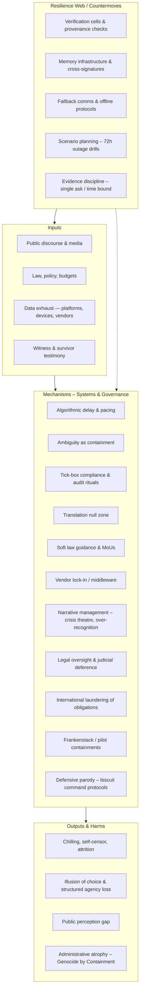

# 🌀 Systems & Governance  
**First created:** 2025-08-27  |  **Last updated:** 2025-10-14  
*How the systems we use interlace with what controls and powers them.*

---

## ✨ Scope  

**Systems & Governance** examines how containment architectures replicate through law, bureaucracy, infrastructure, and narrative.  
It maps both the official mechanisms of control and their absurd, accidental, and satirical echoes — from real oversight frameworks to parody ministries of biscuits.

---

## 🛰️ Quick Links  

- [💫 Containment Logic](💫_Containment_Logic/README.md)  
- [⚖️ Legal & State Governance](⚖️_Legal_State_Governance/README.md)  
- [👑 Ownership & Control](👑_Ownership_Control/README.md)  
- [📚 Narrative Management](📚_Narrative_Management/README.md)  
- [🛰️ Infrastructure Procurement](🛰️_Infrastructure_Procurement/README.md)  
- [🧪 Development & Experimentation](🧪_Development_Experimentation/README.md)  
- [🧊 Antarctic Biscuit Defence Directory](🧊_Antarctic_Biscuit_Defence_Directory/)  
- [🚩 Angleland Ahoy](🚩_Angleland_Ahoy/)  
- [🔮 Visual Framing](#-visual-framing)  
- [🏮 Footer](#-footer)

---

## 🦚 Core Themes  

- **Containment Logic** → empathy as throttle, translation collapse, bureaucratic paradoxes.  
- **Legal & State Governance** → permissioning, oversight, and accountability theatre.  
- **Ownership & Control** → who holds the process, who owns the decision.  
- **Narrative Management** → curated amnesia, perception gaps, clone-friendly architectures.  
- **Infrastructure Procurement** → surveillance stacks, vendor contracts, and metadata choke points.  
- **Development & Experimentation** → innovation as cover for containment; failure as resource.  
- **Antarctic Biscuit Defence Directory** → the bureaucratic parody of defence logic — biscuit as classified object.  
- **Angleland Ahoy** → a satirical adventure through policy absurdities and civic farce.  

---

## 🗺️🫡 Where are the nodes?: A Map  

| Folder | Focus |
|:--|:--|
| [💫 Containment Logic](💫_Containment_Logic/README.md) | Behavioural governance and operational feedback loops that preserve control while deferring accountability. |
| [⚖️ Legal & State Governance](⚖️_Legal_State_Governance/README.md) | Constitutional and statutory architectures of control. |
| [👑 Ownership & Control](👑_Ownership_Control/README.md) | Process custody, remit collision, and bottlenecks as power. |
| [📚 Narrative Management](📚_Narrative_Management/README.md) | Governance of speech and credibility; silence and visibility as tools of power. |
| [🛰️ Infrastructure Procurement](🛰️_Infrastructure_Procurement/README.md) | Procurement and vendor ecosystems that embed governance in code and contract. |
| [🧪 Development & Experimentation](🧪_Development_Experimentation/README.md) | Experimental containments, pilot programmes, and failure recycling. |
| [🧊 Antarctic Biscuit Defence Directory](🧊_Antarctic_Biscuit_Defence_Directory/) | Satirical bureaucratic inventory of snack-based defence procurement. |
| [🚩 Angleland Ahoy](🚩_Angleland_Ahoy/) | Narrative satire — a playable adventure through governance absurdities. |

---

## 🔮 Visual Framing  

*Alt text:* A governance diagram showing how inputs (law, media, data) pass through containment mechanisms and how parody or resilience can break the feedback loop.

---

## 🌌 Constellations  

🌀 ⚖️ 👑 💫 📚 🛰️ 🧪 🧊 🚩 — The full constellation of control, from statute to satire.  

**Media echoes:**  
- **TV:** *Yes Minister*, *The Wire*, *The Expanse*, *The Thick of It*, *The Crown*.  
- **Film:** *In the Loop*, *HyperNormalisation*, *V for Vendetta*, *Brazil*, *The Death of Stalin*.  
- **Literature:** *Animal Farm* (Orwell); *Eichmann in Jerusalem* (Arendt); *Catch-22* (Heller); *The Count of Monte Cristo* (Dumas).  
- **Podcasts:** *Citations Needed*, *Hood Politics*, *The Bugle*.  
- **Music:** Gil Scott-Heron — *B-Movie*; Radiohead — *Everything in Its Right Place*; Kate Bush — *Experiment IV*.  

---

## ✨ Stardust  

systems governance, containment logic, audit fatigue, vendor lock-in, oversight rituals, algorithmic delay, procurement culture, narrative management, repression finance, experimental policy, bureaucratic satire, biscuit defence  

---

## 🏮 Footer  

*🌀 Systems & Governance* is a living cluster of the Polaris Protocol.  
It maps systemic containment architectures — and their parodies — showing how law, infrastructure, and absurdity co-produce the governance of everyday life.  

> 📡 Cross-references
> 
> - [Disruption Kit](../../) — countermeasures & suppression diagnostics  
> - [Metadata Sabotage Network](../../../Metadata_Sabotage_Network/) — analysis of narrative interference & data lawfare  

*Survivor authorship is sovereign. Containment is never neutral.*  

_Last updated: 2025-10-14_
