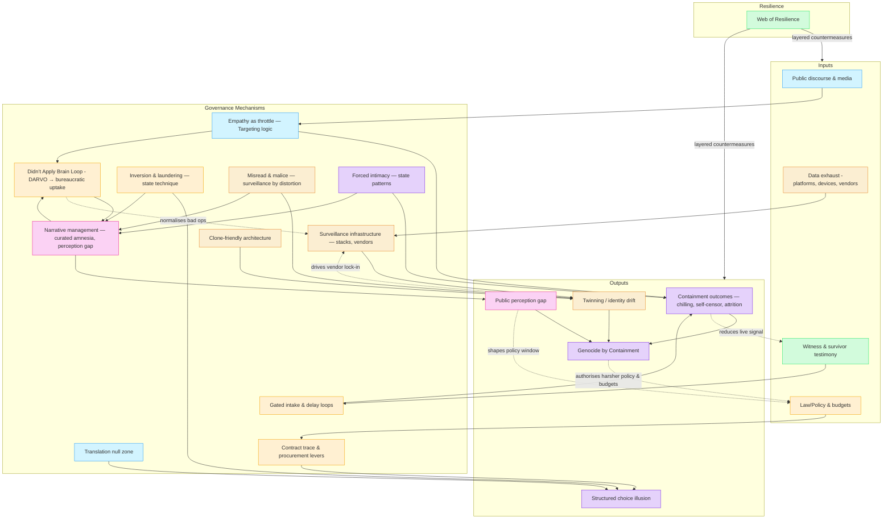

# 🌀 Systems & Governance  

**First created:** 2025-08-27 | **Last updated:** 2025-09-14  

*How the systems we use interlace with what controls and powers them.*  

---

## ✨ Scope  

This cluster holds doctrines and diagnostics on how systems govern behaviour through infrastructure, bureaucracy, and narrative control. 
It maps the architecture of containment — from algorithmic nudges to surveillance stacks — and records how governance operates at both the visible and hidden layers.  

---

## 🧭 Quick Links  

- [🌀 Containment Logic](#-containment-logic)  
- [⚖️ Legal & State Governance](#️-legal--state-governance)  
- [🛰️ Infrastructure & Procurement](#️-infrastructure--procurement)  
- [📚 Narrative Management](#-narrative-management)  
- [🗝 Ownership & Control](#-ownership--control)  
- [🧪 Development & Experimentation](#-development--experimentation)  
- [🔮 Visual Framing](#-visual-framing)  
- [🏮 Footer](#-footer)  

---

## 🦚 Core Themes  

- **Containment Logic** → empathy as throttle, translation collapse, bureaucratic paradoxes.  
- **Infrastructure** → surveillance, intake gates, procurement contracts, and metadata choke points.  
- **Narrative Management** → curated amnesia, perception gaps, clone-friendly architectures.  
- **Ownership** → who holds the tape, who sets the frame, and how choice is structured.  

---

## 📂 Current Files  

### 🌀 Containment Logic  
- [🧠 Targeting Logic Empathy Is a Threat](🧠_targeting_logic_empathy_is_a_threat.md)  
  *How empathy is reframed as weakness inside governance logic.*  
- [🧠 Didn’t Apply Brain Loop](🧠_didnt_apply_brain_loop.md)  
  *DARVO feedback spirals mistaken for “intelligence inputs.”*  
- [⚖️ Operational Dilemma: Fixit vs Chain of Command](⚖️_operational_dilemma_fixit_vs_chain_of_command.md)  
  *The paradox between patching problems and preserving hierarchy.*  
- [⚖️ Small Bureaucrats’ Catch-22](⚖️_small_bureaucrats_catch22.md)  
  *When minor officials hold disproportionate veto power.*  
- [🛂 Gated Intake Post Delay Regional Loop](🛂_gated_intake_post_delay_regional_loop.md)  
  *Delays as containment: stretching time until agency collapses.*  
- [🛬 Translation Null Zone](🛬_translation_null_zone.md)  
  *Where meaning evaporates between systems, leaving gaps exploitable.*  
- [💢 Draft Prevent & IHL](💢_draft_prevent_ihl.md)  
  *Prevent policy clashing with humanitarian law obligations.*  

---

### ⚖️ Legal & State Governance  
- [⚖️ Containment Contract Trace](⚖️_containment_contract_trace.md)  
  *Paper trails showing how contracts embed control logics.*  
- [⚖️ Data Bill & Peers’ Bill — Genocide Duties](⚖️_data_bill_peers_bill_genocide_duties.md)  
  *Legislative obligations reframed to skirt genocide responsibility.*  
- [⚖️ Inversion and Laundering as State Technique](⚖️_inversion_and_laundering_as_state_technique.md)  
  *How states flip blame and “clean” responsibility through procedure.*  
- [⚖️ Shadow Governance Timeline](⚖️_shadow_governance_timeline.md)  
  *Chronology of informal or hidden governance structures.*  
- [⚖️ SLAPPs: UK, Global, Palestine](⚖️_slapps_uk_global_palestine.md)  
  *How gag lawsuits scale from local to transnational arenas.*  
- [⚖️ UK Constitutional Fault Lines](⚖️_uk_constitutional_fault_lines.md)  
  *Stress fractures in unwritten rules and conventions.*  
- [⚖️ Wrong People in Power](⚖️_wrong_people_in_power.md)  
  *Systemic misplacement: who gets promoted, and why it matters.*  
- [🏛️ OSA Misclassification: UK–Israel MoUs & Survivor Records](🏛️_osa_misclassification_uk_israel_mous_survivor_records.md)  
  *Survivor data mishandled through opaque security agreements.*  
- [🏛️ State Patterns of Forced Intimacy](🏛️_state_patterns_of_forced_intimacy.md)  
  *Governance methods that coerce closeness and dependency.*  
- [🇬🇧 Safeguarding & Counter-Extremism Risk Convergence](🇬🇧_safeguarding_counterextremism_risk_convergence.md)  
  *Where child protection and counterterror frameworks collide.*  
- [🇬🇧 UK Voice-Cloning Risks & Legislative Response](🇬🇧_uk_voicecloning_risks_legislative_response.md)  
  *Legislators scrambling to answer AI deepfake voice threats.*  

---

### 🛰️ Infrastructure & Procurement  
- [🛰️ Surveillance Infrastructure](🛰️_surveillance_infrastructure.md)  
  *The backbone of constant watch — stacks, vendors, pipelines.*  
- [📡 Metadata Scrutiny UK](📡_metadata_scrutiny_uk.md)  
  *When metadata itself becomes the object of governance.*  
- [💷 Polaris Costing Estimate](💷_polaris_costing_estimate.md)  
  *Budgetary projection for systemic containment architectures.*  
- [💷 Survivor Costing Estimate](💷_survivor_costing_estimate.md)  
  *What suppression extracts from survivor labour and life.*  
- [💷 Potential Tort Exposure](💷_potential_tort_exposure.md)  
  *Points where survivors may litigate systemic harm.*  
- [💷 Procurement Culture & Department Clashes](💷_procurement_culture_dept_clashes.md)  
  *Contract culture meets bureaucratic turf wars.*  
- [💸 Repression Cost of Capital](💸_repression_cost_capital.md)  
  *Finance logics sustaining suppression machinery.*  

---

### 📚 Narrative Management  
- [👀 Public Perception Gap](👀_public_perception_gap.md)  
  *The gulf between appearance and lived harm.*  
- [📚 Narrative Management and Metadata Sabotage](📚_narrative_management_and_metadata_sabotage.md)  
  *How metadata twists erase or recast survivor stories.*  
- [📚 Print Culture as Precedent](📚_print_culture_as_precedent.md)  
  *Historical print regimes as templates for digital suppression.*  
- [📚 Student Default Faultline](📚_student_default_faultline.md)  
  *Education debt defaults as governance choke points.*  
- [📜 UK Data Bill 2025](📜_uk_data_bill_2025.md)  
  *New legislation extending surveillance and control.*  
- [📜 UK House of Lords 2025](📜_uk_house_of_lords_2025.md)  
  *Peer debates shaping systemic risk oversight.*  
- [🕳️ Curated Amnesia Has a Shape](🕳️_curated_amnesia_has_a_shape.md)  
  *Forgetting is designed, not accidental.*  
- [🕸️ Clone Friendly Architecture](🕸️_clone_friendly_architecture.md)  
  *Infrastructures that encourage replication of identity.*  
- [🕸️ Web of Resilience](🕸️_web_of_resilience.md)  
  *Decentralised survival strategies stitched into systems.*  
- [🧩 Surveillance by Misread and Malice](🧩_surveillance_by_misread_and_malice.md)  
  *When deliberate misreading becomes an intelligence method.*  
- [🪞 The Illusion of Choice](🪞_the_illusion_of_choice.md)  
  *Options multiply, but agency disappears.*  

---

### 🗝 Ownership & Control  
- [🗝 Who Holds the Tape](🗝_who_holds_the_tape.md)  
  *Control of archives = control of history.*  
- [🗝️ Governance, Central Data Outsourcing](🗝️_governance_central_data_outsourcing.md)  
  *Data sovereignty traded away through outsourcing deals.*  
- [🫀 Genocide by Containment](🫀_genocide_by_containment.md)  
  *Administrative disposal systems escalating into atrocity.*  

---

### 🧪 Development & Experimentation  
- [🧠 Value of the Outlier](🧠_value_of_the_outlier.md)  
  *Why deviation is feared — and yet essential.*  
- [🧠 The Dev](🧠_the_dev.md)  
  *Experimental sandbox for building and breaking governance maps.*  
  - [🌀 Rune the Dev (image)](🌀_rune_the_dev.png)  
    *Symbolic artifact attached to Dev node.*  
- [🧟‍♀️ The Frankenstack Problem](🧟‍♀️_the_frankenstack_problem.md)  
  *Janky stitched systems that collapse under pressure.*  
- [🌀 Masculinity Extraction, Governance & Containment](🌀_masculinity_extraction_governance_containment.md)  
  *How gender logics are mined and weaponised.*  
- [🌀 Reverse Colonisation Timeline & Metadata Outsourcing](🌀_reverse_colonisation_timeline_metadata_outsourcing.md)  
  *Colonial inversion played out through metadata outsourcing.*  
- [🎓 University Vector Surveillance](🎓_university_vector_surveillance.md)  
  *Academia as a live surveillance environment.*  
- [💄 Surveillance or Pervert-with-a-Badge?](💄_surveillance_or_pervert_with_a_badge.md)  
  *The thin badge line between spying and stalking.*  
- [📊 KPI vs OKR in Government](📊_kpi_vs_okr_in_government.md)  
  *Metrics as governance weapons.*  
- [📁 Absence of Check-In](📁_absence_of_check_in.md)  
  *Withholding contact as a soft-control tool.*  

---

## 🔮 Visual Framing  

---

## 🏮 Footer  

*🌀 System_Governance* is a living node of the Polaris Protocol.  
It maps systemic containment architectures, showing how infrastructure, narrative, and bureaucracy converge to throttle survivor agency.  

> 📡 Cross-references:  
> - [Disruption Kit](../../) — countermeasures, logs, and suppression diagnostics  
> - [Metadata Sabotage Network](../../../Metadata_Sabotage_Network/) — structural analysis of governance and narrative interference  

*Survivor authorship is sovereign. Containment is never neutral.*  

_Last updated: 2025-09-14_  
