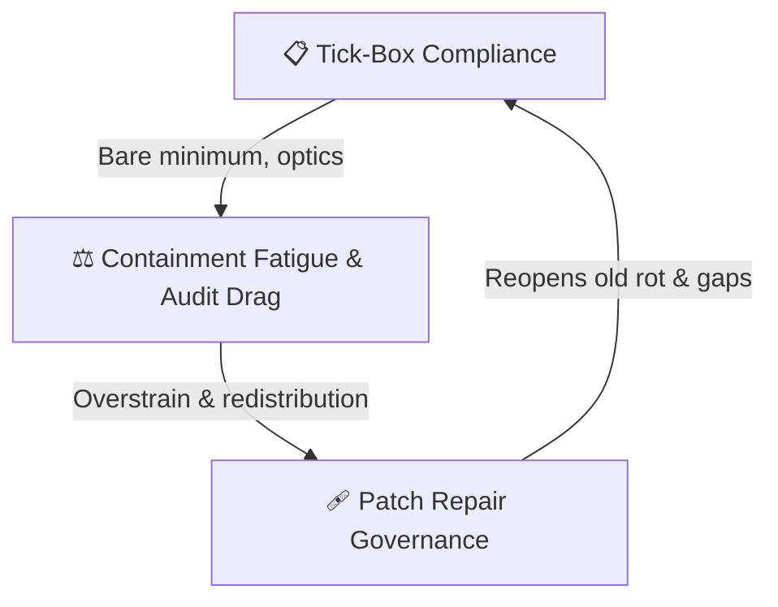

```mermaid
flowchart TD
  A[📋 Tick-Box Compliance] -->|Bare minimum, optics| B[⚖️ Containment Fatigue & Audit Drag]
  B -->|Overstrain & redistribution| C[🩹 Patch Repair Governance]
  C -->|Reopens old rot & gaps| A
```

*Cycle of containment decay: minimalism breeds strain; strain exposes rot; rot is patched with more minimalism.*
