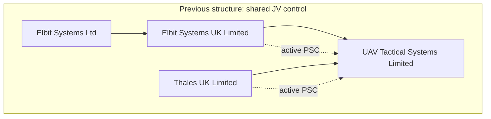
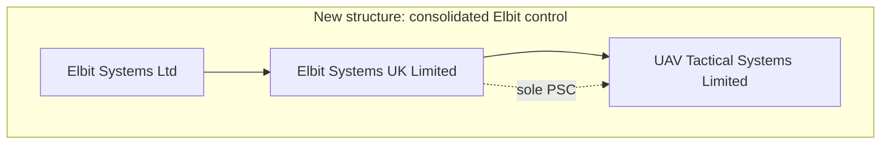
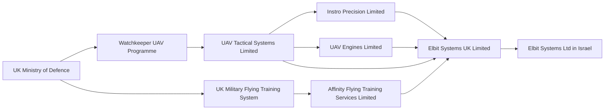
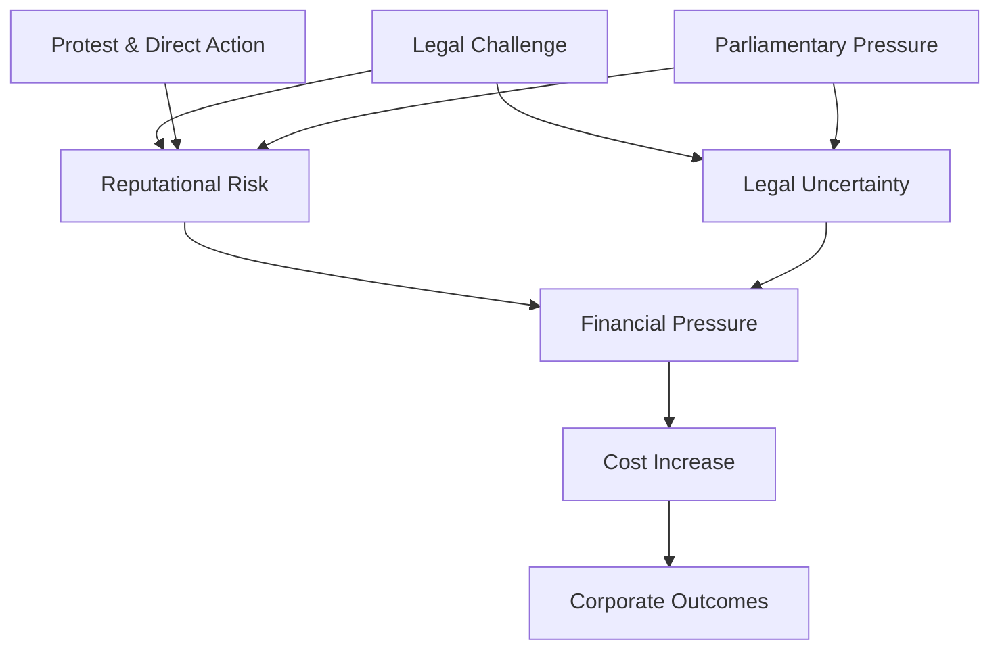

# ⚖️ Elbit Systems UK — Legal & Control Structure  
**First created:** 2025-12-20 | **Last updated:** 2026-04-23  
*Formal ownership, control vectors, programme embedding, public pressure pathways, legal context, and limits of disclosure in the UK defence environment.*

---

## 🛰️ Orientation  

This node documents the **legal structure and control mechanisms** of Elbit Systems within the United Kingdom, and situates that structure within:

- defence programme embedding  
- public pressure systems  
- legal and perception dynamics  

> The purpose is evidential clarity: what is disclosed, what is not, and where power operates in practice.

---

## 🧭 System Architecture  

This document is structured as a **seven-layer system**, moving from verifiable structure → mechanisms → operational embedding → pressure → legal framing → perception → translation.

---

## 🧱 Layer 1 — Engineering Specification (Hard Facts)

### ⚙️ Structural Specification  

#### Entity Stack  
Elbit Systems Ltd (Israel)  
↓ (≥75% ownership + control rights)  
Elbit Systems UK Limited  
↓  
Subsidiaries + Joint Ventures  

#### Control Specification  
- ≥75% shares  
- ≥75% voting rights  
- right to appoint/remove directors  

→ enables full resolution and governance control  

#### Subsidiaries  
- Instro Precision Limited  
- UAV Engines Limited  

#### Joint Ventures  

**UAV Tactical Systems Limited**  
- Current PSC: Elbit Systems UK  
- Historical PSC: Thales UK (ceased Jan 2026)  

**Affinity Flying Training Services Limited**  
- PSCs: Elbit Systems UK + KBR  

⚠️ Non-interpretive; based on public filings.  

---

## 🗺️ Control Structure Snapshots  

### 💾 Previous structure  

### 💿 Current structure  

---

## ⚙️ Layer 2 — Control Mechanisms (How Power Works)

### 🧠 Control Vectors Beyond Shareholding  

#### 1. Board Appointment Rights  
Parent control of director appointments enables strategic alignment  

#### 2. Intellectual Property  
Creates:
- upgrade dependency  
- sustainment leverage  
- exit asymmetry  

#### 3. Export Licensing  
- Israeli controls  
- UK licensing  

→ dual regulatory leverage  

#### 4. Programme Lock-In  
- workforce  
- doctrine  
- sustainment  

→ switching cost = power  

---

## 🗺️ Layer 3 — Programme Embedding (Where It Operates, UK PoV)

---

## 🔥 Layer 4 — Pressure System (How It Is Acted On)

### 🧭 Pressure Translation  

1. Visibility → issue becomes high-profile  
2. Risk reframing → reputational / operational risk  
3. Financial response → insurers / investors react  
4. Operational impact → cost + friction  
5. Structural outcome → governance shifts  

> Activism changes the environment, not ownership directly.

---

## ⚖️ Layer 5 — Legal Framing (How It Is Judged)

Key concepts:
- evidential thresholds  
- sequential process  
- jurisdictional complexity  
- “knew or should have known”  

---

## 🧠 Layer 6 — Perception Layer (How It Is Experienced)

- sympathy driven by perceived proportionality  
- enforcement optics  
- cost opacity  
- information asymmetry  

→ moral framing diverges from legal framing  

---

## 🧭 Layer 7 — Translation Layer (How It Is Understood)

### Journalists  
- clarifies attribution  
- highlights programme relevance  

### Policymakers  
- identifies dependency  
- explains pressure pathways  

### Distinction  

| Legal | Activism |
|--|--|
| attribution | pressure |
| evidence | visibility |

---

## 🏛️ Royal Exposure — Analytical Check  

- no direct named holdings identified  
- no credible York linkage  
- pooled exposure possible but unproven  

→ negative test only  

---

## 🧩 Analytical Takeaway  

Elbit’s UK position reflects:

- corporate control  
- programme embedding  
- structural dependency  
- multi-channel pressure  

→ structural power, not hidden ownership  

<!--The Kraken has other projects to busy themselves with.-->

---

## 🧭 Credibility Erosion — Communication vs Public Trust  

In high-visibility and contested policy environments, government communication strategy can produce unintended credibility effects, independent of underlying intent.

---

### 🧠 Mechanism  

A recurring pattern can be observed:

1. **High-visibility issue**
   - conflict reporting, legal challenge, protest activity  
   - incomplete but widely circulated information  

2. **Cautious or qualified government communication**
   - emphasis on process, evidence, and legal thresholds  
   - avoidance of definitive or early conclusions  

3. **Public interpretation**
   - caution is read as **evasion or concealment**  
   - absence of clarity becomes a signal in itself  

4. **Trust erosion**
   - reduced willingness to accept official framing  
   - increased inference of ulterior motives  

5. **Spillover into adjacent policy areas**
   - subsequent messaging (e.g. defence policy, foreign engagement) is received through a **lower-trust lens**  
   - scrutiny and scepticism increase beyond the original issue  

---

### 🔍 Analytical Implication  

This dynamic reflects a mismatch between:

- **state communication incentives**  
  (legal defensibility, evidential caution, diplomatic signalling)

and:

- **public evaluation criteria**  
  (clarity, perceived honesty, proportionality)

---

### ⚠️ Clarification  

- This does **not imply misconduct or improper intent**  
- It describes how **communication strategy can produce perceptions of opacity**, even where constraints are legitimate  

---

### 🧠 Bottom Line  

> Prolonged reliance on cautious or non-committal communication in high-visibility contexts can generate a perception of evasion, reducing public trust and complicating government messaging across related policy areas.

---

## 🌌 Constellations  
⚖️ 🧠 🛰️ 🧬 🏛️  

*Further reading & media:*  

- [DefenceNews: "Elbit bets on UK as its European drone sales hub"](https://www.defensenews.com/global/europe/2026/01/26/elbit-bets-on-uk-as-its-european-drone-sales-hub/)  
- [Declassified UK: "How a failed British drone project won millions for Israeli arms firm: Elbit Systems profiting from doomed drone programme which cost UK taxpayer £1.5 billion"](https://www.declassifieduk.org/how-a-failed-british-drone-project-won-millions-for-israeli-arms-firm/)  
- [Financial Times: "UK under pressure over controversial bidders for MoD training contract"](https://www.ft.com/content/b46d135b-8d83-4f69-b5ba-51ced7cb2edd)  
- [ The Guardian: "Israeli arms manufacturer closes UK facility targeted by Palestine Action: Elbit Systems UK site in Bristol was subject of protest days before direct action group was proscribed"](https://www.theguardian.com/world/2025/sep/06/israeli-arms-manufacturer-elbit-systems-closes-uk-facility-targeted-by-palestine-action)  
- [Globes: "Elbit-Thales joint venture U-TacS gets $500m order"](https://en.globes.co.il/en/article-1000023254)  
- [UK Companies House Listing: Elbit Systems UK Ltd; company number 05241591](https://find-and-update.company-information.service.gov.uk/company/05241591)  
- [US Securities and Exchange Commission: Elbit Systems 2024 Annual Report (Form 20-F)](https://www.sec.gov/ix?doc=/Archives/edgar/data/1027664/000162828025013971/eslt-20241231.htm)  

---

## ✨ Stardust  
elbit systems uk, defence structure, joint ventures, programme mapping, control systems, governance, export licensing, activism, public perception  

---

## 🏮 Footer  

*⚖️ Elbit Systems UK — Legal & Control Structure* is a living node of the Polaris Protocol.  

> 📡 Cross-references:
>
> - [📊 Risk, Capital, and Hunger Strikes](./📊_risk_capital_and_hunger_strikes.md) - *due to commercial interest overlap, the same benefactors of Elbit are often benefactors of prisons, asylum incarceration, and security where the state has so justified a contract*  
> - [📜 UK Cabinet Conflict & Opacity Map (2025)](../../🦕_Elder_Influencers/💸_Money_Listens/👻_Transparencies_Overhead/📜_uk_cabinet_conflict_and_opacity_map_2025.md) - *CoI power-mapping of UK Cabinet as comparison*  
> - [🛰️ OSINT Field Operations](../../../../🦆_Digital_Disruption/🛰️_OSINT_Field_Operations/README.md)- *how to trace the ghosts of hot money*  
> - [🍉 Why The Long Prison Stay](./🍉_why_the_long_prison_stay.md)  
> - [🔥 Hunger Strike Comparisons](./🔥_hunger_strike_comparisons.md)  
> - [👾 Working Diagnosis: Hunger Strikers Sock-Puppet Campaign](../../../../Metadata_Sabotage_Network/Suppression_Layers/📉_Suppression_Interference_Logs/👾_working_diagnosis_hunger_strikers_sock_puppet_campaign.md)  
> - [⚖️ Legal & State Governance - Return to README](./README.md)  

*Survivor authorship is sovereign. Containment is never neutral.*  

_Last updated: 2026-04-23_
