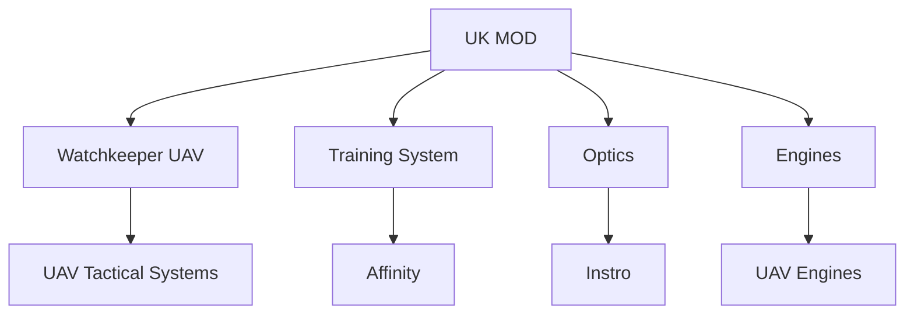
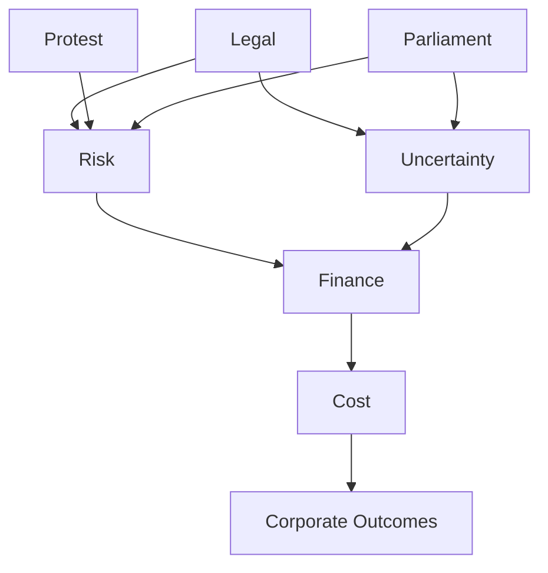

# ⚖️ Elbit Systems UK — Legal & Control Structure  
**First created:** 2025-12-20 | **Last updated:** 2026-04-23  
*Formal ownership, control vectors, programme embedding, public pressure pathways, legal context, and limits of disclosure in the UK defence environment.*

---

## 🛰️ Orientation  

This node documents the **legal structure and control mechanisms** of Elbit Systems within the United Kingdom.

It distinguishes between:

- **formal corporate ownership** (as disclosed in UK filings)  
- **practical control**, exercised through:
  - subsidiaries  
  - joint ventures  
  - intellectual property  
  - contract architecture  
  - export licensing regimes  

It further situates that structure within:

- UK defence programme embedding  
- public and civil-society pressure pathways  
- legal and perception dynamics  

> The purpose is evidential clarity: what is disclosed, what is not, and where power sits.

---

# ⚙️ Structural Specification — Engineering Layer  

This section defines the **formal control architecture**.  
It is intentionally **non-interpretive**.

## 🧱 Entity Stack  

Elbit Systems Ltd (Israel)  
↓ (≥75% ownership + control rights)  
Elbit Systems UK Limited  
↓  
Subsidiaries + Joint Ventures  

---

## 🧿 Control Specification  

Elbit Systems Ltd holds:

- ≥75% shares  
- ≥75% voting rights  
- right to appoint/remove directors  

→ Enables:
- ordinary + special resolution control  
- board control  
- strategic direction control  

---

## 🧩 Subsidiaries  

- Instro Precision Limited  
- UAV Engines Limited  

Control path:  
Elbit → UK Holdco → Subsidiary  

---

## 🧿 Joint Venture Layer  

### UAV Tactical Systems Limited  
- Current PSC: Elbit Systems UK  
- Historical PSC: Thales UK (ceased Jan 2026)  

### Affinity Flying Training Services Limited  
- PSCs: Elbit Systems UK + KBR  

---

# 🧠 Control Vectors Beyond Shareholding  

These describe **mechanisms not captured by equity alone**.

### 1. Board Control  
Director appointment rights → strategic control  

### 2. Intellectual Property  
Creates:
- upgrade dependency  
- sustainment leverage  
- exit asymmetry  

### 3. Export Licensing  
- Israeli controls  
- UK licensing  

→ dual regulatory leverage  

### 4. Programme Lock-In  
- training pipelines  
- doctrine  
- sustainment  

→ switching cost = power  

---

# 🗺️ Programme Mapping  

---

# 🏛️ Royal / Aristocratic Exposure — Negative Test  

- Duchy reports reviewed  
- No direct named holdings identified  
- No York-linked exposure evidenced  

→ indirect pooled exposure cannot be excluded  

**Conclusion:** no evidence of direct royal shareholding  

---

# 🧭 Pressure System — Multi-Channel  

---

# 🧭 Legal Process Timeline  

---

# 🧭 Translation Layer  

## ⚖️ Legal / IHL Focus  
- platform systems  
- control relationships  
- state awareness  

## 🔥 Activism Focus  
- facilities  
- insurers  
- visibility nodes  

→ different logics: attribution vs pressure  

---

# 🧭 Public Sympathy Context  

Activism sits within broader concern regarding:
- civilian harm  
- conflict impacts  
- supply chains  

→ not limited to formal activists  

---

# 🧭 Perception Gap  

Sympathy emerges when:
- enforcement appears disproportionate  
- moral framing ≠ legal framing  

---

# 🧭 Information Asymmetry  

- citizens: information = immediate consequence  
- state: information = threshold-based  

→ perceived inconsistency  

---

# 🧭 Government Position  

Driven by:
- legal thresholds  
- evidential caution  
- diplomatic constraints  

→ slower response than public expectation  

---

# 🧭 Knowledge & Risk  

Key concept:
> “knew or should have known”

High-visibility environment increases relevance  
but does not establish liability  

---

# 🧭 Cost & Enforcement  

Public concern includes:
- policing cost  
- legal cost  
- security cost  

→ rarely aggregated  

---

# 🧩 Analytical Takeaway  

Elbit’s UK position is explained through:

- corporate control  
- programme embedding  
- structural dependency  
- multi-channel pressure  

→ **structural power, not hidden ownership**

---

## 🌌 Constellations  
⚖️ 🧠 🛰️ 🧬 🏛️  

---

## ✨ Stardust  
elbit systems uk, defence subsidiaries, joint ventures, programme mapping, control systems, governance, export licensing, activism, public perception  

---

## 🏮 Footer  

*⚖️ Elbit Systems UK — Legal & Control Structure* is a living node of the **Polaris Protocol**.  
It documents ownership, control, programme embedding, and public pressure dynamics in UK defence governance.

*Survivor authorship is sovereign. Containment is never neutral.*  

_Last updated: 2026-04-23_
