# ⚖️ Legal Frameworks and Remits  
**First created:** 2025-09-26 | **Last updated:** 2026-01-09  
*Statutory bases, oversight mechanisms, and shadow governance of UK surveillance.*  

---

**Jump to:**  
[ ✨ Summary: Parallel Systems](#summary)  
[ 🗺️ Territorial and Institutional Layers](#territorial-institutional)  
[ 🦆 Multiple Surveillance Streams](#multiple-surveillance-streams)  
[ 🔥 Harm Amplification](#harm-amplification)  
[ 📜 Statutes Overview](#statutes-text)  
[ 📜 UK Surveillance Statutes Timeline](#statutes-timeline)  
[ 🛰️ Territorial Split](#territorial-split)  
[ 🏛️ Oversight Mechanisms](#oversight-mechanisms)  
[ 🔮 Warrant Review and Citizen Recourse](#warrant-review)  
[ 🪺 Exploitation and Impact](#exploitation-impact)  
[ 🐉 The Case for Regulation](#case-for-regulation)  
[ 👻 Shadow Governance](#shadow-governance)  
[ 🍉 Historical Habits](#historical-habits)  
[ 🌌 Constellations](#constellations)   
[ ✨ Stardust](#stardust)  

---

They say each service has its box. But boxes leak.  
The State insists on neat boundaries: MI5 inside, MI6 outside, GCHQ listening everywhere.  
Survivors know boundaries are precisely where things blur.  

---

## ✨ Summary: Parallel Systems  

If you are confused, you are not wrong.  
UK surveillance runs on **parallel and layered systems**, each with its own laws, remits, and overseers:  

- **Statutory agencies** (MI5, MI6, GCHQ) — each defined by an Act of Parliament.  
- **Law-based surveillance powers** (RIPA, IPA 2016) — broad frameworks that extend across all agencies.  
- **Oversight bodies** (IPCO, ISC, IPT) — each with partial jurisdiction, but not total visibility.  
- **Shadow governance logics** (Prevent, safeguarding, nudges, donor capture) — running alongside and beneath the formal system.  

These tracks overlap, clash, and sometimes contradict one another.  
The result is not clarity, but hierarchy: parallel systems stacked on top of each other.  

[✨ Back to Top](#top)  

---

## 🗺️ Territorial and Institutional Layers  

- **Not the same as political powers**: Devolved parliaments in Scotland, Wales, and Northern Ireland run health, education, and justice policy. But **security and surveillance powers remain centralised** to Westminster and Whitehall.  
- **Islands as a whole**: MI5, MI6, and GCHQ operate across the British Islands, not carved up by devolved borders.  
- **Police & local authorities**: Certain authorisations (covert sources, comms data) flow downward to **police forces, councils, and regulatory bodies** — but never to the devolved nations as sovereign powers.  
- **Workplace & institutional surveillance**: Employers, schools, and universities become local surveillance nodes via Prevent duties, safeguarding frameworks, and investigatory powers.  

This is not a devolved map. It is a **surveillance hierarchy** stitched across the whole of the UK.  

[✨ Back to Top](#top)  

--- 

## 🦆 Multiple Surveillance Streams  

Under UK law it is entirely lawful for **several surveillance operations to run on the same person at once**:  

- Different agencies (MI5, GCHQ, local police) may each have their own warrant.  
- Distinct legal powers (RIPA, IPA, Prevent duties) can all apply simultaneously.  
- Private-sector partners may be collecting parallel data under “safeguarding” or “security” contracts.  

Anomalies and outliers make interesting data.  
Because of this, a small but real number of people in the UK experience the “symptoms” of **legal multiple surveillance**: duplicated checks, inconsistent decisions, unexplained throttling, or contradictory messaging from different authorities.  

This overlap is not a glitch.  
It is how the system is built.  

[✨ Back to Top](#top)  

---

## 🔥 Harm Amplification  

One poorly governed surveillance stream can already erode rights.  
Several overlapping streams create a **deeply abusive and silencing regime**, even when each is technically lawful.  

When surveillance runs on “interesting data” — anomalies, outliers, dissent — it magnifies harm:  
- the person becomes a testing ground for multiple data pipelines,  
- their ordinary life starts to resemble an investigation,  
- the public message “only worry if you’ve done something wrong” turns into a form of **denial**.  

This denial is itself abusive.  
It normalises creeping pressure into daily life and contributes to **complex trauma** for those under surveillance.  

[✨ Back to Top](#top)  

---

## 📜 Statutes Overview  

- **Security Service Act 1989** → first time MI5 was given a public legal footing.  
  *Context*: After decades of operating in silence, Parliament had to acknowledge the Security Service’s existence, partly under pressure from legal challenges.  

- **Intelligence Services Act 1994** → created a statutory basis for MI6 and GCHQ.  
  *Context*: Cold War secrecy was no longer tenable; the Act both legitimised and constrained foreign intelligence and signals work.  

- **Regulation of Investigatory Powers Act 2000 (RIPA)** → regulated interception warrants, covert human intelligence sources, intrusive surveillance.  
  *Context*: Driven by New Labour (Tony Blair). The European Court of Human Rights had found the UK’s surveillance regime unlawful. RIPA was framed as “bringing the system into line,” but also expanded covert powers into local councils and regulatory bodies.  

- **Investigatory Powers Act 2016 (IPA)** → “Snoopers’ Charter.” Legalised bulk powers, internet connection records, and introduced the “double-lock” system (minister + Judicial Commissioner).  
  *Context*: Passed after the Snowden leaks (2013) exposed GCHQ’s Tempora and bulk interception programmes. UK courts and Strasbourg rulings forced government to place surveillance practices on a statutory basis. The IPA was marketed as transparency, but in practice widened bulk collection.  

- **Data Protection and Digital Information Bill (2025, pending)** → reframes data sharing and digital identity schemes.  
  *Context*: Positioned as a “Brexit dividend” to diverge from EU GDPR. Expands state–industry data sharing and provides a lawful basis for algorithmic surveillance pipelines.

[✨ Back to Top](#top)  

---

## 📜 Statutes Timeline  

```mermaid
timeline
  title 📜 UK Surveillance Statutes Timeline
  1989 : Security Service Act — MI5 put on statutory footing
  1994 : Intelligence Services Act — MI6 & GCHQ formalised
  2000 : RIPA — surveillance regulation + expansion (Blair era)
  2016 : IPA — "Snoopers’ Charter" after Snowden revelations
  2025 : Data Protection & Digital Information Bill — post-Brexit data pipelines
```

[✨ Back to Top](#top)  

---

## 🛰️ Territorial Split  

- **MI5**: lawful authority over UK-based threats.  
- **MI6 (SIS)**: lawful authority over foreign persons/activities.  
- **GCHQ**: interception + cyber capabilities spanning global comms.  

The Intelligence Services Act 1994 (s.1) anchors SIS functions “outside the British Islands.” 
That anchor phrase marks jurisdiction — at least in law.  

[✨ Back to Top](#top)  

---

## 🏛️ Oversight Mechanisms  

- **Investigatory Powers Commissioner’s Office (IPCO)** → audits warrants, publishes reports, oversees Judicial Commissioners.  
- **Investigatory Powers Tribunal (IPT)** → handles complaints against intelligence services and unlawful surveillance.  
- **Intelligence and Security Committee of Parliament (ISC)** → cross-party parliamentary oversight (limited to what the PM permits).  
- **Judicial Review & Courts** → occasional checks via case law (privacy, proportionality, ECHR compliance).  

But oversight often bends to secrecy. Judicial deference is the system’s lubricant.  

[✨ Back to Top](#top)  

---

## 🔮 Warrant Review and Citizen Recourse  

Surveillance powers are not all reviewed equally.  

### 🩺 Who Reviews  
- **Targeted interception / equipment interference** → requires a **ministerial signature** and a **Judicial Commissioner** (the “double lock” under the Investigatory Powers Act 2016).  
- **Bulk interception and bulk data sets** → also require minister + Judicial Commissioner, but the scope is wide and the individual is rarely notified.  
- **Local authority / police warrants** (communications data, covert sources) → often signed off by a **Designated Senior Officer** inside the force or council, not an independent judge.  

### 🩻 What Slips Through  
- **Urgent warrants** → can be issued without prior Judicial Commissioner approval, then reviewed afterwards.  
- **National security certificates** → can exempt entire data sets from review.  
- **Prevent / safeguarding referrals** → generate surveillance outcomes without a warrant at all.  

### 🏝️ Where Citizens Can Go  
- **Investigatory Powers Tribunal (IPT)** → the formal route to challenge surveillance. Cases are rare, opaque, and often ruled “neither confirm nor deny.” 
- **Judicial Review** → theoretically available, but depends on access to evidence usually kept secret.  
- **IPCO complaints** → possible, but outcomes are mostly procedural.  

### 🌶️ Limits  
Even the best-case routes struggle with **overlapping surveillance**.  
If multiple parties are lawfully watching you under different powers, no tribunal will stitch those fragments together.  
The system audits warrants in silos — the cumulative harm is left invisible.  

[✨ Back to Top](#top)  

---

## 🪺 Exploitation and Impact  

When surveillance systems overlap, data is not just collected — it is **monetised**.  
Private contractors and state partners profit from data pipelines built on human lives.  

Because the biological, psychological, social, and spiritual impacts of prolonged surveillance are severe — and because most people cannot pinpoint the cause of what they are going through — the people most affected are often those already asked to “work harder” or “be resilient.” 

Instead of enabling their contribution, the system **actively disables** them:  
- stress and hypervigilance erode health,  
- confusion and secrecy block redress,  
- trauma reduces their ability to work, study, or participate.  

We have a financial interest — not only a moral one — in ensuring that everyone who wants to be economically and socially productive can do so without being **harmed for someone else’s data gain**.  

This should be a **non-partisan issue**: protecting people from data-driven harm protects the whole economy.  

[✨ Back to Top](#top)  

---

## 🐉 The Case for Regulation  

As writers and survivors we argue from moral ideals and virtue ethics:  
no one should be harmed for someone else’s data profit.  

But even if you set ethics aside, there is a **business case** for regulating surveillance properly:  

- **Current form** → data is extracted from individuals, while the long-term health and social costs are picked up by central government.  
- **If regulated** → individuals remain healthier, more productive, and able to innovate.  
- **Economic gains** → reduced burden on health and social care systems, increased workforce independence, reallocation of fiscal resources to services that build productivity.  
- **National efficiency** → a less traumatised, more stable population drives growth in a post-recession era.  

Unchecked surveillance is not only unjust — it is economically wasteful.  
Regulated surveillance could reduce costs, support innovation, and strengthen the independence of the people it currently disables.  

This is not only a moral imperative.  
It is a strategic one.  

> **Regional impact:** the regions most heavily surveilled are also the least economically productive — and no wonder. Chronic surveillance undermines trust, suppresses risk-taking, and drives talent away. A regulated, proportionate system would not just lift national productivity, but also rebalance opportunity at the regional level.  

[✨ Back to Top](#top)  

---

## 👻 Shadow Governance  

Beyond statutes and oversight, other logics drive surveillance expansion:  

- **Prevent as invasive root** → Prevent has spread like **Japanese knotweed**: invasive, resilient, almost impossible to uproot.  
  - Born inside CONTEST counter-terrorism strategy.  
  - Grafted onto education (2015 duty on schools & universities).  
  - Pushed into health and safeguarding systems.  
  - Extends now into charities, workplaces, and community hubs.  
  Like knotweed, Prevent undermines the foundations of everyday institutions. Cutting back one branch is not enough — the root network persists.  

- **HM Dept Coercive Nudges** → behavioural influence framed as compliance, not coercion.  
- **Safeguarding Industry** → child-protection rhetoric masking surveillance triggers.  
- **Donors, Media, and Capture** → procurement logic and vendor lobbying shape surveillance adoption.

[✨ Back to Top](#top)  

---

## 🍉 Historical Habits  

It is tempting to think of surveillance abuse as something that only happens elsewhere — Nazi Germany, authoritarian states, the Cold War.  
But the UK has its own history to learn from.  

- **Empire abroad**: Colonial forces extracted data from local populations while subjecting them to heavy and often abusive policing.  
- **Return home**: These operational habits did not stay overseas. They returned to Britain, redirected against any group the upper tiers of society felt should be contained or silenced.  

Surveillance culture in the UK has always had a colonial undertone:  
extract, police, suppress, and redeploy.  

We should not shy away from this past.  
Acknowledging it shows what our culture tends to repeat as habit — and gives us the chance to **course-correct**.  

A more liberated and just version of Britain begins with refusing to deny our own surveillance inheritance.  

If they blur those lines, it’s not a grey area — it’s theft of sovereignty.  
Survivors have lived long enough to see lines crossed in silence.  

[✨ Back to Top](#top)  

---

## 🌌 Constellations  

⚖️ 🛰️ 🧿 🔮 — This node anchors statutory frameworks, oversight cycles, and the shadow logics that dissolve their boundaries.  

**Media references:**  
- *MI5, MI6, and GCHQ: Who’s Who?* (UK Parliament Commons Library, 2020)  
- *The Shadow State* (BBC Radio 4) — boundary breaches in intelligence work  
- *Lawfare Podcast: Oversight in the UK* — statutory limits and blurring tactics  
- *The Bureau of Investigative Journalism* — coverage of the Investigatory Powers Act and data regimes  

[✨ Back to Top](#top)  

---

## ✨ Stardust  

MI5, MI6, GCHQ, Investigatory Powers Act, RIPA, IPCO, surveillance law, UK intelligence, Prevent, safeguarding, judicial oversight, colonial policing, regulation case  

[✨ Back to Top](#top)  

---

## 🏮 Footer  

*⚖️ Legal Frameworks and Remits* is a living node of the Polaris Protocol.  
It maps the statutory architectures, oversight systems, and shadow logics that define — and dissolve — UK surveillance governance.  

> 📡 Cross-references:
> 
> - [⚖️ Authorisation and Oversight](./⚖️_authorisation_and_oversight.md) - *ministerial and judicial checks on intelligence powers*  
> - [⚖️ IPCO Audit Cycle](./⚖️_ipco_audit_cycle.md) - *oversight inspections of UK intelligence services*  
> - [⚖️ Judicial Deference](./⚖️_judicial_deference.md) - *courts leaning away from intervention*  
> - [🧿 Watch The Watchers](../../🪄_Expression_Of_Norms/🧿_Watch_The_Watchers/README.md) - *tracing practices of counter-surveillance, citizen documentation, and exposure of covert power*  
> - [🈺 Governance and Prevent](../../../../Metadata_Sabotage_Network/Governance_And_Containment/🈺_Governance_And_Prevent/README.md) - *Prevent logic and governance suppression frameworks*  
> - [🧠 HM Dept Coercive Nudges](../../🪄_Expression_Of_Norms/🧠_HM_Dept_Coercive_Nudges/README.md) — *behavioural science repurposed as state containment*  

*Survivor authorship is sovereign. Containment is never neutral.*  

_Last updated: 2026-01-09_  
