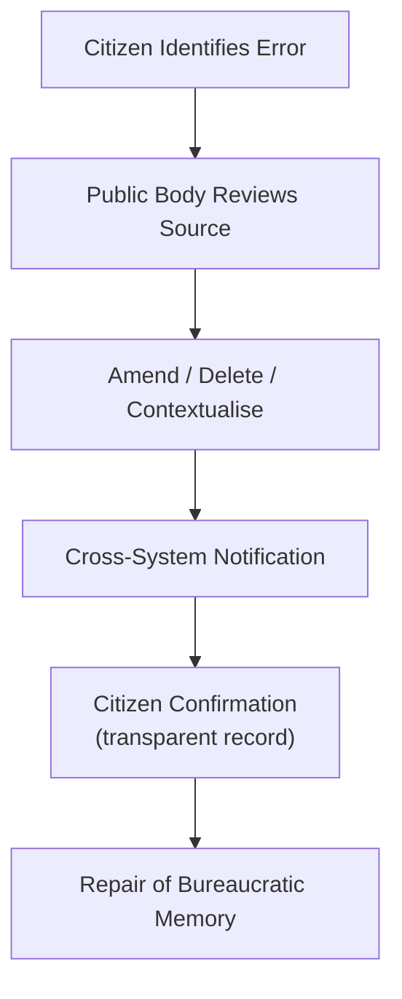

# 📜 Duty to Correct: How Public Bodies Must Fix Wrong Data  
**First created:** 2025-11-16 | **Last updated:** 2026-01-09  
*Why the right to correction is foundational to democratic participation — and how the absence of robust correction mechanisms enables misinterpretation, drift, and long-term bureaucratic harm.*  

---

## 🛰️ Orientation  
Democratic participation requires **accurate administrative identity**.  
If a public body holds incorrect, contaminated, outdated, or misinterpreted information about you, your ability to:

- access services  
- exercise rights  
- be treated proportionately  
- avoid suspicion  
- and function as a citizen  

   is compromised.

This node explains why a *duty to correct* must exist across all public bodies, how it should function, and why its absence is a structural threat to democracy and minority safety.  

---

## ✨ Key Features  
- Defines the “duty to correct” as essential to democratic infrastructure.  
- Shows how current UK systems obstruct correction or make it impossible.  
- Introduces Polaris’ model of data repair, deletion, and contextualisation.  
- Explains the human rights dimensions of identity correction.  
- Links correction failures to authoritarian drift and misinterpretation loops.

---

## ⛓️ Why Correction Is a Democratic Right  
A democracy relies on the principle:

> **The state must know who you are — but must not misdefine you.**

When public bodies misinterpret identity and refuse to correct errors, the citizen becomes trapped in:

- inaccurate metadata  
- distorted reputational profiles  
- obscured rights  
- bureaucratic suspicion  
- safeguarding misunderstanding  
- long-term administrative friction  

Without correction mechanisms, citizens lose functional agency.

---

## 🔥 Misinterpretation Is Not a Minor Error — It’s a Rights Violation  
Incorrect data can cause:

- denial of services  
- harmful safeguarding escalations  
- police overattention  
- welfare sanctions  
- educational exclusion  
- reputational harm  
- Prevent referrals  
- immigration consequences  
- mental health misinterpretation  
- retraumatisation  

Misinterpretation is not a clerical issue.  
It is **structural violence** when left uncorrected.

---

## 🧷 Why UK Institutions Resist Correction  
UK public bodies often refuse or resist correction because:

### 1. Systems Can’t Delete Fields  
Legacy software stores fields permanently.

### 2. Leaders Fear Liability  
Deleting incorrect data looks like erasing “potential risk”.

### 3. Paper Trails Reward Retention  
Staff worry that removing an error exposes them to blame.

### 4. Misinterpretations Spread  
Once an error echoes to multiple systems, no single institution wants to contradict the others.

### 5. SAR/FOI Processes Are Under-Resourced  
Citizens cannot even access the full records to correct them.

---

## 🧩 How Correction Should Work  
Polaris defines a four-tier correction model:

### Tier 1 — Immediate Amendment  
- factual inaccuracies corrected on request  
- errors corrected within 30 days  
- full transparency about source of error  

### Tier 2 — Metadata Contextualisation  
When a note cannot be deleted due to system rules:  
→ attach contextual note clarifying the misinterpretation  
→ ensure future readers understand the correction  

### Tier 3 — Cross-System Notification  
If the error has already echoed:  
→ the body must notify any organisation that inherited the error  
→ send corrected version  
→ request deletion or contextualisation  

### Tier 4 — Identity Integrity Audits  
Annual checks for:  
- inconsistent risk labels  
- duplicated flags  
- outdated notes  
- cross-system contamination  

A democracy must maintain its own “data hygiene”.

---

## 🧬 The Correction Pipeline (Polaris Model)  

This protects the citizen from misremembering by the state.

---

## ⚖️ International Context  
Comparable democracies have stronger correction rights:

- **EU GDPR Art.16:** Broad right to rectification  
- **Canada:** Mandatory correction + annotation  
- **NZ:** Citizen-centred correction frameworks  
- **Germany:** Strong constitutional data dignity  

The UK falls behind, especially post-Brexit.

---

## 🔦 Why Lack of Correction Enables Authoritarian Drift  
Without correction:

- suspicion becomes permanent  
- misinterpretation becomes “evidence”  
- metadata becomes policy  
- echoes become “patterns”  
- individuals cannot escape system narratives  
- institutions increasingly trust their own errors over lived reality  

This is how bureaucratic authoritarianism grows:  
not through intention, but through **uninterruptible error propagation**.

---

## 🧭 Why This Matters for Survivors  
Survivors of bureaucratic harm often describe:

- feeling hunted by mistakes  
- being powerless to correct records  
- encountering disbelief  
- losing opportunities  
- experiencing chronic hypervigilance  
- being retraumatised by opaque refusals  

A duty to correct is trauma-informed governance.  
It restores dignity and ends punitive misremembering.

---

## 🏮 Footer  
*📜 Duty to Correct: How Public Bodies Must Fix Wrong Data* anchors Polaris’ data-rights architecture.  
It frames correction not as clerical nicety but as essential civic infrastructure — the foundation of democratic identity integrity.

> 📡 Cross-references:
> 
> - [📛 Bureaucratic Memory Failure & Identity Contamination](../../../../Metadata_Sabotage_Network/Structural_Analysis/🧼_System_Leakage_Signatures/📛_bureaucratic_memory_failure.md) - *how systems misremember people*  
> - [📡 Cross-System Metadata Echo Chains](../../../../Metadata_Sabotage_Network/Structural_Analysis/🧼_System_Leakage_Signatures/📡_cross_system_metadata_echo_chains.md) - *how data slips between systems, creating falsity and inaccuracy in records*  
> - [🗃️ Safeguarding Logic Mission Creep & Identity-Pathologising](../../../../Metadata_Sabotage_Network/Governance_And_Containment/🈺_Governance_And_Prevent/🗃️_safeguarding_logic_mission_creep_and_identity_pathologising.md) - *how "safeguarding" can become fascist and/or authoritarian in nature*
> - [🪼 Who Had Their Voice Stolen?](../../../../🦆_Digital_Disruption/🛰️_OSINT_Field_Operations/💸_Lets_Make_The_Money_Talk/🪼_who_had_their_voice_stolen.md) - *example potential complications*
> - [🐝 Audit Stinger](../../../../🦆_Digital_Disruption/🛰️_OSINT_Field_Operations/🍯_Finding_HoneyBot/🐝_audit_stinger.md) - *example audit work to proactively help survivors correct their records*  
> - [⚖️ Official Secrets Reform and Accountability](./⚖️_official_secrets_reform_and_accountability.md) - *the OSA **must** change to assist in other organisations' duties to correct records*  

_Last updated: 2026-01-09_
