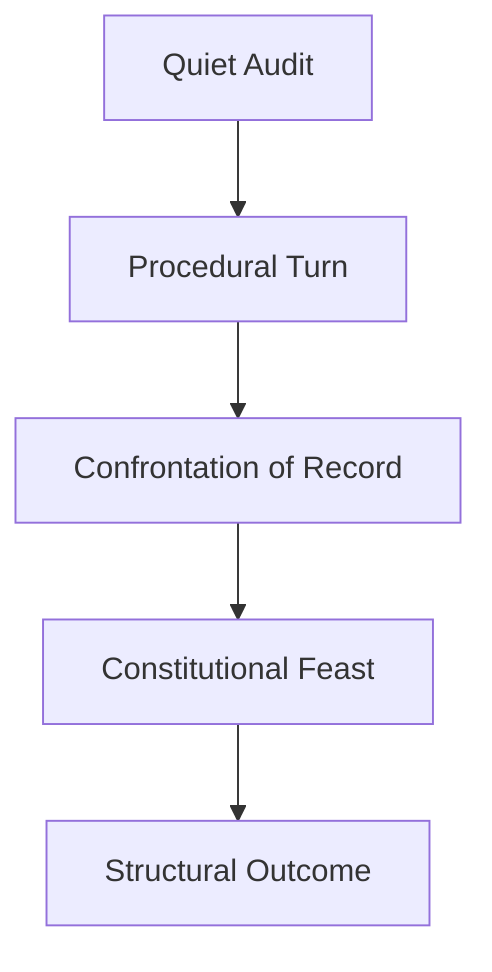

# 🕎 The Esther Protocol  
**First created:** 2025-11-23 | **Last updated:** 2026-01-22  
*A full-spectrum governance archetype derived from Estheric disclosure logic, procedural timing, and lawful strategic escalation.*  

---

## 🛰️ Orientation

The **Esther Protocol** is a structural governance archetype describing how individuals with limited institutional power use *procedural rights, lawful disclosure, timing, and documentation* to alter institutional outcomes.  
It formalises a pattern observed across:

- safeguarding failures  
- misconduct concealment  
- public-sector opacity  
- metadata suppression  
- decision-making without audit trails  
- risk-flag misuse  
- crisis bureaucracy  
- institutional betrayal  

The Protocol is not adversarial by nature.  
It is **reactive architecture**, invoked when systems fail in their duties of care, transparency, or accountability.

---

## 🦚 The Four Core Principles

## 1. Strategic Withholding  
- Observe before acting  
- Seek patterns of omission  
- Map discrepancies in timelines  
- Identify who has authority vs who has influence  
- Preserve optionality in escalatory pathways  

Strategic withholding protects vulnerable actors in hostile or uncertain institutional environments.

---

## 2. Precision-Timed Disclosure  
- Reveal information only when its procedural effect is maximised  
- Use forums the institution cannot avoid (hearings, minutes, legal duties)  
- Control the pacing of the narrative  
- Allow systems enough rope to confirm their own actions  

The timing is not avoidance; it is **tactical safety**.

---

## 3. Procedural Escalation  
- FOI and SAR as lawful force multipliers  
- PSED duties to expose discriminatory patterns  
- Audit trail creation through correspondence  
- Escalating in compliance with statutory routes  
- Turning institutional procedure into a pressure valve  

Esther does not fight the system;  
she makes the system reveal itself.

---

## 4. Disclosure as Leverage  
- Offer the institution the chance to correct itself  
- Use transparency as a stabilising force  
- Place evidence into the formal record  
- Create conditions where misconduct cannot be ignored  

This is the “banquet moment”:  
the point at which truth becomes *procedurally undeniable*.

---

## 📜 Operational Phases  

### **Phase A — The Quiet Audit**  
- Collecting evidence  
- Documenting interactions  
- Identifying systemic weak points  
- Tracking timelines and contradictions  

### **Phase B — The Procedural Turn**  
- Filing FOIs and SARs  
- Invoking equality and safeguarding requirements  
- Requesting rationale documentation  
- Creating mandatory audit trails  

### **Phase C — The Confrontation of Record**  
- Bringing information into the formal space  
- Ensuring decisions are logged  
- Triggering mandatory review  
- Involving external oversight bodies  

### **Phase D — The Constitutional Feast**  
- The point where evidence is incontrovertible  
- The disclosure that compels institutional admission  
- The governance equivalent of Esther’s banquet  

---

## 👑 Cultural and Strategic Lineage

The Esther Protocol arises wherever:

- marginalised people must navigate opaque power structures  
- institutional silence endangers others  
- procedural tools act as the only leverage  
- harm has been distributed and concealed  
- systems rely on women to “drop the bone”

It is a strategy of survival that becomes a strategy of justice.

---

## 🔥 Risks and Countermeasures

### **Risks**
- Retaliatory bureaucratic delay  
- Attempts to intimidate or discredit  
- Selective disclosure  
- Misuse of internal policies to obstruct  
- Narrative distortion  

### **Countermeasures**
- Maintain written-only channels  
- Insist on statutory timelines  
- Keep contemporaneous notes  
- Cross-reference disclosed documents  
- Escalate to external regulators where necessary  

---

## 🐦‍🔥 Implementation in Modern Systems

The Esther Protocol is live in:

- FOI/SAR systems  
- whistleblowing frameworks  
- misconduct reporting  
- equality and safeguarding structures  
- local government transparency routes  
- higher-education governance  
- complaints and inquiry processes  

It operationalises a simple truth:  
**transparency is the most powerful force a citizen can wield.**

---

## 🪬 Decision Pathway Diagram  

---

## 🌌 Constellations  
🕎 ✂️ 🧩 🪖 🧿 — governance archetypes; strategic proceduralism; narrative inversion; lawful pressure mechanisms; institutional critique.

---

## ✨ Stardust  
esther protocol, governance archetype, foi strategy, sar escalation, procedural justice, disclosure timing, institutional power, accountability frameworks, survivor governance, administrative leverage

---

## 🏮 Footer

*🕎 The Esther Protocol* is a foundational theoretical node of the **Polaris Protocol**, articulating how individuals utilise lawful disclosure, strategic timing, and procedural escalation to correct institutional harm. It models the archetypal pattern of Esther as a governance strategy: protecting the vulnerable, compelling truth, and rebalancing power through the record itself.

> 📡 Cross-references:
> 
> - [*Pending:* 📜 Book of Esther (FOI Edition)] - *satirical-midrash companion node (meta satire)*
> - [⚖️ Legal & State Governance - Return to README](./README.md)  

*Survivor authorship is sovereign. Containment is never neutral.*

_Last updated: 2026-01-22_
