# 🌀 Managed Transition vs Revolution  
**First created:** 2025-09-27 | **Last updated:** 2025-09-27  
*Why blocked reform manufactures rupture — and why survivors resist “revolutionary purity”*  

---

## 📖 Definition  

Managed transition means steady change without collapse.  
It is not centrism, nor complicity, but a recognition that upheaval is costly — especially for marginalised and disabled people who rarely survive revolutions intact.  

Revolutionary purity insists rupture is the only way.  
Reactionary politics — whether extractive elites or authoritarian fringes — foreclose democratic reform until pressure explodes.  

The choice is rarely “revolution vs nothing.” 
The real choice is whether we build safety nets and transition gradually, or let repression ensure the bubble bursts violently.  

---

## ⏳ Historical Anchor: Late Tsarist Russia  

- The Tsars tightened control instead of reforming.  
- Gradual change was blocked by elites clinging to power.  
- When revolution came, it was explosive, chaotic, and violent — not because Russians “wanted” collapse, but because managed transition had been denied.  

This dynamic echoes today: if reform is consistently blocked, rupture becomes inevitable.  

---

## ⚖️ Reactionary Left, Reactionary Right  

- **Reactionary left** → Pragmatism that looks radical only because capitalism is so rigid. A push leftward to rebalance a distorted system.  
- **Reactionary right** → Not just “more right-wing,” but a distinct authoritarian extractive force. Often so extreme it operates off the spectrum entirely.  
- **Distorted spectrum** → Labelling any realism as “far left” or any social progress as “radical” erases nuance. We are not on a line, but inside a box pulled by competing forces.  

---

## 🧭 Survivorship Perspective  

- Every revolution in history has been bloody and chaotic.  
- Disabled people, queer people, women, and other marginalised groups are rarely protected when systems collapse.  
- Ableism, sexism, and racism do not vanish with revolution; they are often intensified in the chaos.  
- Saying “I don’t want a revolution” is not about comfort. It is about survivability.  

---

## 📦 Box-Diagram Politics  

The field is not a simple left ↔ right.  
It looks more like a box of competing pressures:  

- Managed transition — gradual, survivable reform.  
- Reactionary right — authoritarian, extractive, repressive.  
- Revolutionary purity — rupture that risks erasing marginalised lives.  
- Extractive elites — blocking reform to preserve profit.  

When reactionary and extractive forces dominate, managed transition is taken off the table. The bubble will burst — either with safety nets in place, or in disaster.    

```mermaid
flowchart TB
    MT[🟢 Managed Transition<br>Gradual, survivable reform] 
    RR[🔴 Reactionary Right<br>Authoritarian, extractive force] 
    RP[⚫ Revolutionary Purity<br>Rupture, erasure of margins] 
    EE[🟡 Extractive Elites<br>Block reform to preserve profit] 

    MT <--> RR
    MT <--> RP
    MT <--> EE
    RR <--> RP
    RR <--> EE
    RP <--> EE
```

---

## 🔗 Polaris Relevance  

- Governance logics that block reform manufacture crisis.  
- Survivors know revolutions rarely protect the vulnerable.  
- Refusing revolutionary purity is not centrism: it is realism rooted in survivability.  

---

## 🏮 Footer  

*Managed Transition vs Revolution* is a living node of the Polaris Protocol.  
It maps how blocked reform produces rupture, and why survivors resist narratives that erase the risks of upheaval.  

> 📡 Cross-references:  
> - [🌀 System_Governance](../🌀_System_Governance/) — governance logics and control loops  
> - [🗝️ Politics_Memory_Work](../🗝️_Politics_Memory_Work/) — memory and narrative suppression  

*Survivor authorship is sovereign. Containment is never neutral.*  

_Last updated: 2025-09-27_
