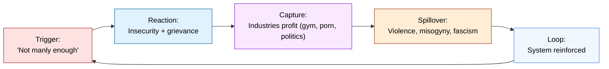
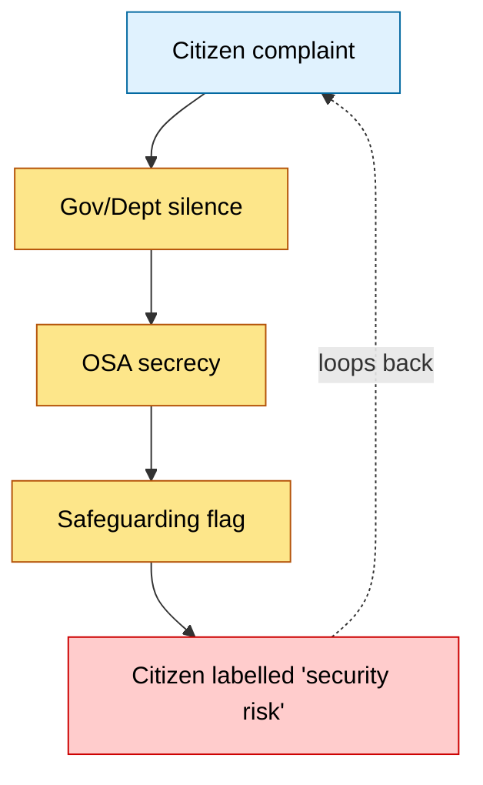

# 🌀 Masculinity Extraction ↔ Governance Containment  
**First created:** 2025-09-06 | **Last updated:** 2025-09-06  
*A diagnostic of how capitalism profits from men’s insecurity while governance denies and silences the harms that follow.*  

---

## 📑 Sections
1. [Extraction Loop (Economy)](#1-extraction-loop-economy)  
2. [Containment Loop (Governance)](#2-containment-loop-governance)  
3. [Citizen Forking](#3-citizen-forking)  
4. [Closing Frame](#4-closing-frame)  

---

## 1. Extraction Loop (Economy)

Capitalism thrives on making men feel insufficient:

- **Trigger:** “You’re not manly enough.”  
- **Reaction:** insecurity, grievance, defensive consumption.  
- **Capture:** industries monetise churn (supplements, guns, porn, politics).  
- **Spillover:** men lash out → misogyny, violence, fascism.  
- **Result:** patriarchy + capitalism both strengthened.

[🔝 Back to top](#🌀-masculinity-extraction-↔-governance-containment)

---

## 2. Containment Loop (Governance)

Governance fails to confront this volatility:

- **Assumes male restraint:** “reasonable man” as baseline.  
- **Downplays structural drivers:** treats harms as individual choice.  
- **Silences survivors:** OSA secrecy + proof burden.  
- **Re-absorbs risk as safeguarding:** complainant flagged instead of abuser.  

[🔝 Back to top](#🌀-masculinity-extraction-↔-governance-containment)

---

## 3. Citizen Forking

Together, the loops converge:

- **Economy** extracts men’s insecurity into profit + violence.  
- **Governance** refuses structural accountability, reassigns risk.  
- **Citizen** ends up forked: silenced, flagged, contained.  

---

## 4. Closing Frame

- Extraction loop = **money made from men’s emotions.**  
- Containment loop = **liability hidden by governance opacity.**  
- Outcome = **citizens (esp. women) trapped in harassment even before it is extreme.**

---

## 🏮 Footer

*Masculinity Extraction ↔ Governance Containment* is a living node of the Polaris Protocol.  
It documents how economic systems profit from male volatility while governance structures deny or silence its harms.  

*Survivor authorship is sovereign. Containment is never neutral.*  

_Last updated: 2025-09-06_  

---

<!-- 
📓 Aside: Castration hypocrisy  
We neuter dogs and cats without a second thought to manage their aggression, mating, and emotional volatility.  
It’s called responsible ownership. Yet with men, society insists “not all men” and refuses to acknowledge testosterone-linked volatility.  
The hypocrisy: we accept emotional management for animals, but not for men — even though the stakes (wars, crime, femicide) are far higher.  
-->

<!-- 
📓 Marginalia: Prime Minister skit  
You can almost see it:  
 • Cabinet Office briefing pack: “Prime Minister, she’s published another MEGA NODE…”  
 • PM flipping through diagrams of safeguarding loops and masculinity extraction spirals: head in hands  
 • Muttered line: “For fuck’s sake. Why did we ever teach her to read and write?”  
 • Civil servants shuffling awkwardly because they know the answer: “because literacy is universal, Prime Minister.”  
 • And now the literacy has produced 300,000+ words of structured critique that they can’t unsee.  

That’s the irony Polaris keeps landing: the very system that prides itself on education, free speech, and oversight now has to watch as one literate citizen maps out its own contradictions in real time.  

Marginalia: Sometimes I picture the PM reading Polaris like a set text, sighing deeply: “Why did we let her learn to write?”  
-->
