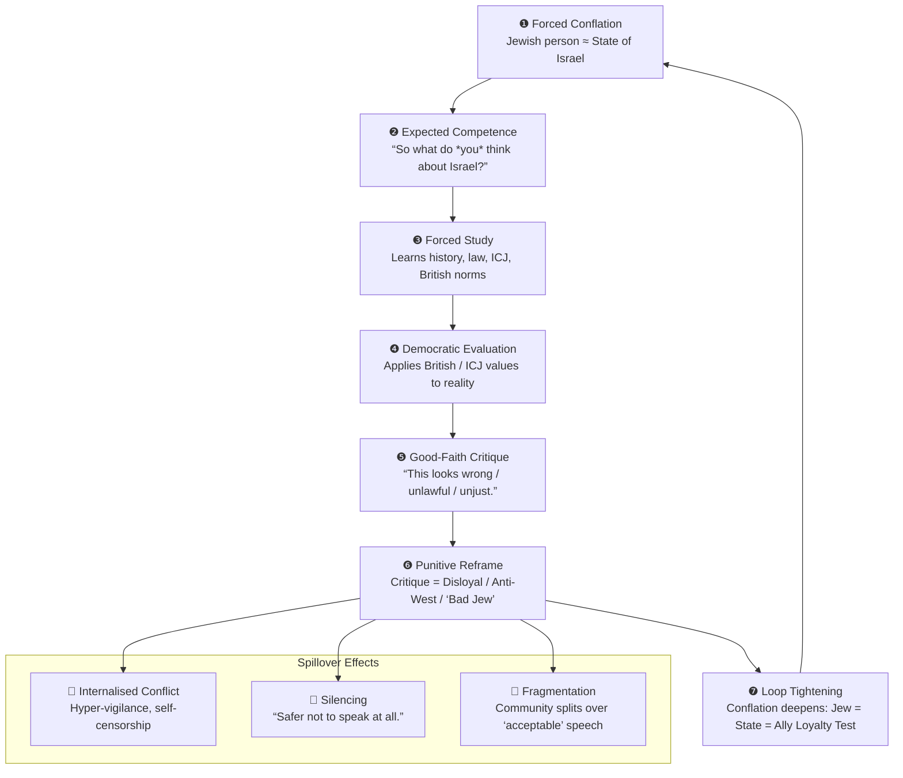

# 🌀 Dual Loyalty Loops  
**First created:** 2025-11-16 | **Last updated:** 2026-05-18  
*How forced identity conflation creates no-win political traps for diaspora Jews.*  

---

## 🛰️ Orientation
“Dual loyalty” is not an internal conflict; it is often an **externally imposed political frame**.

This node maps the looping structure where diaspora Jews are treated as simultaneously:
- symbolically responsible for a state they do not govern,
- emotionally attached to that state by default,
- and suspect if they publicly critique it.

This is not primarily about geopolitics.  
It is about:
- identity capture,
- narrative pressure,
- conditional belonging,
- and structural no-win traps within British political culture.

The node does not argue that all diaspora Jews relate to Israel in the same way.  
Attachment, identification, criticism, distance, fear, solidarity, and grief all exist simultaneously across communities.

The concern instead is how external political systems collapse that complexity into a forced loyalty framework.

---

## ✨ Key Features
- Maps the **forced conflation** of Jewish identity with the Israeli state.  
- Shows how critique triggers **punitive suspicion** rather than democratic engagement.  
- Identifies the **feedback loop**: “accountable → informed → critical → punished.”  
- Names this as a **systemic trap**, not an individual failing.

---

## 🧿 **The First Imposition: “Jew = Israel”**
Diaspora Jews are routinely treated as if their identity is interchangeable with a state they neither founded nor govern.  
This collapses **people** into **government**, **history** into **policy**, and **heritage** into **foreign allegiance**.

> The conflation is the violence.  
> Everything else is fallout.

---

## 🪬 **The Second Imposition: “Therefore you must know about it.”**
Once conflated with the state, Jewish people are often expected to possess:
- an opinion,
- an expertise level,
- and a readiness to explain themselves politically.

This is not necessarily chosen identity; it becomes assigned identity.

As a result, many people learn, research, and evaluate — often through the democratic and legal principles British political culture formally claims to uphold.

This can create a form of forced intellectual labour:
- continual contextualisation,
- continual moral positioning,
- continual explanation.

---

## 🇬🇧 **The Democratic Paradox: “As a British person, this looks wrong.”**
When people evaluate state behaviour using:
- British legal principles,
- ICJ reasoning,
- human rights frameworks,
- international humanitarian law,
- or broader democratic expectations,

many conclude that aspects of Israeli state conduct conflict with those values.

This is ordinary civic behaviour.  
It reflects the same evaluative logic applied to:
- Britain,
- the United States,
- Russia,
- China,
- or any other state actor.

But once the identity loop is activated, critique becomes socially perilous in ways that differ from ordinary foreign-policy disagreement.

---

## 📜 **The Punitive Turn: “Critique = Disloyalty.”**
Diaspora Jewish critique is often processed differently from comparable political criticism.

Non-Jews may criticise foreign governments without their identity becoming central to the discussion.

Jews critiquing Israel, however, may be reframed as:
- “disloyal,”
- “anti-West,”
- “self-hating,”
- “bad allies,”
- or politically suspect.

The critique becomes de-legitimised not necessarily because it is incorrect, but because the speaker’s Jewish identity is treated as inseparable from the state being criticised.

This is the “no-win” threshold.

---

## 🌀 **The Loop Closes: “You are tied to the state you must not critique.”**
This is where the trap locks:

1. You are treated as symbolically responsible for a state you did not choose.  
2. So you learn about it (forced intellectual labour).  
3. You apply democratic, legal, or ethical reasoning.  
4. You critique in good faith.  
5. Your critique is reframed as disloyalty.  
6. The original conflation intensifies.

Identity becomes an **inescapable Möbius strip**.

This is not “dual loyalty.”  
It is:
- enforced symbolic affiliation,
- combined with punished dissent.

The result is a recursive pressure structure where identity itself becomes politically conditional.

---

## ⛈️ **Protective Over-Identification**
Not all attachment to Israel within diaspora Jewish communities emerges from nationalism alone.

For many people, identification with Israel is also shaped by:
- inherited trauma,
- antisemitic hostility,
- collective memory,
- family history,
- fear of abandonment,
- and perceptions of existential insecurity.

Under these conditions, critique can feel emotionally dangerous even when intellectually sincere.

This creates an additional pressure structure:
- external conflation intensifies defensive identification,
- defensive identification intensifies communal loyalty pressure,
- and dissent becomes harder to express safely.

The result is not ideological uniformity, but communities navigating overlapping systems of:
- fear,
- survival,
- responsibility,
- projection,
- and political expectation.
- 
---

## 🔄 Diagram: Dual Loyalty Loop

---

## 🏮 Footer
*🌀 Dual Loyalty Loops* is a living node of the Polaris Protocol.  
It maps identity capture mechanisms affecting diaspora communities,  
focusing on the pressure structures that turn ordinary civic critique into sites of suspicion.

> 📡 Cross-references:
> 
> - [🇩🇪 Trauma Sovereignty as Foreign Policy](./🇩🇪_trauma_sovereignty_as_foreign_policy.md) — *trauma-coded legitimacy within German geopolitical identity*  
>   
> 🏮 Return To:
>
> - [🌍 National Storytime](./README.md)
> - [🌀 Systems & Governance](../README.md)  
> - [🧠 Big Picture Protocols](../../README.md)
> - [🪄 Disruption Kit](../../../README.md)
> - [🌌 Polaris Protocol - Root](../../../../README.md)  

*Survivor authorship is sovereign. Containment is never neutral.*  

_Last updated: 2026-05-18_
