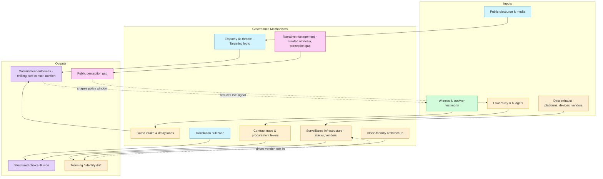

# 🌀 System & Governance  

**Scope:**  

This cluster holds doctrines and diagnostics on how systems govern behaviour through infrastructure, bureaucracy, and narrative control.  
It maps the architecture of containment — from algorithmic nudges to surveillance stacks — and records how governance operates at both the visible and hidden layers.  

---

## ✨ Core Themes  

- **Containment Logic** → how empathy, delay, or translation are weaponised as governance tools.  
- **Infrastructure** → surveillance, intake gates, contract traces, and technical choke points.  
- **Narrative Management** → amnesia design, perception gaps, and clone-friendly architectures.  
- **Ownership** → who holds the tape, who sets the frame, and how choice is structured.  

---

## 📂 Current Files

- [🧠 Targeting Logic Empathy Is a Threat](🧠_targeting_logic_empathy_is_a_threat.md)  
  - [🧠 The Frankenstack Problem](🧠_the_frankenstack_problem.md)  
  - [🧠 Value of the Outlier](🧠_value_of_the_outlier.md)  
  - [🧠 The Dev](🧠_the_dev.md)  
  - [⚖️ Containment Contract Trace](⚖️_containment_contract_trace.md)  
  - [🛂 Gated Intake Post Delay Regional Loop](🛂_gated_intake_post_delay_regional_loop.md)  
  - [🛬 Translation Null Zone](🛬_translation_null_zone.md)  
  - [🛰️ Surveillance Infrastructure](🛰️_surveillance_infrastructure.md)  
  - [👀 Public Perception Gap](👀_public_perception_gap.md)  
  - [🗡 Narrative Management and Metadata Storage](🗡_narrative_management_and_metadata_storage.md)  
  - [🗝 Who Holds the Tape](🗝_who_holds_the_tape.md)  
  - [🕸️ Clone Friendly Architecture](🕸️_clone_friendly_architecture.md)  
  - [🕳️ Curated Amnesia Has a Shape](🕳️_curated_amnesia_has_a_shape.md)  
  - [🪞 The Illusion of Choice](🪞_the_illusion_of_choice.md)  

---

## 🔍 Visual Framing  

---

*This folder is part of the wider `Big_Picture_Protocols/` canon.  
It should be read alongside trauma/clinical, radicalisation, and political economy sub-clusters for a full map of systemic behaviour.*  
