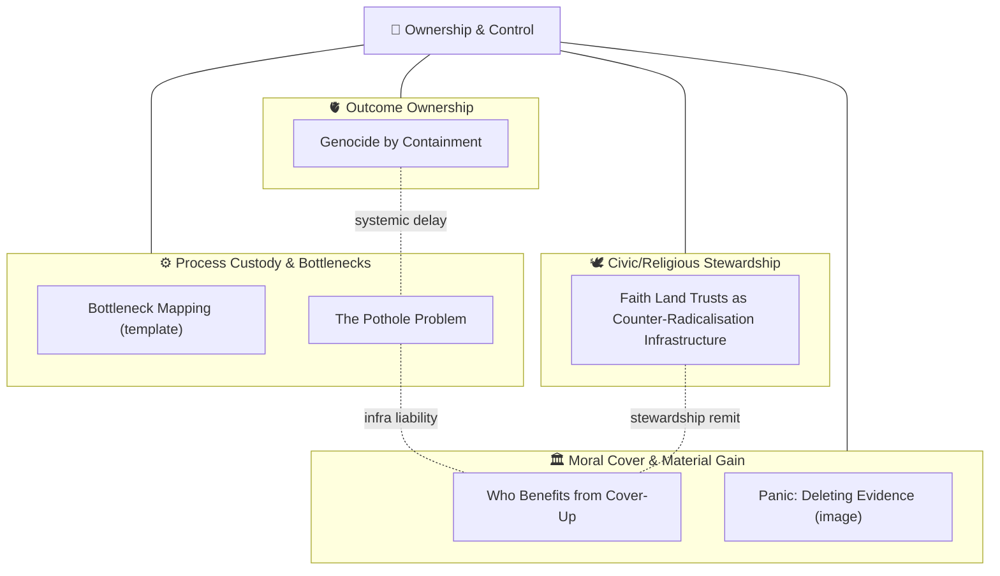

# 👑 Ownership & Control
**First created:** 2025-10-13 | **Last updated:** 2025-10-14  
*Who owns the process — where remit, custody, and operational power actually sit once rules meet reality.*  

---

## 🛰️ Orientation

**Ownership & Control** sits alongside *[🌀 Systems & Governance](../README.md)* as the layer that asks: **who** runs the machinery when authorities overlap and mandates blur?  
Where *Legal & State Governance* analyses the juridical architecture, **Ownership & Control** maps **custody of process** — remit collisions, delegated operational power, and the quiet bottlenecks that determine outcomes.

It interlocks with nearby clusters:

- [⚖️ Legal & State Governance](../⚖️_Legal_State_Governance/README.md) — *constitutional architecture and oversight ritual*  
- [💫 Containment Logic](../💫_Containment_Logic/README.md) — *behavioural governance and due-diligence enforcement*  
- [🛰️ Infrastructure Procurement](../🛰️_Infrastructure_Procurement/README.md) — *contractual levers and supply-side control*  

---

## ✨ Key Themes

- **Process Custody & Remit Collision** — who decides, who signs, who stalls.  
- **Bottlenecks as Power** — mapping choke points and single-points-of-failure.  
- **Moral Cover & Material Gain** — when “public interest” fronts private benefit.  
- **Civic Infrastructure Drift** — from stewardship to extraction (roads, land, services).  
- **Containment by Ownership** — when control of assets/process = control of outcomes.

---

## 🛸 Included Nodes

- [⛪️ Faith Land Trusts as Counter-Radicalisation Infrastructure](./⛪️_faith_land_trusts_as_counter_radicalisation_infrastructure.md) — *religious estates as security-adjacent civic levers*  
- [💰 Who Benefits from Cover-Up](./💰_who_benefits_from_cover_up.md) — *motive structures behind institutional concealment*  
- [🕳️ The Pothole Problem](./🕳️_the_pothole_problem.md) — *ownership, liability, and enforcement gaps in road maintenance*  
- [🫀 Genocide by Containment](./🫀_genocide_by_containment.md) — *outcome ownership when systems “merely” restrict, delay, or degrade*  

**Templates & Visuals:**  
`bottleneck_mapping_log_template.csv` · `panic_deleting_evidence.png`

> **Using the CSV Template:**  
> Columns: `Date`, `System/Process`, `Actor(s)`, `Bottleneck Description`, `Impact`, `Escalation Path`, `Notes`.  
> Example: `2025-10-10, Procurement chain, Local Authority, Tender paused pending review, Road repair delayed 6 months, FOI escalation, “Budget oversight” justification.`

---

## 🚀 Routing Notes

- If analysis is primarily **juridical/oversight** (permissions, courts, statutes), route to *[⚖️ Legal & State Governance](../⚖️_Legal_State_Governance/README.md)*.  
- If it’s **behavioural control/due-diligence or policing**, route to *[💫 Containment Logic](../💫_Containment_Logic/README.md)*.  
- If the lever is **procurement/contracting or physical infrastructure**, link to *[🛰️ Infrastructure Procurement](../🛰️_Infrastructure_Procurement/README.md)*.

---

## 🗺️🫡 Where are the nodes?: A Map  

A compact internal map showing how process-ownership questions cluster here.

*Alt text:* a four-block map of Ownership & Control: (1) process custody/bottlenecks, (2) moral cover/material gain, (3) civic/religious stewardship, (4) outcome ownership.

---

## 🗓️ Planned Nodes

Shortlist for near-term addition (titles are working; refine to house style during drafting):

- **🧭 Remit Collider Log** — systematic capture of overlap/hand-off failures.  
- **🧰 Custody of Process Playbook** — who owns which step, with escalation ladders.  
- **🏗️ Stewardship vs Extraction Index** — diagnostic for civic asset governance.  
- **🧵 Chain-of-Benefit Tracer** — multi-actor gain mapping (money, influence, narrative).  
- **🧪 Rapid Decision Vetoes** — catalogue of micro-veto powers in routine ops.

> Use `bottleneck_mapping_log_template.csv` to seed each planned node with real cases before full write-ups.

---

## 🌌 Constellations

🌀 👑 ⚖️ 🛰️ 💫 — *Operational custody at the intersection of law, procurement, and behavioural enforcement.*

---

## ✨ Stardust

remit collision, process custody, bottleneck power, stewardship vs extraction, liability gaps, institutional concealment, procurement leverage, outcome ownership

---

## 🏮 Footer

*👑 Ownership & Control* is a living sub-cluster of the Polaris Protocol.  
It documents **who truly owns the process** — and how that ownership shapes outcomes across public life.

> 📡 Cross-references:
> 
> - [🌀 Systems & Governance](../README.md) — *parent framework for oversight architectures*  
> - [⚖️ Legal & State Governance](../⚖️_Legal_State_Governance/README.md) — *constitutional architecture and oversight ritual*  
> - [💫 Containment Logic](../💫_Containment_Logic/README.md) — *behavioural governance and due-diligence enforcement*  
> - [🛰️ Infrastructure Procurement](../🛰️_Infrastructure_Procurement/README.md) — *contractual levers and supply-side control*

*Survivor authorship is sovereign. Containment is never neutral.*  

_Last updated: 2025-10-14_
