# 🕳️ The Pothole Problem  
**First created:** 2025-10-09 | **Last updated:** 2026-01-08  
*When six-hundred-year-old law meets twenty-first-century asphalt.*  

---

## 🛰️ Orientation  
The pothole is Britain’s most visible governance glitch.  
Every crater in the road exposes a deeper crater in public administration:  
a statute book that predates the Church of England, procurement logic from the turnpike age, and an enforcement regime optimised for mediocrity.  

This node maps how ancient legal sediment, weak regulatory muscle, and modern populism fuse into a perfect loop of visible neglect.

---

## 🌳 Key Features  
- Traces highway maintenance law from Tudor parish duty to post-Thatcher austerity.  
- Diagnoses the *weak-enforcement equilibrium* governing utilities and contractors.  
- Shows how neglect converts into populist political capital.

---

## ⚖️ Historical Statute Timeline — From Parish Labour to Populist Asphalt  

| Era | Key Statutes / Shifts | Structural Logic | Residue in 2025 |
|------|-----------------------|------------------|-----------------|
| **Medieval roots (pre-1500s)** | *Statute of Winchester (1285)* — clear the king’s highways; define a public right of passage. | The highway is a *right*, not an asset. | “Reasonable repair” still inherits this vagueness. |
| **Tudor parochial era (1555–1562)** | *Highways Act 1555* → parish labour duty under a “surveyor of highways”; *Highways Act 1562* tweaks it. | Maintenance as communal burden. | Source of today’s “local authority” logic. |
| **Restoration (1662)** | *Highways Act 1662* tightens parish duties. | Early inspection culture. | Bureaucratic ancestry of highway surveys. |
| **Turnpike era (1700s–1830s)** | *Turnpike Acts 1766, 1773, 1835* + private toll trusts. | Fragmented privatization. | Echoed in today’s contractor patchwork. |
| **Victorian consolidation (1835–1888)** | *General Highways Act 1835*; *Highways Act 1862*; *Local Gov Act 1888* → county councils take main roads. | Professionalisation + scale. | Core local-road bureaucracy still dates here. |
| **Motor age (1920–1936)** | *Roads Act 1920* → Road Fund; *Trunk Roads Act 1936* → central control. | Central/local split hardens. | Basis of National Highways vs Council divide. |
| **Post-war consolidation (1959–1980)** | *Highways Acts 1959 → 1980* consolidate a century of law. | Modern veneer on ancient frame. | **Highways Act 1980** still in force. |
| **Present (1980–2025)** | Incremental amendments; no full rewrite. | Patch over patch. | Medieval governance running on digital dashboards. |

**Takeaway:** Britain manages 21st-century roads using a 16th-century operating system.

---

## 🧱 Weak Enforcement Equilibrium  

The *Roads: Maintenance, Repairs and Street Works (SN00739)* briefing concedes that **authorities can impose reinstatement standards — but enforcement is weak**.  

That weakness defines the market:  

| Actor | Incentive | Behaviour | Outcome |
|--------|------------|-----------|----------|
| Utility / Contractor | Minimise cost & delay | Patch quickly, superficially | Faster decay |
| Local Authority | Avoid litigation + overspend | Under-inspect, defer repair | Backlog expands |
| National Gov | Preserve efficiency optics | Delegate → diffuse accountability | Public blames “the council” |

Neglect becomes policy by arithmetic:  
if prosecution is rare, *mediocrity pays*.  
Without performance bonds, independent inspection, and automatic penalties, every actor behaves rationally — against the public interest.

---

```mermaid
flowchart TD
  A[💼 Contractor / Utility] -->|Cuts cost to maximise profit| B[🩹 Superficial reinstatement]
  B -->|Deterioration accelerates| C[🚗 Public complaints + road damage]
  C -->|Budget pressure / blame| D[🏛️ Local Authority]
  D -->|Underfunded + risk-averse| E[🔍 Weak inspection / enforcement]
  E -->|Low prosecution likelihood| F[💰 Good enough becomes standard]
  F -->|Systemic expectation of mediocrity| A
  D -->|Defers resurfacing| G[📉 Expanding backlog]
  G -->|Visible decay fuels distrust| H[⚖️ Populist leverage as They don't care about your roads]
  H -->|Political churn without structural fix| D
```

#### 🩻 Diagram Notes — The Logic of Minimal Compliance  
This loop shows how *weak enforcement* stabilises neglect:  
each actor optimises locally, decay compounds globally.  
Contractors save, councils triage, ministers posture, voters rage.  
The pothole is not a maintenance failure — it is a **compliance artefact**:  
performance theatre in asphalt form.

---

## 🔥 Political Resonance  
Because potholes are hyper-visible and universal, they become the perfect populist lever:  
low-information, high-anger, instantly legible.  
When a system’s failures are mapped in tyre damage rather than spreadsheets, any party promising “We’ll fix your roads” can harvest votes without fixing the structure.

---

### 🛠️ Obvious Fixes (That Somehow Aren’t Done)

The UK doesn’t need a moonshot to solve its road decay.  
It needs basic governance literacy — the kind you’d expect from a functioning procurement system.

| Fix | Description | Why It’s Obvious | Why It Hasn’t Happened |
|------|--------------|------------------|------------------------|
| **1. Unified Enforcement Framework** | Merge National Highways and local-authority standards into one enforceable code. | Contractors can’t play “different council, different rule.” | Political turf wars + Whitehall inertia. |
| **2. Mandatory Reinstatement Bonds** | Every utility deposit a bond refunded only if post-inspection meets standard. | Creates financial teeth; quality becomes cheaper than failure. | Lobby resistance from utilities + telecoms. |
| **3. Independent Inspection Pool** | Rotating regional inspectors (not council-staff) audit 5% of repairs monthly. | Restores credibility; data for public dashboards. | Funding optics — “too bureaucratic.” |
| **4. Digital Coordination Layer** | Single national map logging all streetworks in real time. | Stops utilities from digging the same road twice. | Exists in prototype form; never mandated. |
| **5. Transparent Repair Ledger** | Public, timestamped ledger of reported vs. repaired potholes with photos. | Turns complaint data into accountability. | Fear of comparison: councils dislike visible metrics. |
| **6. Ring-fenced Road Fund 2.0** | Hypothecate a share of fuel duty or EV road levy directly to maintenance. | Predictable funding cycle; long-term planning possible. | Treasury refuses earmarks; prefers annual drama. |
| **7. Performance-Based Procurement** | Payment milestones tied to surface lifespan, not completion date. | Incentivises durable materials and workmanship. | Current contracts reward speed, not longevity. |
| **8. Utility Coordination Permits** | Require joint streetworks planning every quarter per region. | One trench, one fix. | No statutory compulsion; coordination is “voluntary.” |
| **9. National Skills Pool for Maintenance** | Portable accreditation and wage parity across councils. | Stabilises quality; reduces local skill shortages. | Public-sector wage caps + fragmented HR systems. |
| **10. Climate-Resilient Surfacing Trials** | Pilot new materials with drainage and freeze-thaw tolerance. | Reduces recurrence under extreme weather. | Innovation budgets cut; lowest-bid procurement blocks adoption. |

Every item in this table exists somewhere in policy recommendations dating back a decade.  
None require new physics — only new willpower.

---

### 💫 Summary Insight  

The absence of reform is not ignorance; it’s *political convenience*.  
Neglect allows ministers to announce “new funding boosts” every spring while never changing the enforcement architecture that would make those boosts unnecessary.  
In the economics of optics, **repairing the same road twice** is better politics than fixing it once properly.

---

## 🌌 Constellations  
🕳️ 🧱 🧿 🛰️ — Legal sediment → incentive decay → political capture.

*Further reading:*  
- [Pothole claims up 90% in three years, says RAC](https://www.bbc.co.uk/news/articles/clyzyww1jp2o), BBC News.  

---

## ✨ Stardust  
highways act 1555, highways act 1980, procurement failure, weak enforcement, utilities reinstatement, governance decay, infrastructure neglect, populist leverage, risk economy, compliance artefact, road repair reform

---

## 🏮 Footer  

*🕳️ The Pothole Problem* is a living node of the Polaris Protocol.  
It traces the persistence of Tudor-era road law through modern procurement loops to reveal how visible neglect becomes political currency.  

> 📡 Cross-references:
> 
> - [🗺️ Linguistic Silk Road — How Words Travel](../../🦕_Elder_Influencers/🕸️_World_Webs/🗺️_linguistic_silk_road_how_words_travel.md)  
> - [🚜 Tools Are Not Costumes](../../🦕_Elder_Influencers/🍿_Historical_Democratic_Actions/🌳_Freedom_Farming_Food/🚜_tools_are_not_costumes.md)
> - [🧃 COGAT Is a Containment Operation](../../🦕_Elder_Influencers/🕸️_World_Webs/🧃_cogat_is_a_containment_op.md)
> - [🦕 Partition Loop — Borders as Violence](../../🦕_Elder_Influencers/🛟_Borders_Boats_Walls/🦕_partition_loop.md)  

*Survivor authorship is sovereign. Containment is never neutral.*  

_Last updated: 2026-01-08_
