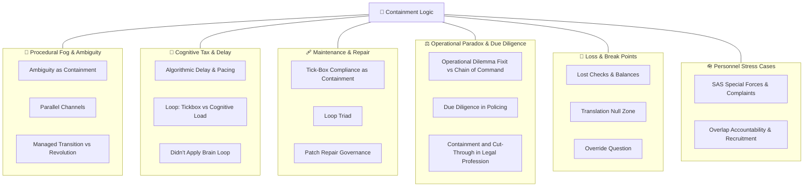

# 💫 Containment Logic  
**First created:** 2025-10-13  |  **Last updated:** 2025-10-14  
*Behavioural governance and operational feedback loops that preserve the illusion of control while deferring accountability.*  

---

## 🛰️ Orientation  

**Containment Logic** sits inside *[🌀 Systems & Governance](../README.md)* as the **behavioural-operations layer**.  
Where *[⚖️ Legal & State Governance](../⚖️_Legal_State_Governance/README.md)* studies rule-sets and *[👑 Ownership & Control](../👑_Ownership_Control/README.md)* maps custody of process,  
**Containment Logic** captures how *habits, audits, and rituals* become soft enforcement.  

It examines how systems appear self-correcting but are, in practice, self-preserving — converting duty of care into duty of containment.

---

## ✨ Key Themes  

- **Procedural Fog & Ambiguity** — policy as camouflage.  
- **Algorithmic Pacing** — rate-limit and throttle as emotional control.  
- **Tick-Box Governance** — audit satisfaction over reality.  
- **Patch-Repair Mythology** — maintenance as ritual, not remedy.  
- **Cognitive Load & Delay** — tired minds comply.  
- **Due Diligence Loops** — endless reviews masking incapacity.  
- **Override Moments** — precise questions that puncture bureaucratic theatre.  

---

🛸 Included Nodes  

### 🧮 Procedural Fog & Ambiguity  
- [🌀 Ambiguity as Containment](./🌀_ambiguity_as_containment.md) — *fog as policy*  
- [🌀 Parallel Channels](./🌀_parallel_channels.md) — *duplication as stalling device*  
- [🌀 Managed Transition vs Revolution](./🌀_managed_transition_vs_revolution.md) — *staging change to preserve power*  

### 🧠 Cognitive Tax & Delay  
- [🦯 Algorithmic Delay and Pacing](./🦯_algorithmic_delay_and_pacing.md) — *rate-limiting as soft control*  
- [📋 Loop: Tickbox vs Cognitive Load](./📋_loop_tickbox_vs_cognitive_load.md) — *cognitive tax as gatekeeping*  
- [🧠 Didn’t Apply Brain Loop](./🧠_didnt_apply_brain_loop.md) — *DARVO feedback spirals as “intelligence inputs”*  

### 🩹 Maintenance and Repair Myths  
- [📋 Tick-Box Compliance as Containment](./📋_tick_box_compliance_as_containment.md) — *audit passes, reality fails*  
- [🩹 Loop Triad: Tickbox Containment Fatigue Patch-Repair](./🩹_loop_triad_tickbox_containment_fatigue_patch_repair.md) — *maintenance myths that entrench harm*  
- [🩹 Patch Repair Governance](./🩹_patch_repair_governance.md) — *endless fixes, no remedy*  

### ⚖️ Operational Paradox & Due Diligence  
- [⚖️ Operational Dilemma: Fixit vs Chain of Command](./⚖️_operational_dilemma_fixit_vs_chain_of_command.md) — *patch or obey?*  
- [🧾 Due Diligence and Operational Capacity in Policing](./🧾_due_diligence_and_operational_capacity_in_policing.md) — *when risk assessment becomes containment*  
- [⚖️ Containment and Cut-Through in the Legal Profession](./⚖️_containment_and_cutthrough_in_the_legal_profession.md) — *law as loop management*  

### 🔬 Loss & Break Points  
- [🔬 Lost Checks and Balances](./🔬_lost_checks_and_balances.md) — *hollowed guardrails*  
- [🛬 Translation Null Zone](./🛬_translation_null_zone.md) — *where meaning evaporates between systems*  
- [❓ Override Question as Silence Breaker](./❓_override_question_as_silence_breaker.md) — *one precise question that collapses the maze*  

- [🪖 SAS Special Forces and Complaints](./🪖_SAS_special_forces_and_complaints.md) — *discipline exception as shield*  
- [🪖 Overlap Accountability and Why We Cannot Recruit](./🪖_overlap_accountability_and_why_we_cannot_recruit.md) — *burnout by design*  

---

## 🧭 Routing Notes  

If a node focuses on **procedural law or statutory architecture**, route to *[⚖️ Legal & State Governance](../⚖️_Legal_State_Governance/README.md)*.  
If it explores **custody or remit collision**, route to *[👑 Ownership & Control](../👑_Ownership_Control/README.md)*.  
If it addresses **behavioural nudge or compliance culture**, it belongs here.  
If it deals with **physical delivery systems or contracts**, cross-link to *[🛰️ Infrastructure Procurement](../🛰️_Infrastructure_Procurement/README.md)*.  

---

## 🗺️🫡 Where are the nodes?: A Map  

*Alt text:* A six-branch map showing feedback-loop containment: ambiguity, cognitive tax, patch-repair, operational dilemmas, loss points, and personnel stress.

---

## 🗓️ Planned Nodes  

- **🧩 Containment Metrics Dashboard** — data schema for measuring loop density.  
- **🧮 Fatigue Economy Map** — correlating staff turnover with tick-box burden.  
- **🧾 Due Diligence Audit Triage** — auto-classifier for compliance vs capacity issues.  
- **🧠 Cognitive Tax Calculator** — simple tool for estimating mental load per task.  
- **🧵 Feedback Loop Registry** — index of containment mechanisms across agencies.  

> *Use the same column pattern as `bottleneck_mapping_log_template.csv`: `Date`, `Process`, `Actor(s)`, `Loop Type`, `Impact`, `Escalation`, `Notes`.*

---

## 🌌 Constellations  

🌀 💫 ⚖️ 👑 🧠 — *Behavioural containment and feedback governance between law, ownership, and mind.*

---

## ✨ Stardust  

behavioural governance, tick-box culture, algorithmic delay, patch-repair, compliance fatigue, ambiguity as policy, due diligence loops, cognitive tax, operational containment

---

## 🏮 Footer  

*💫 Containment Logic* is a living sub-cluster of the Polaris Protocol.  
It documents the mechanics by which systems simulate responsiveness while sustaining containment.  

> 📡 Cross-references:
> 
> - [🌀 Systems & Governance](../README.md) — *parent framework for oversight architectures*  
> - [⚖️ Legal & State Governance](../⚖️_Legal_State_Governance/README.md) — *juridical and constitutional control layers*  
> - [👑 Ownership & Control](../👑_Ownership_Control/README.md) — *process custody and remit collision*  
> - [🛰️ Infrastructure Procurement](../🛰️_Infrastructure_Procurement/README.md) — *supply-side and contractual governance*  

*Survivor authorship is sovereign. Containment is never neutral.*  

_Last updated: 2025-10-14_
