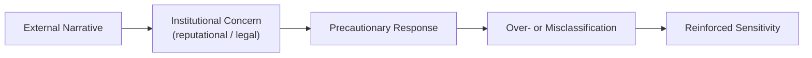

# ⚔️ Culture War Risk Logic in UK Public Institutions  
**First created:** 2025-11-16 | **Last updated:** 2026-04-24  
*How culture war narratives can influence institutional behaviour, shaping risk perception, decision-making, and governance priorities.*  

---

## 🛰️ Orientation  

Culture war narratives are not confined to media or political debate.  
They can influence how public institutions interpret risk and respond to uncertainty.

This influence may be observed across:

- councils  
- schools  
- NHS bodies  
- universities  
- regulators  
- police  
- safeguarding frameworks  

In some cases, decision-making may shift from:

> **“What does the evidence show?”**  
to  
> **“How might this be perceived or criticised?”**

This node examines that shift as a **pattern of institutional behaviour under reputational pressure**, rather than as a claim of uniform practice.

---

## ✨ Key Features  

- Identifies how external narratives can shape internal decision-making.  
- Explores links between political discourse and administrative interpretation.  
- Examines anticipatory behaviour in response to perceived scrutiny.  
- Highlights potential tension between symbolic action and substantive outcomes.  
- Connects to broader themes of safeguarding, risk framing, and data interpretation.  

---

## 🔥 What “Culture War Risk Logic” Refers To  

This concept does not describe a single ideology or intent.

It refers to a pattern where institutions may act in anticipation of:

- media criticism  
- political scrutiny  
- reputational risk  
- legal challenge  

This can result in a defensive posture, where:

> **precaution and perception are prioritised alongside, or sometimes ahead of, evidence-based assessment.**

---

## 🧨 Pathways of Influence  

Several mechanisms may contribute to this dynamic:

### 1. **Political Signalling**  
Statements by public figures—formal or informal—may be interpreted by institutions as indicators of expected direction, even where no formal policy change has occurred.

---

### 2. **Media Environment**  
High-scrutiny media ecosystems can increase sensitivity to:

- potential criticism  
- reputational exposure  
- and perceived risk amplification  

This may encourage pre-emptive or precautionary responses.

---

### 3. **Capacity and Training Constraints**  
Variability in training and resources can affect how staff interpret:

- identity and community dynamics  
- political rhetoric  
- risk indicators  

This may increase reliance on simplified or precautionary interpretations.

---

### 4. **Legal and Compliance Pressure**  
Concerns about:

- litigation,  
- regulatory scrutiny,  
- and formal complaints  

can lead to more risk-averse decision-making.

---

## 🔬 A Possible Distortion Pattern  

This is not inevitable, but it is a recognisable feedback pattern in high-pressure environments.  

---

## 🎭 Symbolic vs Substantive Focus  

Under heightened scrutiny, institutions may place increased emphasis on:

- visible signals of action,  
- policy framing,  
- or reputational positioning.  

At times, this can occur alongside challenges in:

- proportionality,  
- evidence-based assessment,  
- and addressing underlying issues.  

This tension is not unique to culture war contexts,  
but may be amplified within them.

---

## 🧠 Conditions That Increase Reactivity  

Institutional sensitivity to external narratives may increase during periods of:

- political instability  
- resource constraint  
- high public scrutiny  
- complex or ambiguous risk environments  

These conditions can contribute to:

- precautionary overreach,  
- increased internal monitoring,  
- and reduced decision confidence.  

---

## 👾 Groups More Likely to Be Affected  

Where precautionary or interpretive frameworks are applied unevenly,  
there is a risk that certain groups may be disproportionately impacted.

These can include:

- minority or marginalised communities  
- politically active individuals  
- groups associated with contested public narratives  

The specific impact varies by context and implementation.

---

## 🪼 Data and Classification Effects  

Where these dynamics intersect with data systems, potential effects include:

- broad or ambiguous categorisation  
- accumulation of subjective or precautionary flags  
- difficulty correcting or contextualising records  

Over time, this may affect:

- accuracy of records  
- consistency across systems  
- and trust in institutional processes  

---

## 🐦‍🔥 Why This Node Matters  

Understanding this pattern can help:

- identify when precautionary logic begins to distort decision-making  
- distinguish between evidence-based action and perception-driven response  
- support more proportionate and transparent governance approaches  

---

## 🌌 Constellations  
⚔️ 🧠 ⚖️ 🧿 — governance under pressure; risk perception; institutional behaviour  

---

## ✨ Stardust  
culture war, institutional behaviour, risk perception, governance, media influence, precautionary decision-making, safeguarding, data systems  

---

## 🏮 Footer  
*⚔️ Culture War Risk Logic in UK Public Institutions* is part of the **Polaris Protocol**.  
It examines how external narratives can influence institutional behaviour, particularly under conditions of heightened scrutiny and uncertainty.  

> 📡 Cross-references:
> 
> - [🧯 PREVENT As Political Atomisation Engine](../../../../Metadata_Sabotage_Network/Governance_And_Containment/🈺_Governance_And_Prevent/🧯_prevent_as_a_political_atomisation_engine.md)  
> - [📛 Bureaucratic Memory Failure & Identity Contamination](../../../../Metadata_Sabotage_Network/Structural_Analysis/🧼_System_Leakage_Signatures/📛_bureaucratic_memory_failure.md)  
> - [📡 Cross-System Metadata Echo Chains](../../../../Metadata_Sabotage_Network/Structural_Analysis/🧼_System_Leakage_Signatures/📡_cross_system_metadata_echo_chains.md)  
> - [🗃️ Safeguarding Logic Mission Creep & Identity-Pathologising](../../../../Metadata_Sabotage_Network/Governance_And_Containment/🈺_Governance_And_Prevent/🗃️_safeguarding_logic_mission_creep_and_identity_pathologising.md)  

*Survivor authorship is sovereign. Containment is never neutral.*  

_Last updated: 2026-04-24_
