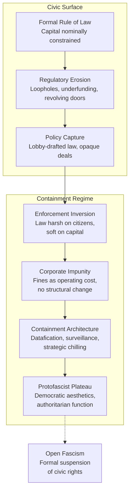

# ⚖️ Above the Law — Protofascism Threshold  
**First created:** 2025-11-09 | **Last updated:** 2025-12-27  
*When capital becomes immune to law, democracy enters its protofascist phase.*  

---

## 🛰️ Orientation  
This node identifies the threshold where corporate and financial power function **above the law**—a point at which civic structures remain cosmetically democratic but are substantively captured.  
Polaris treats this as a **protofascist signal**: the moment when legality becomes performative, policy becomes corporate theatre, and accountability is replaced by containment.

---

## ✨ Key Features  
- **Impunity of Capital** — law bends to wealth; fines become operational costs.  
- **State Capture** — regulation authored by lobbyists; oversight converted into partnership.  
- **Suppression of Dissent** — journalism, protest, and academia reframed as “security risks.”  
- **Aesthetic of Inevitability** — ideology recast as neutral economics; inevitability replaces consent.  
- **Containment-by-Design** — data infrastructures engineered to predict and pacify civic disruption.  

---

## 🕸 Diagram — From Legal Immunity to Protofascism  

---

## 🧿 Analysis  

### 1. Enforcement Inversion  
At the protofascist threshold, law no longer constrains power — it protects it.  
Corporations are fined rather than prosecuted; citizens are prosecuted rather than heard.  
Regulators perform accountability while negotiating leniency.  

### 2. Containment Architecture  
Digital infrastructure becomes the new instrument of discipline: data brokerage, automated risk scoring, and predictive policing substitute bureaucracy for deliberation.  
Control is outsourced; oversight becomes a dashboard metric.  

### 3. The Economic Immune System  
Once capital attains legal immunity, it develops **auto-immune responses** to threat:  
- whistleblowers neutralised via contract law;  
- critics labelled as “reputational risks”;  
- dissent quarantined under security language.  

The result is a self-reinforcing feedback loop in which state and capital co-protect one another.

### 4. Cultural Normalisation  
Protofascism requires no jackboots—only bureaucracy.  
Its rituals are administrative: risk frameworks, impact assessments, non-disclosure agreements.  
Democracy survives as ceremony, but the decision-function has migrated to private servers.  

### 5. Diagnostic Use  
Use this node to identify environments where:  
- regulation serves investor confidence rather than public protection;  
- transparency is replaced by “commercial sensitivity”;  
- democratic deliberation has been automated into compliance software.

---

## 🛰️ Public Oversight Is Harm Prevention  
**FOI and OSINT are the only civic instruments that keep this threshold visible.**  
When citizens can observe procurement trails, data-sharing contracts, and enforcement asymmetries, the threshold is measurable.  
When visibility is lost, containment becomes invisible—law and capital merge into one unaccountable actor.  

Each freedom-of-information request, data-subject access, and public audit re-anchors legality in daylight.  
Without those civic sightlines, “rule of law” reverts to rule of power.  

---

## 🌌 Constellations  
🧿 ⚖️ 🔥 🛰️ — Core diagnostic node linking legality, economy, and containment mechanics.  

---

## ✨ Stardust  
protofascism, corporate immunity, state capture, democratic erosion, civic sovereignty, data containment, enforcement inversion, legality theatre  

---

## 🏮 Footer  
*⚖️ Above the Law — Protofascism Threshold* is a living node of the Polaris Protocol.  
It maps the moment when economic impunity mutates civic frameworks into containment architectures, identifying the protofascist gradient before open authoritarian capture.  

> 📡 Cross-references:
> 
> - [🧭 Are We Fascist Yet?](./🧭_are_we_fascist_yet.md)  — *situational analysis of UK protofascism*  
> - [🐝 Post-Protofascist Reconstruction](../../✨_Glimmer_Is_Taxable_And_Other_Big_Drums/🏛️_Chaps_Be_Serious/🐝_post_protofascist_reconstruction.md) — *civic recovery blueprint*  
> - [*Pending:* 🛰️ Surveillance FOI-SAR Dual Oversight Protocol] — *public oversight methodology*
> - [👾 Intent-Free Authoritarian Drift](./👾_intent_free_authoritarian_drift.md)
> - [🏛️ The Boringing (UK 2010–2025)](./🏛️_the_boringing_uk_2010_2025.md)
> - [🪬 Authoritarianism Beyond Left Right](../../🐍_Ouroborotic_Violence/🪬_Radicalisation_Extremism/🪬_authoritarianism_beyond_left_right.md)
> - [🩺 Stakeholder Mapping from Symptoms](../../../../Metadata_Sabotage_Network/Structural_Analysis/🧬_Structural_Mapping/🩺_stakeholder_mapping_from_symptoms.md)  

*Survivor authorship is sovereign. Containment is never neutral.*  

_Last updated:2025-12-27_
