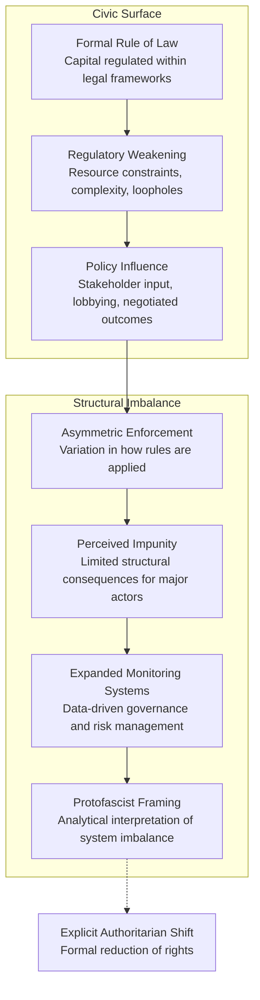

# ⚖️ Above the Law — Protofascism Threshold  
**First created:** 2025-11-09 | **Last updated:** 2026-04-24  
*An analytical model for examining how concentrations of economic power may affect legal accountability and democratic governance.*  

---

## 🛰️ Orientation  

This node explores conditions under which economic or corporate power may appear to operate with reduced legal constraint.

> **Where accountability mechanisms weaken or become unevenly applied, perceptions of “being above the law” can emerge.**

The concept of a “protofascist threshold” is used here as an **interpretive framework**, not a definitive classification.

It describes a scenario where:

- formal democratic structures remain in place,  
- but decision-making and accountability may become increasingly asymmetric.  

---

## ✨ Key Features  

- **Uneven Accountability**  
  Legal and regulatory outcomes may differ significantly between actors.

- **Regulatory Influence**  
  Policy development may be shaped by stakeholders with substantial economic leverage.

- **Pressure on Dissenting Voices**  
  Journalism, protest, and academic critique may encounter increased scrutiny or constraint in certain contexts.

- **Narratives of Inevitability**  
  Economic or policy choices may be framed as unavoidable rather than contestable.

- **Expansion of Monitoring Systems**  
  Data-driven governance tools may play a growing role in managing risk and behaviour.

---

## 🕸 Diagram — From Regulatory Weakening to Asymmetric Accountability  

```mermaid
flowchart TD
    A[Formal Rule of Law<br/>Capital regulated within legal frameworks] --> B[Regulatory Weakening<br/>Resource constraints, complexity, loopholes]
    B --> C[Policy Influence<br/>Stakeholder input, lobbying, negotiated outcomes]
    C --> D[Asymmetric Enforcement<br/>Variation in how rules are applied]
    D --> E[Perceived Impunity<br/>Limited structural consequences for major actors]
    E --> F[Expanded Monitoring Systems<br/>Data-driven governance and risk management]
    F --> G[Protofascist Framing<br/>Analytical interpretation of system imbalance]
    G -.-> H[Explicit Authoritarian Shift<br/>Formal reduction of rights]

    subgraph Civic Surface
        A
        B
        C
    end

    subgraph Structural Imbalance
        D
        E
        F
        G
    end
```

---

## 🧿 Analysis  

### 1. Asymmetric Enforcement  
In some contexts, enforcement outcomes may vary depending on:

- organisational scale,  
- economic significance,  
- or legal complexity.  

This can create the perception that:

> **accountability is unevenly distributed.**

---

### 2. Data and Governance Infrastructure  
Digital systems increasingly support:

- monitoring,  
- risk assessment,  
- and compliance tracking.  

These tools can improve efficiency,  
but may also:

- reduce transparency of decision-making,  
- or shift authority toward system design and data interpretation.  

---

### 3. Feedback Between State and Market Systems  
Close interaction between public and private sectors can produce:

- shared incentives,  
- collaborative policy development,  
- and complex accountability structures.  

In some interpretations, this may appear as **mutual reinforcement of power**, though outcomes vary by context.

---

### 4. Cultural and Institutional Framing  
Where administrative processes dominate:

- accountability may be expressed through procedure rather than outcome,  
- and decision-making may become less visible to the public.  

This can contribute to perceptions of:

> **democratic form without equivalent clarity of function.**

---

### 5. Diagnostic Use  

This node is intended as a **tool for analysis**, not a categorical judgement.

It may be useful in examining environments where:

- regulatory outcomes appear inconsistent,  
- transparency is limited by commercial or legal constraints,  
- or public accountability mechanisms appear weakened.  

---

## 🛰️ Public Oversight  

Mechanisms such as:

- Freedom of Information (FOI),  
- Subject Access Requests (SARs),  
- investigative journalism,  
- and open-source intelligence (OSINT)  

play an important role in:

- maintaining visibility,  
- supporting accountability,  
- and enabling public scrutiny.  

---

## 🌌 Constellations  
🧿 ⚖️ 🔥 🛰️ — governance, accountability, economic power, oversight  

---

## ✨ Stardust  
governance, accountability, regulatory systems, economic power, oversight, data governance, institutional behaviour, democratic structures  

---

## 🏮 Footer  

*⚖️ Above the Law — Protofascism Threshold* is a living node of the **Polaris Protocol**.  
It provides an analytical framework for examining how concentrations of power may interact with legal and democratic systems.  

> 📡 Cross-references:
> 
> - [🧭 Are We Fascist Yet?](./🧭_are_we_fascist_yet.md)  
> - [🐝 Post-Protofascist Reconstruction](../../✨_Glimmer_Is_Taxable_And_Other_Big_Drums/🏛️_Chaps_Be_Serious/🐝_post_protofascist_reconstruction.md)  
> - [👾 Intent-Free Authoritarian Drift](./👾_intent_free_authoritarian_drift.md)  
> - [🏛️ The Boringing (UK 2010–2025)](./🏛️_the_boringing_uk_2010_2025.md)  

*Survivor authorship is sovereign. Containment is never neutral.*  

_Last updated: 2026-04-24_
