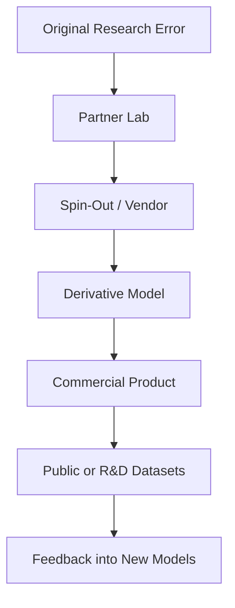
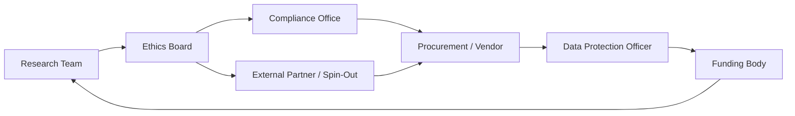

# ⚗️ Data Contamination Chain  
**First created:** 2025-11-07 | **Last updated:** 2025-12-29  
*How one early misclassification of personal data mutates into systemic reuse and long-term dataset contamination.*  

---

## 🛰 Orientation  

A single legal or procedural error — a dataset wrongly treated as “non-personal” — can multiply through time.  
Once marked as open or shareable, the data travels through academic, commercial, and public-private channels until it becomes effectively ubiquitous.  
This node explains that mechanism: how *inheritance of legitimacy* transforms a one-off mistake into an enduring breach.

---

## ✨ Key Features  

- Traces how a mis-categorised dataset propagates.  
- Defines the concept of **inherited legitimacy**.  
- Connects biometric data value to speed of contamination.  
- Provides a logic model for survivor investigations and regulatory mapping.  

---

## 🔍 Analysis  

### 1. **Origin Event — The Root Error**  
A dataset is mislabelled as “non-personal” or “public domain.”  
Reasons vary: human oversight, rushed ethics clearance, ambiguous consent forms, or faulty anonymisation tests.  
From this moment, every subsequent actor assumes lawful use.

### 2. **Delegated Due Diligence**  
Each downstream entity relies on the previous one’s assurance.  
Because auditing full provenance is costly, they rarely re-verify.  
This creates a *cascade of implied legality* — the heart of the contamination chain.

### 3. **Inheritance of Legitimacy**  

Each link inherits the legitimacy of the last without reassessing consent or lawfulness.

### 4. **Biometric Acceleration**  
Biometric data — voice, face, gait — acts as a contagion vector because:  
- It is uniquely identifiable.  
- It carries high market value.  
- It anchors other behavioural data, strengthening identifiability across datasets.  

Thus a single voice corpus can seed dozens of models and retrainings across sectors.

### 5. **Regulatory Blind Spots**  
- *Research exemptions* and *innovation partnerships* blur boundaries between academic and commercial use.  
- *Anonymisation* claims sidestep consent renewal.  
- *Procurement opacity* hides subcontracted processing.  

Each of these enables contamination to persist unnoticed.

### 6. **Investigatory Strategy**  
For survivors or auditors:  
1. **Identify the earliest plausible misclassification.**  
2. **Trace onward transfers** via publications, funding databases, or project partners.  
3. **Issue SARs** demanding documentation of data source, lawful basis, and onward recipients.  
4. **Map the inheritance loop** — who relied on whom for legitimacy.  
5. **Present findings as systemic risk**, not individual blame.  

The aim is accountability for structural failure, not personal fault.

---

## 🌓 Regulatory Feedback Loop  

*Description:*  
Each node validates the previous one’s assumptions: research cites ethics approval, ethics cites compliance, compliance cites procurement, and procurement cites funding oversight.  
The loop reinforces legitimacy even when the foundational consent is flawed.

---

## 🌌 Constellations  

🧿 ⚖️ 🧬 🛰️ — systemic diagnostics; legal opacity; data lineage; survivor analytics.

---

## ✨ Stardust  

data contamination, inherited legitimacy, dataset reuse, systemic breach, misclassification, research exemptions, due diligence, provenance mapping, biometric data, regulatory failure  

---

## 🏮 Footer  

*⚗️ Data Contamination Chain* is a living node of the Polaris Protocol.  
It documents how an initial data-classification error can propagate through institutional and commercial ecosystems, creating enduring privacy breaches and structural opacity.  

> 📡 Cross-references:
> 
> - [🕸️ Voice Lineage and Dataset Chain](../../../../Metadata_Sabotage_Network/🔥_Data_Risks/🧟‍♀️_Residual_Shadows/🕸️_voice_lineage_and_dataset_chain.md) — *tracing multi-entity reuse of voice data*  
> - [⚖️ Containment Contract Trace](../⚖️_Legal_State_Governance/⚖️_containment_contract_trace.md) — *analysis of layered contractual opacity*  
> - [🗣️ How to Detect if Your Voice Has Been Used in a Dataset](../../../Survivor_Tools/📱_Digital_But_Make_It_Secure/🗣️_how_to_detect_if_your_voice_has_been_used_in_a_dataset.md) — *forensic detection and SAR templates*  

*Survivor authorship is sovereign. Containment is never neutral.*  

_Last updated: 2025-12-29_
