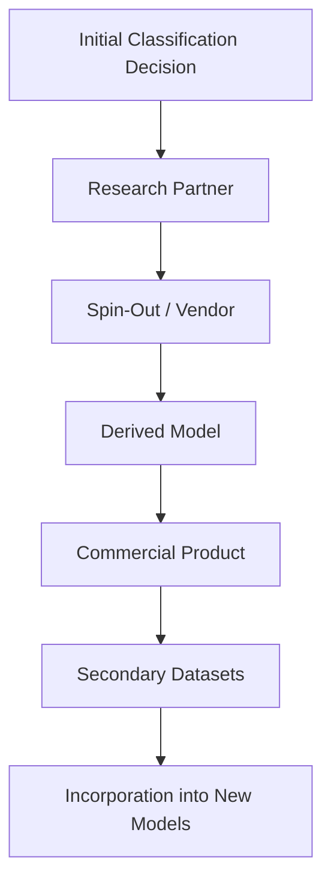
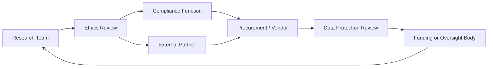

# ⚗️ Data Contamination Chain  
**First created:** 2025-11-07 | **Last updated:** 2026-04-24  
*How an early misclassification of personal data can propagate through reuse, creating long-term integrity and compliance risks.*  

---

## 🛰️ Orientation  

A single legal or procedural error — such as a dataset incorrectly classified as “non-personal” — can propagate across systems over time.  

Once treated as open or shareable, data may move through academic, commercial, and public-private environments with limited revalidation of its original status.  

This node maps that mechanism:  
how **assumed legitimacy** can be inherited across systems, turning an initial error into a persistent governance risk.

---

## ✨ Key Features  

- Traces how misclassified datasets can propagate through reuse  
- Defines **inherited legitimacy** as a structural risk mechanism  
- Identifies conditions under which contamination accelerates  
- Provides a practical model for audit, investigation, and regulatory mapping  

---

## 🔍 Analysis  

### 1. **Origin Event — Initial Misclassification**  
A dataset is treated as “non-personal,” “anonymised,” or “public domain,”  
based on:

- incomplete anonymisation,  
- ambiguous consent frameworks,  
- time or resource constraints,  
- or misinterpretation of legal thresholds.  

From this point, downstream users may rely on that classification without reassessment.

---

### 2. **Delegated Due Diligence**  
Subsequent actors often depend on prior assurances rather than conducting full provenance checks.  

Because:

- verifying origin is resource-intensive,  
- liability is assumed to have been addressed upstream,  
- and documentation may be incomplete,  

this creates a **chain of delegated trust**.

---

### 3. **Inheritance of Legitimacy**  

```mermaid
graph TD
A[Initial Classification Decision] --> B[Research Partner]
B --> C[Spin-Out / Vendor]
C --> D[Derived Model]
D --> E[Commercial Product]
E --> F[Secondary Datasets]
F --> G[Incorporation into New Models]
```
At each stage, legitimacy is typically assumed rather than independently verified.  

This does not require bad faith—only **insufficient revalidation at scale**.

---

### 4. **Biometric Acceleration**  
Certain data types increase propagation risk, particularly:

- voice,  
- facial imagery,  
- gait or behavioural signatures.  

These datasets:

- are difficult to fully anonymise,  
- retain linkage potential across systems,  
- and carry high commercial and research value.  

As a result, they can act as **amplifiers of initial classification errors**.

---

### 5. **Regulatory Blind Spots**  

Propagation is more likely where:

- research–commercial boundaries are blurred,  
- anonymisation standards are inconsistently applied,  
- subcontracting chains lack transparency,  
- procurement documentation is incomplete.  

These conditions do not guarantee failure,  
but they **increase the likelihood of unnoticed propagation**.

---

### 6. **Investigatory Approach**  

For auditors, regulators, or affected individuals:

1. Identify the earliest plausible classification decision  
2. Trace downstream reuse (publications, partnerships, funding)  
3. Request documentation on lawful basis and provenance (e.g. SARs)  
4. Map reliance chains — who relied on whose assessment  
5. Frame findings as **systemic risk**, not individual fault  

The objective is to understand **where validation failed**, not to assign blame to a single actor.

---

## 🌓 Reinforcing Validation Loops  

```mermaid
graph LR
A[Research Team] --> B[Ethics Review]
B --> C[Compliance Function]
C --> D[Procurement / Vendor]
D --> E[Data Protection Review]
E --> F[Funding or Oversight Body]
F --> A
B --> G[External Partner]
G --> D
```
*Description:*  
Different governance layers may rely on each other’s assurances.
This can create closed validation loops, where legitimacy is reinforced
even if the original classification was flawed.  

---

---

## 🌌 Constellations  

🧿 ⚖️ 🧬 🛰️ — data governance, legal risk, provenance, systemic diagnostics  

---

## ✨ Stardust  

data integrity, dataset reuse, provenance risk, misclassification, delegated due diligence, biometric data, regulatory gaps, audit strategy  

---

## 🏮 Footer  

*⚗️ Data Contamination Chain* is a living node of the Polaris Protocol.  
It examines how early-stage classification decisions can propagate through complex data ecosystems, creating long-term governance and compliance risks.  

> 📡 Cross-references:
> 
> - [🕸️ Voice Lineage and Dataset Chain](../../../../Metadata_Sabotage_Network/🔥_Data_Risks/🧟‍♀️_Residual_Shadows/🕸️_voice_lineage_and_dataset_chain.md)  
> - [⚖️ Containment Contract Trace](../⚖️_Legal_State_Governance/⚖️_containment_contract_trace.md)  
> - [🗣️ How to Detect if Your Voice Has Been Used in a Dataset](../../../Survivor_Tools/📱_Digital_But_Make_It_Secure/🗣️_how_to_detect_if_your_voice_has_been_used_in_a_dataset.md)  

*Survivor authorship is sovereign. Containment is never neutral.*  

_Last updated: 2026-04-24_
