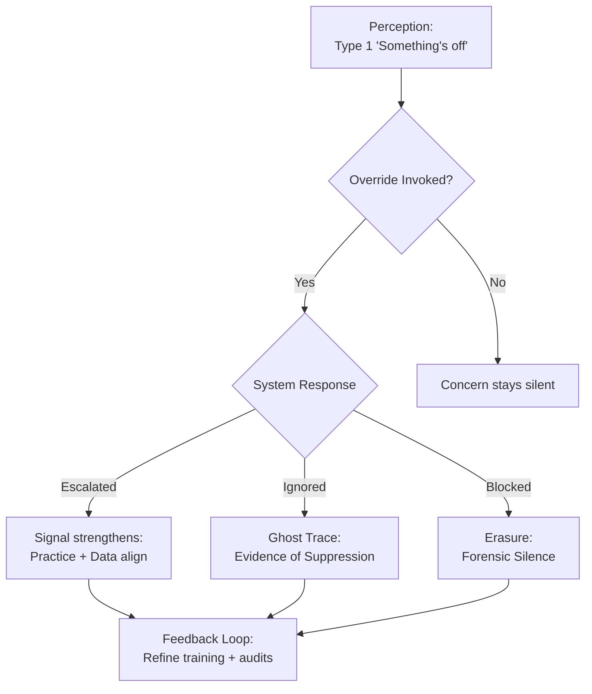

# ❓ Override Question as Silence Breaker  
**First created:** 2025-09-23 | **Last updated:** 2025-12-29  
*Professional overrides as both a safeguard and a diagnostic signal of systemic silence.*  

---

## 🌱 Scope  

Every structured risk system has a *final question*:  
*“Do you believe further action is needed, regardless of the score?”*  

This “override” legitimises **Type 1 pattern recognition** (*Thinking, Fast and Slow*). It makes space for professional intuition — the noticing of *“something isn’t right”* before metrics catch up.  

---

## ✨ Functions  

- **Safety net:** ensures concern cannot be buried under thresholds.  
- **Bias exposure:** shows whether concerns are consistently ignored, minimised, or punished.  
- **Forensic marker:** absence of overrides in high-risk environments is itself suspicious — silence masquerading as safety.  

---

## 🧠 Intuition Literacy  

Override depends on trusting Type 1 recognition.  

- Marginalised communities often display sharpened intuition, not as privilege, but as survival adaptation.  
- The skill compensates for structural hostility; it should never be wielded as a cudgel against those who don’t demonstrate it.  
- Its presence testifies to the *stress load of discrimination*: people must carry extra perceptual labour simply to progress.  

Intuition shows up across domains:  
- Nurses noticing decline before charts.  
- Sherlock Holmes reading traces like a conjurer.  
- Tarot readers or psychics naming patterns without formal data.  

👉 Intuition literacy is the invisible counterpart to data literacy. Both are needed to break silence.  

---

## 🪼 Flowchart: Override Outcomes  

---

## 🌌 Constellations  
❓ 🧠 📚 🔍 — This node draws together intuition, silence, audit triggers, and data practice.

**Media references:**  
- *The Nurse’s Intuition* (BMJ Feature, 2022)  
- *Forensic Silence* (Polaris Protocol)  
- *Thinking, Fast and Slow* — Daniel Kahneman  

---

## ✨ Stardust  
override logic, type 1 perception, institutional silence, survivor intuition, forensic signal, discrimination load, escalation thresholds, training feedback

---

## 🏮 Footer  

*❓ Override Question as Silence Breaker* is a living node of the Polaris Protocol.  
It situates professional override as both a safeguard and a probe for forensic silence.

> 📡 Cross-references:
> 
> - [📚 Forensic Silence](../📚_Narrative_Management/📚_forensic_silence.md) - *Active narrative gaps where records were scrubbed — the hole itself becomes evidence*  
> - [🧠 Intuition as Skill](../../🫀_Our_Hearts_Our_Minds/🌱_Human_Principles/🧠_intuition_as_skill.md) - *Type 1 recognition as a trainable, bounded skill — from safeguarding overrides to psychic theatre*  

*Survivor authorship is sovereign. Containment is never neutral.*  

_Last updated: 2025-12-29_
