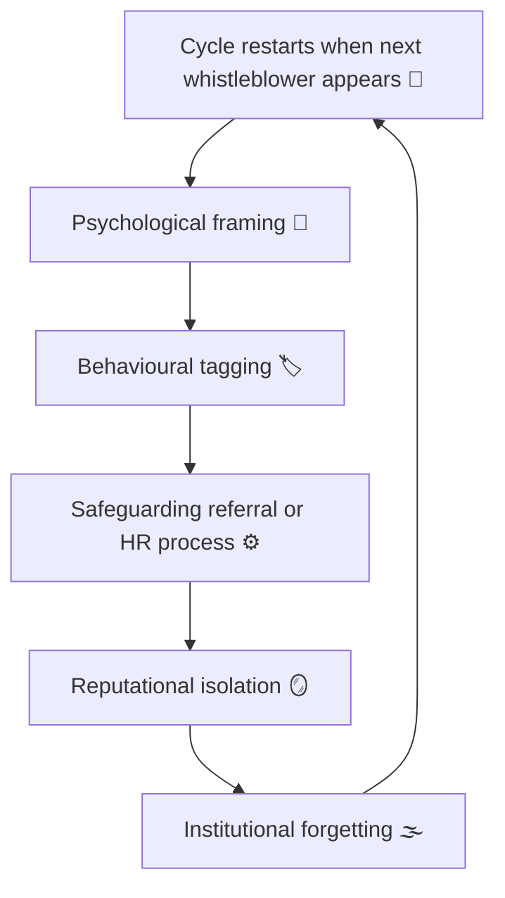

# 🌀 Behavioural Containment — When Governance Becomes Psychology  
**First created:** 2025-11-11 | **Last updated:** 2025-12-29  
*When systems explain dissent as disorder.*  

---

## 🧭 Orientation  

When polite containment and reputational management no longer suffice, institutions often reach for the language of psychology.  
Disagreement becomes “distress”; persistence becomes “fixation.”  
The system reclassifies critique as behaviour to be *managed*, not argument to be heard.  

This is **behavioural containment** — the psychologisation of governance.

---

## ⚖️ Definition  

> **Behavioural containment** describes the conversion of political or procedural conflict  
> into an interpretive frame of mental state, motivation, or risk behaviour.  

It is the next stage of reputational governance: when civility fails, pathology begins.

---

## 🧩 Operational Pattern  

| Stage | Apparent Frame | Function |
|:------|:----------------|:----------|
| **1️⃣ Redescription** | “This person is upset, not strategic.” | Converts structural harm into personal emotion. |
| **2️⃣ Diagnostic Drift** | “They seem fixated.” | Turns persistence into pathology. |
| **3️⃣ Behavioural Labeling** | “They are showing concerning patterns.” | Creates justification for exclusion. |
| **4️⃣ Procedural Translation** | “We must manage this safely.” | Invokes safeguarding to silence critique. |
| **5️⃣ Institutional Forgetting** | “It was a mental health case, not a governance issue.” | Erases systemic responsibility. |

---

## 🧮 Containment Flow  

---

## 🪞 Cultural Dynamics  

- **Therapeutic surveillance:** emotional tone becomes a governance metric.  
- **Psychological projection:** system attributes its own anxiety to the challenger.  
- **Soft coercion:** wellness language conceals disciplinary action.  
- **Documentary distortion:** reports use clinical tone to remove context.  

---

## 🧰 Governance Implications  

| Domain | Expression | Risk |
|:--------|:------------|:------|
| **Safeguarding** | Survivor credibility reframed as instability. | Data and testimony discounted. |
| **Academia** | Dissent categorised as “conduct issue.” | Removes debate from peer domain. |
| **Public Service** | Whistleblowing treated as “stress reaction.” | Policy failure unexamined. |

---

## 🧱 Counter-Strategies  

1. **Translate back to systems language** — reassert procedural context.  
2. **Demand parallel documentation** — require both behavioural and structural logs.  
3. **Invoke external verification** — bring independent analysts, not counsellors.  
4. **Track tone shifts** — map when discourse moves from evidence to affect.  

---

## 🌌 Constellations  

🌀 🤝 🎭 🪞  

Behavioural Containment forms the hinge between **Narrative Management** and **Containment Logic**.  
It shows how governance absorbs critique by converting it into emotion — and how that conversion maintains institutional stability.

---

## ✨ Stardust  

behavioural containment, psychologisation, governance psychology, survivor credibility, institutional response, reputational management, safeguarding, tone drift, system pathology, administrative coercion

---

## 🏮 Footer  

*🌀 Behavioural Containment — When Governance Becomes Psychology* is a living node of the Polaris Protocol.  
It maps how systems use mental health framing to convert legitimate structural critique into manageable affect — and how to restore epistemic balance.

> 📡 Cross-references:
> 
> - [🤝 Polite Containment — How Civility Becomes a Control Mechanism](../../../../Metadata_Sabotage_Network/Structural_Analysis/🧼_System_Leakage_Signatures/🤝_polite_containment.md)  
> - [🎭 Reputation as Governance — How Institutions Script Their Own Credibility](../📚_Narrative_Management/🎭_reputation_as_governance.md)  
> - [💣 Syntactic Drift and Clone Tone](../../../../Metadata_Sabotage_Network/Narrative_And_Psych_Ops/🪆_Narrative_Interference/💣_syntactic_drift_and_clone_tone.md)
> - [🧬 Twinning as Reputation Repair](../../../../Metadata_Sabotage_Network/Governance_And_Containment/🈴_Allies_And_Ethics/🧬_twinning_as_reputation_repair.md)  

*Survivor authorship is sovereign. Containment is never neutral.*  

_Last updated: 2025-12-29_
