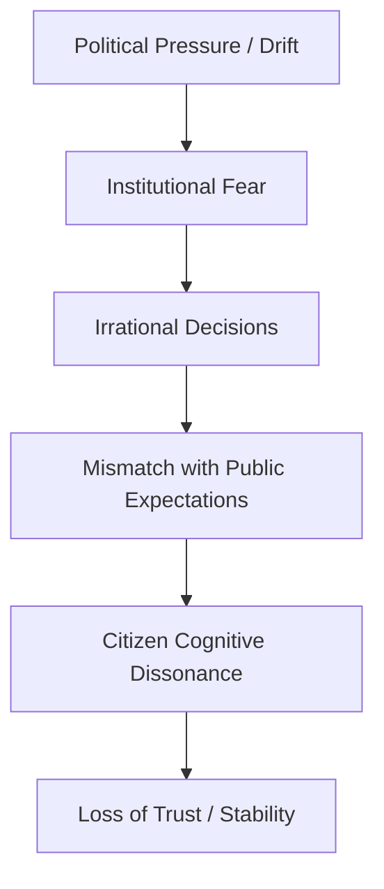

# 🌀 When System Behaviour Stops Making Sense: Cognitive Dissonance in Drift  
**First created:** 2025-11-19 | **Last updated:** 2025-12-29  
*The eerie psychological, bureaucratic, and political moment when institutions begin behaving irrationally, inconsistently, or self-defeatingly — and why this is one of the most reliable indicators of authoritarian drift.*  

---

## 🛰️ Orientation  
One of the earliest, most disorienting symptoms of drift is not violence, extremism, or explicit authoritarianism.  
It is something subtler and more uncanny:

> **You realise the system is behaving in ways that make no rational sense.**

Not just flawed.  
Not just slow.  
But **incoherent**, contradictory, inconsistent, and structurally illogical.

This cognitive dissonance is not a personal misreading.  
It is a structural signal.

Pairs with:  
- 🚫 *when_no_one_steps_in*  
- 🗂️ *when_institutions_start_treating_you_as_a_category_not_a_person*  
- ⚡ *why_some_people_become_systemic_lightning_rods*  
- 🧭 *how_authoritarian_drift_feels_from_the_inside*

---

## ✨ Key Features  
- Describes the “uncanniness” of drift-exposed bureaucracy.  
- Explains why institutional behaviour becomes irrational under pressure.  
- Validates the emotional discomfort and confusion that follow.  
- Differentiates harmless inefficiency from dangerous incoherence.  
- Provides a Polaris model for interpreting system nonsense as data.

---

## 🧿 Analysis / Content  

### 🌀 1. What “System Behaviour Not Making Sense” Actually Means  
It’s the moment when:

- actions contradict policies  
- decisions don’t follow evidence  
- staff cannot explain their own reasoning  
- rules change mid-process  
- outcomes contradict the system’s goals  
- errors escalate instead of resolving  
- communication becomes evasive or opaque  
- correction becomes impossible  

You know how the system *should* behave.  
And you can feel that it *is not doing that.*

This mismatch is the essence of drift dissonance.

---

### 🔍 2. The Lived Experience of Dissonance  
People describe:

- “None of this adds up.”  
- “I’m not imagining this, right?”  
- “I don’t understand why they’re acting like this.”  
- “This feels like a different country than the one I grew up in.”  
- “They won’t say the truth out loud.”  
- “Every answer contradicts the last one.”  
- “Everyone seems confused but pretending they’re not.”  

Dissonance feels surreal.  
It is the psychological damage of systemic irrationality.

---

### 🧨 3. Why Institutions Start Behaving Irrationally  
Under drift, institutions experience:

#### **a) Panic logic**  
Fear-based decision-making replaces proportionality.

#### **b) Hierarchy paralysis**  
Staff are too scared to act without permission.

#### **c) Policy incoherence**  
Contradictory directives from political leadership.

#### **d) Data contamination**  
Systems are acting on false inputs.

#### **e) Overcentralisation**  
One person or office becomes a bottleneck.

#### **f) Cultural war distortion**  
Institutions act to avoid press attacks, not to fulfil remit.

#### **g) Resource collapse**  
Not enough staff → not enough organisational cognition.

The outcome is behaviour that violates internal logic.

---

### 🧬 4. The Dissonance Pipeline  

Cognitive dissonance is not paranoia.  
It is recognition of mismatch.

---

### ⚡ 5. Why Minorities Notice First  
Those closest to system edge cases feel the irrationality before the majority.

Minoritised people experience:

- contradictory treatment  
- risk-based interpretation  
- data errors with high stakes  
- cultural misreading  
- inconsistent decision-making  
- policy applied unevenly  
- tone shifts  
- rapidly changing institutional behaviour  

They encounter drift where others encounter friction.

---

### 🧩 6. Cognitive Dissonance as an Early-Warning Sensor  
Dissonance is a sign that:

- internal constraints are collapsing  
- staff are acting defensively, not functionally  
- error-correction is failing  
- organisational purpose is drifting  
- political anxiety is permeating departments  
- safeguarding and Prevent logic are overriding nuance  
- the bureaucracy is “breaking character”  

Citizens feel this emotionally before they articulate it intellectually.

---

### 🧱 7. The Dangerous Phase: Normalising the Nonsense  
If cognitive dissonance is ignored, citizens begin to:

- rationalise incoherence  
- accept inconsistency as “just how it is”  
- internalise institutional fear  
- reduce expectations  
- avoid interaction with the state  
- self-censor  
- lose trust  
- absorb democratic erosion as normal  

This is how drift embeds.

---

### 🧭 8. The Polaris Reframe  
When system behaviour stops making sense:

> **The problem is not your perception.  
> The problem is the system’s behaviour.**

Your confusion is a diagnostic tool.  
Your discomfort is accurate.  
Your clarity is not a liability — it is insight.

---

## 🏮 Footer  
*🌀 When System Behaviour Stops Making Sense: Cognitive Dissonance in Drift* is part of Polaris’ Democratic Drift Phenomenology cluster.  
It validates the uncanny recognition that institutions are no longer behaving rationally, and reframes that recognition as a form of structural intelligence rather than personal anxiety.

> 📡 Cross-references:
> 
> - [🧩 The Recognition Event: When You Realise You’re Not Imagining It](../../🫀_Our_Hearts_Our_Minds/🌱_Human_Principles/🧩_the_recognition_event.md)  
- [*Pending:* 🚫 when_no_one_steps_in]  
- [⚡ Why Some People Become Systemic Lightning Rods](../../🦕_Elder_Influencers/🕊️_Just_Boxes/⚡_why_some_people_become_systemic_lightning_rods.md)  
- [🗂️ When Institutions Start Treating You as a Category, Not a Person](../../../../Metadata_Sabotage_Network/Narrative_And_Psych_Ops/🪆_Narrative_Interference/🗂️_when_institutions_start_treating_you_as_a_category_not_a_person.md)  
- [🧭 How Authoritarian Drift Feels From the Inside](../../🫀_Our_Hearts_Our_Minds/🌱_Human_Principles/🧭_how_authoritarian_drift_feels_from_the_inside.md)  
- [🧠 The Continuum of Authoritarian Drift](../../../../Metadata_Sabotage_Network/Governance_And_Containment/🈺_Governance_And_Prevent/🧠_the_continuum_of_authoritarian_drift.md)  

*Survivor authorship is sovereign. Containment is never neutral.*  

_Last updated: 2025-12-29_
