# 📋 Tickbox vs Cognitive Load  
**First created:** 2025-09-24 | **Last updated:** 2025-10-14  
*A feedback loop between institutional minimalism and survivor exhaustion.*

---

```mermaid
flowchart TD
  A[📋 Tick-Box Compliance as Containment] -->|Minimalism & optics| B[😴 Cognitive Load as Infrastructure]
  B -->|Fatigue & futility| A
```

*Loop of containment: institutional minimalism breeds survivor exhaustion; exhaustion sustains institutional minimalism.*

---

## 🌌 Constellations  
📋 😴 🧠 🩹 — This node maps a recurring exhaustion loop that emerges from surface-level compliance structures.

## ✨ Stardust  
tickbox, exhaustion, compliance theatre, cognitive load, survivor fatigue, containment loop

## 🏮 Footer  

*Tickbox vs Cognitive Load* is a living node of the Polaris Protocol.  
It diagrams a self-reinforcing loop where institutional minimalism (tick-box culture) perpetuates survivor exhaustion, and that exhaustion enables further institutional withdrawal.

> 📡 Cross-references:
> 
> - [🧠 Psychological Containment](../../../../Metadata_Sabotage_Network/Narrative_And_Psych_Ops/🧠_Psychological_Containment/README.md) - 
*Polaris Protocol doctrine node — behavioural science repurposed as state containment*  
> - [⚖️ Containment Contract Trace](../⚖️_Legal_State_Governance/⚖️_containment_contract_trace.md) - *How “compliance”, secrecy, and CVE practice in the UK create plausible deniability, gaslighting, and governance failure — with remedies*  
> - [📋 Tick-Box Compliance as Containment](./📋_tick_box_compliance_as_containment.md) - *Institutional minimalism that simulates accountability while erasing systemic responsibility*  

*Survivor authorship is sovereign. Containment is never neutral.*  

_Last updated: 2025-10-14_
