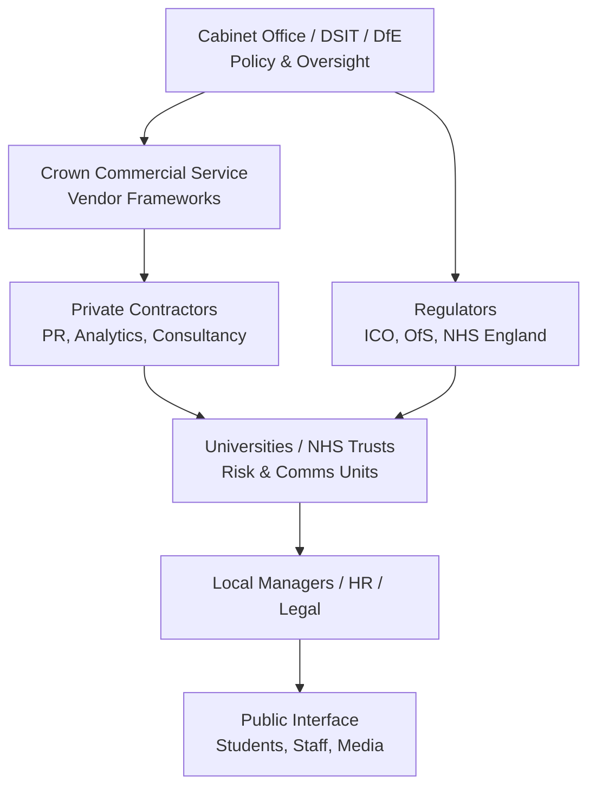

# 🕸️ Macro Containment Architecture  
**First created:** 2025-11-08 | **Last updated:** 2026-08-14  
*How government-level risk and communications systems cascade containment logic through public institutions.*  

---

## 🧭 Orientation  
This node sketches the *vertical chain* linking Whitehall “risk & comms” policy to university and NHS practice.  
Containment is rarely local; it’s designed into procurement frameworks, regulatory templates, and shared service language.

---

## 🧩 Key Features  
- **Tiered structure:** Policy → Contractor → Regulator → Institution.  
- **Unified vocabulary:** “reputational impact,” “stakeholder management,” “narrative alignment.”  
- **Procurement vectors:** Crown Commercial Service frameworks for Strategic Comms & Risk.  
- **Feedback loop:** Public-order or data incidents escalate via Cabinet Office risk boards and return as “best-practice” guidance.  
- **Containment by design:** story management precedes substance handling.

---

## 🔍 Analysis / Content  

**Interpretation:**  
- Policy level defines *risk language*.  
- Contractors convert policy into toolkits and dashboards.  
- Regulators reinforce uptake through compliance expectations.  
- Institutions implement these templates internally, appearing autonomous but governed by shared infrastructure.  

Containment therefore functions as a *distributed protocol*: identical reflexes across sites, each tracing back to the same administrative DNA.

---

## 🌌 Constellations  
🕸️ 🛰️ 🔮 — Connects macro-policy design to micro-institutional behaviour.

---

## ✨ Stardust  
risk management, communications strategy, containment architecture, public sector procurement, reputation management, regulatory coupling, Whitehall policy, systemic analysis, Polaris protocol

---

## 🏮 Footer  

*🕸️ Macro Containment Architecture* is a living node of the Polaris Protocol.  
It visualises how national risk and communications frameworks produce uniform containment reflexes across the public sector.  

> 📡 Cross-references:
> 
> - [Big Picture Protocols] — systemic containment analysis  
> - [Containment Scripts] — platform and institutional casefiles  

*Survivor authorship is sovereign. Containment is never neutral.*  

_Last updated: 2026-08-14_
