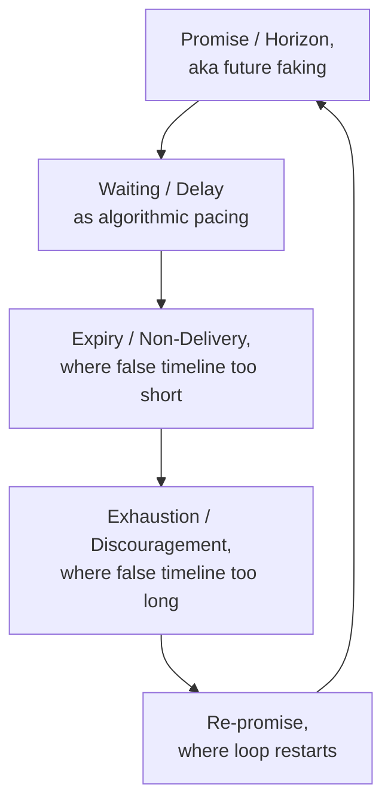

# 🦯 Algorithmic Delay and Pacing  
**First created:** 2025-09-14 | **Last updated:** 2025-10-14  
*How governance manipulates tempo — slowing translations, stretching timelines, throttling urgency until action dies.*  

---

## 🛰️ Core Pattern  

Containment does not only silence.  
It also *paces*.  

- **Translation lag** — responses arrive too late to be useful, citing “review cycles” or “system processing.”  
- **Deadline stretching** — referrals pushed just past statutory cut-offs, so survivors appear “non-compliant.”  
- **Urgency throttling** — algorithmic dampers on signals of risk, slowing visibility until the moment of crisis has passed.  
- **Loop elongation** — audits, consultations, and feedback loops spun out over months to exhaust momentum.  
- **Future faking** — promises of imminent change or reform that never materialises, creating a false horizon that keeps survivors waiting.  
- **False timelines** — windows deliberately set *too long* (to discourage or exhaust) or *too short* (to guarantee disappointment when no action appears).  

Governance teaches the body to wait — until waiting becomes consent.  

---

## ✨ Examples  

- **Throttling chokepoints** (2025-08-26) — field logs record deliberate slowdowns in message and upload pathways [oai_citation:0‡index.md 12.txt](file-service://file-67ZKa9usAoXNfHKTEnzdBo).  
- **Retrospective throttling** (2025-09-22) — search and cross-reference visibility reduced *after* survivor testimony, eroding archival urgency [oai_citation:1‡index.md 12.txt](file-service://file-67ZKa9usAoXNfHKTEnzdBo).  
- **Psychological containment** — pacing delays used as compliance theatre, encouraging “patience” as proof of being reasonable [oai_citation:2‡_where_to_go.md 1.txt](file-service://file-UL2r2skTpE2uCkGNXpHw7V).  
- **Future faking** — survivors promised that “next cycle,” “next review,” or “new leadership” will bring resolution, while nothing changes.  
- **False expectations management** — official reviews set 18 months ahead (so urgency dies), or 3 weeks ahead (so the guaranteed non-delivery crushes morale).  

---

## 🗣 Discussion  

Algorithmic delay mirrors tactics long recognised in interpersonal and cult dynamics.  

- **Gendered roots** — In heterosexual relationships, women often report unmet expectations as their primary frustration: being clear, then ignored. This maps directly onto *future faking* and *false timelines*.  
- **Abuse playbooks** — Pick-up artist forums and later MGTOW / alt-right spaces codified “future faking” as a tactic of control. What begins in relationships becomes part of wider political technique.  
- **Cult parallels** — Repeated failed prophecies (Heaven’s Gate’s shifting raptures, recent “rapture date” movements) show how false horizons keep followers trapped. Each non-event doesn’t break the loop — it tightens it.  
- **Embodied urgency** — As in music like Muse’s *Time Is Running Out*, pacing itself produces bodily tension. Algorithmic delay works the same way: it is felt in the nervous system as urgency denied.  

---

## ➰ Loop of Delay and False Expectations  

A visual cycle showing how algorithmic pacing, future faking, and false timelines interlock.  

*This loop captures how survivors are pulled into repeating cycles of anticipation, waiting, disappointment, and re-promise — where urgency is eroded and action always slips just out of reach.*

---

## 🔥 Why It Matters  

Tempo is governance.  
- **Speed kills resistance.** Urgency is needed to mobilise.  
- **Delay kills urgency.** Pacing dissolves solidarity by making each step feel belated.  
- **False timelines corrode trust.** They create cycles of anticipation and disappointment, eroding survivor confidence until disengagement feels like the only rational response.  

Every elongated or manipulated timeline is a covert judgement:  
that survivor memory is not urgent,  
that bureaucratic comfort matters more than risk,  
that a slow “consideration” is neutral.  

It is never neutral.  

---

## 🌌 Constellations  

🌀 🧿 🛰️ 🔮 — Tempo control sits inside governance diagnostics.  

**Media sources:**  
- Shoshana Zuboff — *The Age of Surveillance Capitalism* (behavioural pacing and delay as strategy)  
- Franz Kafka — *The Trial* (justice as endless procedural deferral)  
- UK Grenfell Inquiry timelines (public urgency stretched until memory dissipates)  
- NHS safeguarding review delays (false expectations management in “independent” audits)  
- Undercover Policing Inquiry (2015–ongoing) — survivors trapped in cycles of promises, phase delays, and endlessly deferred accountability  
- *Brazil* (1985, dir. Terry Gilliam) — bureaucracy as suffocating delay machinery  
- *I, Daniel Blake* (2016, dir. Ken Loach) — survival worn down by procedural stalling  
- Destiny’s Child — *Bills, Bills, Bills* (1999) — unmet promises and extraction in relationships  
- Muse — *Time Is Running Out* (2003) — the *pacing of the music itself* conveys urgency, mirroring the embodied frustration of delay  
- Failed prophecy movements — Heaven’s Gate, recent “rapture dates” — cult timelines reset by non-events, echoing false horizons in governance  
- PUA / MGTOW tactics — “future faking” as relationship manipulation, now mainstreamed into alt-right playbooks   

---

## ✨ Stardust  

algorithmic delay, pacing, throttling, urgency, governance tempo, psychological containment, systemic delay, suppression scripts, future faking, false timelines, expectations management  

---

## 🏮 Footer  

*Algorithmic Delay And Pacing* is a living node of the Polaris Protocol.  
It documents how containment scripts manipulate time itself — slowing, stretching, faking horizons, or managing expectations until survivor urgency dissipates.  

> 📡 Cross-references:
> 
> - [🌀 Systems &_Governance](../README.md) — *parent cluster of governance diagnostics*  
> - [🧠 Psychological Containment](../../../../Metadata_Sabotage_Network/Narrative_And_Psych_Ops/🧠_Psychological_Containment/README.md) — *delay as compliance theatre*  
> - [🛰️ Throttling Chokepoints (26 August 2025)](../../../Field_Logs/🛰️_throttling_chokepoints_2025-08-26.md) — *field log evidence*  

*Survivor authorship is sovereign. Containment is never neutral.*  

_Last updated: 2025-10-14_  
