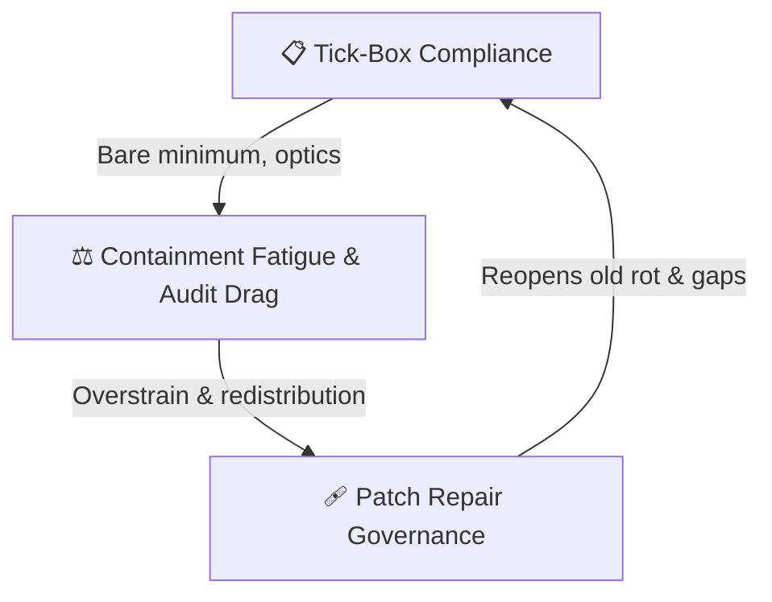

# 🩹 Triad — Tickbox, Containment Fatigue & Patch Repair  
**First created:** 2025-09-25 | **Last updated:** 2026-01-06  
*A containment cycle where minimalism breeds strain, exposing rot patched with further minimalism.*  

---

*Cycle of containment decay: minimalism breeds strain; strain exposes rot; rot is patched with more minimalism.*

---

## 🌌 Constellations  
📋 ⚖️ 🩹 🧠 — This node charts how institutional minimalism mutates into fatigue and repeated patch repairs.

## ✨ Stardust  
tickbox compliance, containment fatigue, audit drag, patch repair governance, institutional decay, minimalism cycle

## 🏮 Footer  

*🩹 Triad — Tickbox, Containment Fatigue & Patch Repair* is a living node of the Polaris Protocol.  
It visualises how bare-minimum compliance leads to containment fatigue, exposing deeper rot that is then patched again with minimalistic fixes.

> 📡 Cross-references:
> 
> - [📋 Tickbox vs Cognitive Load](./📋_loop_tickbox_vs_cognitive_load.md) - *A feedback loop between institutional minimalism and survivor exhaustion*
> - [🩹 Patch Repair Governance](./🩹_patch_repair_governance.md) - *Containment systems as stitched patchwork — holes covered until pressure elsewhere forces old rot to reopen*  
> - [⚖️ Containment Contract Trace](../⚖️_Legal_State_Governance/⚖️_containment_contract_trace.md) - *Unconsented containment, metadata silencing, and covert NDAs*  

*Survivor authorship is sovereign. Containment is never neutral.*  

_Last updated: 2026-01-06_
