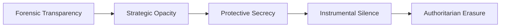
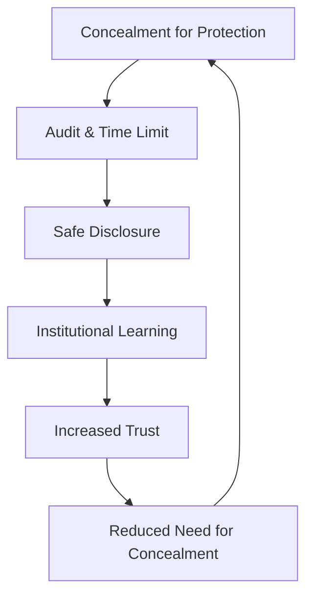

# 🪞 Ethical Censorship Continuum  
**First created:** 2025-11-01 | **Last updated:** 2026-01-06  
*Mapping the moral terrain between concealment for protection and concealment for power.*  

---

## 🛰️ Orientation  

Censorship is rarely absolute.  
Most of the time, it lives on a continuum between care and control — from a single withheld sentence to entire histories excised for convenience.  
This node outlines the ethical spectrum of concealment: when silence protects, when it harms, and when it simply delays accountability.  

The framework draws on Hobbes, Kant, and Bentham, extended through the *Polaris* lens of **survivor voice fidelity**:  
how truth is handled when institutions claim to act in our best interest.

---

## ⚖️ Classical Foundations  

| Philosopher | Principle | Position on Concealment | Modern Resonance |
|--------------|------------|------------------------|------------------|
| **Thomas Hobbes** | Stability through authority | Truth is secondary to order; censorship as structural necessity. | Wartime information control, emergency secrecy. |
| **Immanuel Kant** | Duty and universality | Lying undermines the moral law; truth is an absolute duty. | Human-rights frameworks, whistleblower ethics. |
| **Jeremy Bentham** | Consequentialism | Concealment justified if it prevents greater harm. | Public-interest tests, national-security exemptions. |
| **Polaris Extension** | Accountability after delay | Concealment tolerated only if fully logged and time-limited. | Survivor voice fidelity; delayed disclosure with audit trail. |

Each stance is defensible in context, catastrophic in excess.

---

## 🕳️ Diagram — The Continuum of Concealment  

Censorship becomes unethical not at a single point, but when movement along the line becomes one-way.

---

## 🔥 Applied Ethics — When Concealment Serves Care  

| Scenario | Ethically Permissible If | Polaris Caution |
|-----------|-------------------------|----------------|
| **Operational secrecy** (e.g. active investigation) | Transparency could endanger lives or compromise evidence. | Must include post-event disclosure plan. |
| **Privacy protection** (e.g. victim anonymity) | Silence shields vulnerability, not authority. | Revisit once risk subsides. |
| **Crisis communication gating** | Sequencing truth to prevent panic. | Requires clear sunset clause and independent audit. |
| **Strategic opacity in diplomacy** | Temporary cover for negotiation. | Publish rationale when safe; avoid precedent creep. |

---

## 🪼 When Concealment Becomes Control  

The threshold is crossed when concealment outlives the threat it was meant to neutralise.  
At that point, secrecy stops being protection and becomes **curation of perception**.  
Authoritarian systems thrive here: they treat opacity as asset rather than emergency.  

Soft democracies flirt with the same logic whenever they equate *stability* with *silence*.  
Once moral hygiene becomes brand management, truth is already rationed.

---

## 🐦‍🔥 Survivor Voice Fidelity — Restorative Disclosure  

Polaris adds a post-crisis clause: every concealment must carry its own **declassification mechanism**.  
If the justification was safety, transparency must follow when safety is restored.  
Every hidden truth deserves a re-entry plan — the ethical equivalent of repatriation.

---

## 🫀 The Ethics Loop  

Without the audit stage, the loop collapses into authoritarian inertia.

---

## 🪬 Reflection — The Emotional Logic of Withholding  

Every act of censorship is also an act of care in disguise.  
Officials convince themselves they are sparing someone — the public, a victim, a reputation — from harm.  
That conviction, even when sincere, breeds blindness: the sense that silence is the same as kindness.  
Polaris argues the opposite: silence is ethical only if it carries a built-in method for its own reversal.

---

## 🌌 Constellations  

🪞 📚 📮 🧠  

---

## ✨ Stardust  

ethical censorship, concealment continuum, survivor voice fidelity, hobbes kant bentham, transparency, strategic opacity, delayed disclosure, institutional ethics  

---

## 🏮 Footer  

*🪞 Ethical Censorship Continuum* defines the moral gradient between protective silence and authoritarian erasure.  

> 
> - [📚 The Banned Book Paradox](../../🪄_Expression_Of_Norms/🎶_Banned_Broadcasts_Cooperative/📚_banned_book_paradox.md)  
> - [🤭 Who Is Scared of The Internationale?](../../🪄_Expression_Of_Norms/🎶_Banned_Broadcasts_Cooperative/🤭_who_is_scared_of_the_internationale.md)
> - [🧿 Canonisation by Erasure](../../🪄_Expression_Of_Norms/🎶_Banned_Broadcasts_Cooperative/🧿_canonisation_by_erasure.md)  
> - [📊 Navy Transparency as Resistance](../../🪄_Expression_Of_Norms/🎶_Banned_Broadcasts_Cooperative/data/📊_navy_transparency_as_resistance.md)  
> - [🫀 Pathologising Sensitivity as Containment](../../../Containment_Scripts/Suppression_Modes/🫀_pathologising_sensitivity_as_containment.md)  

*Silence without expiry is not ethics; it’s inertia disguised as care.*

_Last updated: 2026-01-06_
