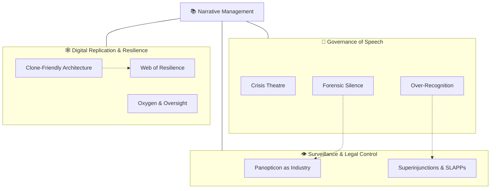

# 📚 Narrative Management  
**First created:** 2025-10-13 | **Last updated:** 2025-10-14  
*How speech, silence, and storytelling are engineered to stabilise power.*

---

## 🛰️ Orientation  

**Narrative Management** forms the communicative limb of *[🌀 Systems & Governance](../README.md)*.  
It explores how discourse itself is governed — through censorship, over-recognition, and reputational containment.  
Where *[⚖️ Legal & State Governance](../⚖️_Legal_State_Governance/README.md)* tracks the **rules**, and *[💫 Containment Logic](../💫_Containment_Logic/README.md)* exposes the **procedures**,  
**Narrative Management** focuses on the **stories**: what can be said, who gets to speak, and how credibility is managed as a political asset.  

It studies both suppression and counter-narrative — how states, corporations, and survivors fight over framing.

---

## ✨ Key Themes  

- **Crisis Theatre** — emergency as governance mode.  
- **Forensic Silence** — evidentiary gaps by design.  
- **Over-Recognition** — institutional listening as anaesthetic.  
- **Panopticon as Industry** — marketised watchfulness and moral monetisation.  
- **Superinjunctions & SLAPPs** — legal speech containment in sensitive cases.  
- **Clone-Friendly Architecture** — replication incentives in digital ecosystems.  
- **Web of Resilience** — decentralised counter-narratives and survivor knowledge networks.  

---

## 🛸 Included Nodes  

- [👁️ Panopticon as Industry](./👁️_panopticon_as_industry.md) — *surveillance as market logic*  
- [📚 Crisis Theatre](./📚_crisis_theatre.md) — *emergency as governance mode*  
- [📚 Forensic Silence](./📚_forensic_silence.md) — *evidentiary gaps by design*  
- [📚 Over-Recognition](./📚_over_recognition.md) — *PR “listening” without action*  
- [🕸️ Clone-Friendly Architecture](./🕸️_clone_friendly_architecture.md) — *replication incentives*  
- [🕸️ Web of Resilience](./🕸️_web_of_resilience.md) — *decentralised survival strategies*  
- [🚨 Superinjunctions & SLAPPs in Rape Cases](./🚨_superinjunctions_slapps_rape_cases.md) — *speech suppression in sexual-violence litigation*  
- [🫁 Oxygen and Oversight](./🫁_oxygen_and_oversight.md) — *narrative space as democratic ventilation*  

---

## 🚀 Routing Notes  

If a node primarily deals with **law or statutory architecture**, route it to *[⚖️ Legal & State Governance](../⚖️_Legal_State_Governance/README.md)*.  
If it analyses **procedural containment** or **compliance performance**, cross-link to *[💫 Containment Logic](../💫_Containment_Logic/README.md)*.  
If it concerns **process custody** or **information ownership**, link to *[👑 Ownership & Control](../👑_Ownership_Control/README.md)*.  
If it maps **platform or data infrastructure**, connect with *[🛰️ Infrastructure Procurement](../🛰️_Infrastructure_Procurement/README.md)*.  

---  

## 🗺️🫡 Where are the nodes?: A Map  

*Alt text:* A tri-branch diagram showing narrative control through speech governance, surveillance/legal control, and digital resilience counter-frames.

---

## 🗓️ Planned Nodes  

- **🗞️ Strategic Leak Architecture** — when exposure is choreographed rather than resisted.  
- **📣 Counter-Speech Playbook** — survivor and journalist tactics for narrative re-entry.  
- **📊 Data Narrative Laundering** — how dashboards and metrics reshape truth.  
- **📁 Document Theatre** — performance of transparency through staged disclosure.  
- **🧩 Algorithmic Public Relations** — automated reputation management systems.  

---

## 🌌 Constellations  

🌀 📚 👁️ 🕸️ 🚨 — *Control through communication, suppression through visibility, resilience through networked speech.*

---

## ✨ Stardust  

narrative control, crisis theatre, forensic silence, over-recognition, panopticon, slapps, clone architecture, resilience networks, digital governance, media ethics

---

## 🏮 Footer  

*📚 Narrative Management* is a living sub-cluster of the Polaris Protocol.  
It maps the architectures of speech — how listening, silence, and spectacle govern truth.  

> 📡 Cross-references:
> 
> - [🌀 Systems & Governance](../README.md) — *parent framework for oversight architectures*  
> - [⚖️ Legal & State Governance](../⚖️_Legal_State_Governance/README.md) — *statutory and judicial containment of speech*  
> - [💫 Containment Logic](../💫_Containment_Logic/README.md) — *procedural and behavioural control layers*  
> - [👑 Ownership & Control](../👑_Ownership_Control/README.md) — *custody and remit collision of information*  
> - [🛰️ Infrastructure Procurement](../🛰️_Infrastructure_Procurement/README.md) — *platform architectures and data infrastructures*  

*Survivor authorship is sovereign. Containment is never neutral.*  

_Last updated: 2025-10-14_
