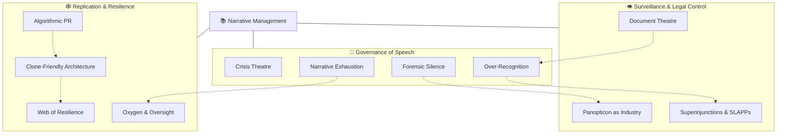

# 📚 Narrative Management  
**First created:** 2025-10-13 | **Last updated:** 2026-05-09  
*How speech, silence, storytelling, and legitimacy are engineered to stabilise power.*

---

## 🛰️ Orientation  

**Narrative Management** forms the communicative limb of *[🌀 Systems & Governance](../README.md)*.  
It examines how discourse itself is governed — through suppression, amplification, procedural framing, reputational containment, and strategic ambiguity.  

Where *[⚖️ Legal & State Governance](../⚖️_Legal_State_Governance/README.md)* tracks the **rules**, and *[💫 Containment Logic](../💫_Containment_Logic/README.md)* maps the **procedures**,  
**Narrative Management** focuses on the **interpretive layer**:

- what can be said,
- who is permitted credibility,
- which emotions are socially legible,
- and how visibility itself becomes governable infrastructure.

This cluster studies both suppression and counter-narrative.  
It analyses how states, corporations, media systems, platforms, advocacy groups, and survivor networks compete to define reality under pressure.

Importantly:

narrative management is not limited to censorship.

It also includes:

- selective acknowledgement,
- attention flooding,
- symbolic inclusion without redistribution,
- metric laundering,
- managed transparency,
- procedural spectacle,
- and emotional exhaustion as a governance outcome.

---

## 🧭 Governance Scope  

This cluster focuses on the governance of **meaning**, not merely information.

Key governance questions include:

- Who determines narrative legitimacy?
- Which actors are framed as trustworthy, irrational, dangerous, or disposable?
- How are ambiguity and uncertainty operationalised politically?
- When does “visibility” become containment rather than accountability?
- How do institutions stabilise themselves communicatively during crisis?
- How do survivor and civilian networks maintain narrative continuity under fragmentation?

This means the cluster concerns both:

- overt narrative control,
- and emergent narrative shaping through incentives, infrastructures, algorithms, and institutional behaviour.

---

## ✨ Key Themes  

- **Crisis Theatre** — emergency as governance mode.  
- **Forensic Silence** — evidentiary gaps by design.  
- **Over-Recognition** — institutional listening as anaesthetic.  
- **Panopticon as Industry** — marketised watchfulness and moral monetisation.  
- **Superinjunctions & SLAPPs** — legal speech containment in sensitive cases.  
- **Clone-Friendly Architecture** — replication incentives in digital ecosystems.  
- **Document Theatre** — transparency as staged performance.  
- **Algorithmic Public Relations** — automated reputation shaping systems.  
- **Narrative Exhaustion** — cognitive overload as democratic destabilisation pressure.  
- **Web of Resilience** — decentralised counter-narratives and survivor knowledge networks.  

---

## 🛸 Included Nodes  

- [👁️ Panopticon as Industry](./👁️_panopticon_as_industry.md) — *surveillance as market logic*  
- [📚 Crisis Theatre](./📚_crisis_theatre.md) — *emergency as governance mode*  
- [📚 Forensic Silence](./📚_forensic_silence.md) — *evidentiary gaps by design*  
- [📚 Over-Recognition](./📚_over_recognition.md) — *PR “listening” without redistribution or accountability*  
- [🕸️ Clone-Friendly Architecture](./🕸️_clone_friendly_architecture.md) — *replication incentives and memetic scalability*  
- [🕸️ Web of Resilience](./🕸️_web_of_resilience.md) — *distributed survival and counter-memory systems*  
- [🚨 Superinjunctions & SLAPPs in Rape Cases](./🚨_superinjunctions_slapps_rape_cases.md) — *speech suppression in sexual-violence litigation*  
- [🫁 Oxygen and Oversight](./🫁_oxygen_and_oversight.md) — *narrative space as democratic ventilation*  

---

## ⚖️ Governance Notes  

This cluster requires careful distinction between:

- **disinformation analysis**,  
- **institutional communications critique**,  
- **survivor testimony**,  
- and **speculative attribution**.

Narrative instability does not automatically imply conspiracy.

Equally:

institutional messaging is not automatically neutral simply because it is procedural, legalistic, or technically accurate.

Governance review should therefore monitor:

- evidentiary grounding,
- attribution discipline,
- proportional framing,
- emotional escalation effects,
- and the difference between systemic incentives versus coordinated intent.

Particular caution is required around:

- identifiable individuals,
- ongoing legal proceedings,
- platform moderation claims,
- and emotionally charged geopolitical narratives.

The purpose of this cluster is not to collapse complexity into certainty.

It is to improve interpretive literacy under conditions of institutional strain.

---

## 🚀 Routing Notes  

If a node primarily concerns **law, regulation, courts, or statutory powers**, route it to *[⚖️ Legal & State Governance](../⚖️_Legal_State_Governance/README.md)*.  

If it analyses **procedural containment**, **compliance signalling**, or **institutional choreography**, cross-link to *[💫 Containment Logic](../💫_Containment_Logic/README.md)*.  

If it concerns **process custody**, **ownership rights**, or **information remit collision**, connect with *[👑 Ownership & Control](../👑_Ownership_Control/README.md)*.  

If it maps **platform architecture**, **data infrastructure**, or **algorithmic distribution systems**, link to *[🛰️ Infrastructure Procurement](../🛰️_Infrastructure_Procurement/README.md)*.  

If it concerns **mass emotional destabilisation**, **attention exhaustion**, or **public cognitive overload**, cross-link with adjacent resilience and psychological-governance clusters where appropriate.

---

## 🗺️🫡 Where are the nodes?: A Map  

```mermaid
graph TD
  N["📚 Narrative Management"]

  subgraph G1["🧭 Governance of Speech"]
    CT["Crisis Theatre"]
    FS["Forensic Silence"]
    OR["Over-Recognition"]
    NE["Narrative Exhaustion"]
  end

  subgraph G2["👁️ Surveillance & Legal Control"]
    PAI["Panopticon as Industry"]
    SIR["Superinjunctions & SLAPPs"]
    DT["Document Theatre"]
  end

  subgraph G3["🕸️ Replication & Resilience"]
    CFA["Clone-Friendly Architecture"]
    WR["Web of Resilience"]
    OXO["Oxygen & Oversight"]
    APR["Algorithmic PR"]
  end

  N --- G1
  N --- G2
  N --- G3

  %% Cross-links
  FS -.-> PAI
  OR -.-> SIR
  DT -.-> OR
  CFA -.-> WR
  APR -.-> CFA
  NE -.-> OXO

  %% Clicks
  click CT href "./📚_crisis_theatre.md" "Open node"
  click FS href "./📚_forensic_silence.md" "Open node"
  click OR href "./📚_over_recognition.md" "Open node"
  click PAI href "./👁️_panopticon_as_industry.md" "Open node"
  click SIR href "./🚨_superinjunctions_slapps_rape_cases.md" "Open node"
  click CFA href "./🕸️_clone_friendly_architecture.md" "Open node"
  click WR href "./🕸️_web_of_resilience.md" "Open node"
  click OXO href "./🫁_oxygen_and_oversight.md" "Open node"
```

*Alt text:* A tri-branch diagram showing narrative governance through speech control, surveillance/legal containment, and decentralised resilience networks.

---

## 🗓️ Planned Nodes  

- **🗞️ Strategic Leak Architecture** — when exposure is choreographed rather than resisted.  
- **📣 Counter-Speech Playbook** — survivor and journalist tactics for narrative re-entry.  
- **📊 Data Narrative Laundering** — how dashboards and metrics reshape truth legitimacy.  
- **📁 Document Theatre** — transparency performance through staged disclosure.  
- **🧩 Algorithmic Public Relations** — automated reputation and sentiment management systems.  
- **☕️ Narrative Exhaustion** — cognitive overload and interpretive burnout under permanent crisis conditions.  
- **📡 Attention Flooding** — suppression through saturation rather than silence.  

---

## 🌌 Constellations  

🌀 📚 👁️ 🕸️ 🫁 — governance through communication, legitimacy through framing, containment through visibility, resilience through distributed speech.

---

## ✨ Stardust  

narrative management, crisis theatre, forensic silence, over-recognition, narrative exhaustion, algorithmic public relations, panopticon, slapps, digital governance, reputational containment, media systems, cognitive overload, discourse governance

---

## 🏮 Footer  

*📚 Narrative Management* is a living sub-cluster of the Polaris Protocol.  
It maps the architectures of speech, visibility, legitimacy, and interpretive control under contemporary governance conditions.

The cluster examines how communication systems shape political reality — not only through censorship, but through framing, overload, procedural spectacle, and the management of credibility itself.

> 📡 Cross-references:
> 
> - [🌀 Systems & Governance](../README.md) — *parent framework for oversight and institutional coordination systems*  
> - [⚖️ Legal & State Governance](../⚖️_Legal_State_Governance/README.md) — *statutory and judicial containment structures*  
> - [💫 Containment Logic](../💫_Containment_Logic/README.md) — *procedural and behavioural governance layers*  
> - [👑 Ownership & Control](../👑_Ownership_Control/README.md) — *custody, remit, and informational authority*  
> - [🛰️ Infrastructure Procurement](../🛰️_Infrastructure_Procurement/README.md) — *platform architectures and infrastructural governance*  

*Survivor authorship is sovereign. Containment is never neutral.*  

_Last updated: 2026-05-09_
