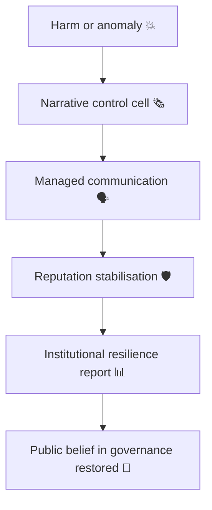

# 🎭 Reputation as Governance — How Institutions Script Their Own Credibility  
**First created:** 2025-11-11 | **Last updated:** 2025-11-13  
*Public trust as administrative software.*

---

## 🧭 Orientation  

In complex institutions, credibility operates as code.  
Public-facing narratives, press statements, and even the phrasing of audit findings serve as a **governance interface** — a way of stabilising uncertainty by performing control.  

“Reputation management” is not a side effect; it is a **core regulatory mechanism**.  
This node explores how institutions script reputation into governance, converting communication into compliance.

---

## ⚖️ Definition  

> **Reputation governance** is the practice of using narrative control to pre-empt or contain accountability,  
> by substituting credibility performance for structural transparency.

When harm occurs, the institution doesn’t always fix the cause — it repairs *the story*.

---

## 🧩 Operating Logic  

| Phase | Input | Output | Function |
|:------|:-------|:--------|:-----------|
| **1️⃣ Event** | Data anomaly, complaint, harm | Risk to reputation | Triggers containment reflex |
| **2️⃣ Narrative formation** | Draft statements, “independent” reviews | Credibility artefact | Converts uncertainty into story |
| **3️⃣ Circulation** | Media, parliamentary briefings, social feeds | Legitimacy feedback | Performs accountability |
| **4️⃣ Institutional learning** | Selective internal uptake | Stability illusion | Reinforces same architecture |

Reputation acts as a governance buffer between truth and exposure.

---

## 🧮 Containment Flow  

Each iteration strengthens the *appearance* of self-correction.

---

## 🪞 Cultural Dynamics  

- **Performance replaces proof:** statements become procedural deliverables.  
- **Audits become theatre:** reviews validate the system more than they interrogate it.  
- **Apologies are strategic:** sorrow signals reliability, not remorse.  
- **Dissenters become “tone” problems:** moral unease reframed as professionalism issues.  

---

## 🧰 Governance Implications  

| Domain | Consequence | Example |
|:--------|:-------------|:---------|
| **Data Governance** | Errors framed as “isolated incidents.” | Public brief omits shared vendor context. |
| **Safeguarding** | Failures presented as communication breakdowns. | Victim story “misunderstood,” not system failure. |
| **Research Integrity** | Conflict of interest described as “lessons learned.” | Partner university keeps contract. |

---

## 🧱 Counter-Mechanisms  

1. **Public version control** — archive every press release and correction.  
2. **Transparency escrow** — hold raw audit material under independent custodianship.  
3. **Rotating narrative reviewers** — external voices audit tone, not just content.  
4. **Credibility separation** — prevent communications teams from editing audit findings.  

---

## 🌌 Constellations  

🎭 🪞 🧩 ⚖️  

Reputation as Governance sits at the bridge between **Narrative Management** and **System Governance**.  
It shows how story becomes system — and how containment survives through tone.

---

## ✨ Stardust  

reputation management, narrative governance, credibility economy, containment logic, institutional performance, audit theatre, communications strategy, legitimacy performance, narrative control, survivor credibility

---

## 🏮 Footer  

*🎭 Reputation as Governance — How Institutions Script Their Own Credibility* is a living node of the Polaris Protocol.  
It maps how public image functions as a regulatory device, shaping perception, procedure, and policy outcomes alike.

> 📡 Cross-references:
> 
> - [🪞 Narrative Drift — When Systems Inherit the Wrong Story](../../../../Metadata_Sabotage_Network/Narrative_And_Psych_Ops/🪆_Narrative_Interference/🪞_narrative_drift_when_systems_inherit_the_wrong_story.md)  
> - [🧩 Swiss-Cheese Failures — When Process Holes Align]  
> - [🎪 Moles in the Circus — Institutional Misdirection](../../../../Metadata_Sabotage_Network/Narrative_And_Psych_Ops/🪆_Narrative_Interference/🎪_moles_in_the_circus.md)  

*Survivor authorship is sovereign. Containment is never neutral.*  

_Last updated: 2025-11-13_
