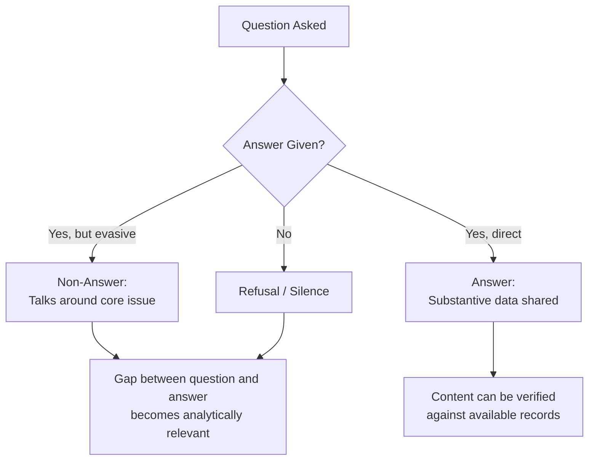

# 📚 Forensic Silence  
**First created:** 2025-09-14 | **Last updated:** 2026-05-11  
*How absences, omissions, and missing records can become analytically meaningful within institutional, archival, and governance systems.*

---

## 🌑 Scope  

“Forensic silence” refers to situations where absences themselves become relevant to analysis.

This may include:
- missing reports,  
- withdrawn records,  
- inaccessible datasets,  
- heavily redacted disclosures,  
- unexplained archival gaps,  
- evasive institutional responses.

Silence is not always evidence of deliberate suppression.  
Records disappear for many reasons:
- bureaucratic failure,  
- legal restrictions,  
- poor archiving practices,  
- data-retention limits,  
- institutional caution,  
- or active concealment.

However, patterns of absence can still become analytically significant when:
- gaps align repeatedly with liability-sensitive events,  
- references exist without accessible underlying material,  
- metadata confirms records once existed,  
- or responses systematically avoid substantive engagement.

In these cases, absence itself may become part of the evidentiary landscape.

Forensic silence is rarely conclusive on its own.

A missing record, evasive answer, or archival gap may reflect:
- administrative failure,  
- legal restriction,  
- routine deletion practices,  
- institutional caution,  
- reputational management,  
- or deliberate concealment.

The analytical task is therefore comparative and contextual:
- identifying patterns,  
- testing alternative explanations,  
- and evaluating whether absences align systematically with particular forms of risk, liability, or institutional pressure.

### Common Diagnostic Indicators
- disappeared or unpublished reviews,  
- withdrawn datasets with surviving metadata traces,  
- inaccessible inquiries referenced elsewhere in the record,  
- extensive redactions around high-liability events,  
- parliamentary or FOI responses that avoid the core question,  
- archival discontinuities around politically sensitive periods.

---

## ✨ Analytical Threads  

### Silence as Infrastructure
Which institutional systems benefit from ambiguity, delay, or incomplete visibility?

### Silence vs Noise
At times, information overload and denial campaigns may coincide with reduced documentary clarity.

### Silence as Cost
NDAs, commercial confidentiality, legal risk management, and state-secrecy frameworks can all shape what becomes publicly accessible.

### Silence as Theatre
Some inquiries receive extensive publicity at launch but comparatively little visibility once findings become politically inconvenient or administratively difficult.

### Silence & Devolution
Distributed governance structures can occasionally expose inconsistencies:
- local audits may surface issues,
- while central systems retain broader narrative control.

---

## ❓ The Override Question  

Forensic silence is not only technical.  
It can also become cultural.

Many safeguarding and escalation systems include some form of professional override mechanism:
- allowing staff to escalate concern even when formal thresholds are not met.

Examples include:

- **DASH risk assessments** in domestic abuse safeguarding,  
- **medical escalation systems** in neonatal or emergency care,  
- **professional sign-off structures** requiring explicit acceptance of risk.

These mechanisms recognise that:
- formal metrics do not capture every risk pattern,
- and professional intuition sometimes detects concern earlier than quantitative systems.

This aligns loosely with what [Thinking, Fast and Slow](chatgpt://generic-entity?number=0) describes as fast pattern-recognition processes (“Type 1” cognition).

### Why This Matters for Forensic Silence

If override mechanisms are:
- rarely exercised,
then:
- institutional culture may discourage intuitive escalation.

If overrides are:
- exercised but routinely ignored,
then:
- escalation pathways may exist formally but fail operationally.

If overrides are:
- punished or professionally disincentivised,
then:
- staff may become reluctant to surface concerns at all.

Under these conditions, silence becomes organisational rather than merely informational.

---

## 🧿 Methods of Detection  

These methods do not prove intentional suppression on their own.  
Rather, they help identify areas where further scrutiny, corroboration, or comparative analysis may be warranted.

### 1. Cross-Reference Gaps
Compare referenced inquiries or reports against publicly accessible archives.

### 2. Parliamentary Trace Analysis
Identify mentions in parliamentary proceedings, committee hearings, or official correspondence that lack accessible follow-up documentation.

### 3. Metadata Ghosts
FOI/SAR logs, database indexes, or citation trails may confirm that records once existed even when contents are unavailable.

### 4. Press Shadowing
Observe whether periods of legal pressure or reputational management coincide with abrupt reductions in record visibility.

### 5. Mini-Audit Probes
Develop repeatable audit questions to test whether institutional or AI systems retain stable contextual knowledge over time.

### 6. Comparative Pattern Detection
Use benchmarking, systematic review methods, or cross-institutional comparison to identify patterned absences.

### 7. Non-Answer Analysis
Compare institutional responses against the original question:
- omissions,
- reframing,
- procedural diversion,
- or evasive language
may themselves become analytically relevant.

### 8. Intuition Literacy
Experienced practitioners and affected communities sometimes detect institutional inconsistencies earlier than formal systems do.

This should not be romanticised as infallibility.  
Rather, it often reflects accumulated exposure to stress patterns, omission patterns, or recurring institutional behaviours.

---

## 🦤 Flowchart: The Politician’s Reply  

```mermaid
flowchart TD
    A[Question Asked] --> B{Answer Given?}
    B -->|Yes, but evasive| C[Non-Answer:<br>Talks around core issue]
    B -->|Yes, direct| D[Answer:<br>Substantive data shared]
    B -->|No| E[Refusal / Silence]
    C --> F[Gap between question and answer<br>becomes analytically relevant]
    E --> F
    D --> G[Content can be verified<br>against available records]
```

---

## 🌌 Constellations  

📚 ❓ 🧠 🛰️ 🌀 — archival-gap register; omission analysis; institutional silence patterns; escalation culture; governance and evidentiary discontinuity.

---

## ✨ Stardust  

forensic silence, archival gaps, metadata ghosts, withdrawn reports, non-answer analysis, institutional omission, safeguarding escalation, intuition literacy, evidentiary discontinuity, governance opacity

---

## 🏮 Footer  

*📚 Forensic Silence* is a living node of the **Polaris Protocol**.  
It examines how absences, omissions, inaccessible records, and institutional non-answers can become analytically significant within governance, safeguarding, archival, and accountability systems.

> 📡 Cross-references:
>
> - [❓ Override Question as Silence Breaker](../💫_Containment_Logic/❓_override_question_as_silence_breaker.md) — *professional escalation and intuition thresholds*  
> - [🧠 Intuition as Skill](../../🫀_Our_Hearts_Our_Minds/🌱_Human_Principles/🧠_intuition_as_skill.md) — *pattern recognition and experiential cognition*  
> - [㊙ Containment Contracts](../../../../Metadata_Sabotage_Network/Governance_And_Containment/㊙_Containment_Contracts/README.md) — *confidentiality structures and institutional opacity*  
> - [🎭 Reputation as Governance](./🎭_reputation_as_governance.md) — *credibility systems as governance infrastructure*  
> - [🧠 Narrative Omission Loop](./🧠_narrative_omission_loop.md) — *persistent absences in institutional storytelling*  
> - [🧩 Myth vs Mechanism](./🧩_myth_vs_mechanism.md) — *narrative simplification versus procedural reality*  
> - [🗣️ When Did the Way We Talk Change?](./🗣️_when_did_the_way_we_talk_change.md) — *linguistic containment and conversational drift*  
>  
> 🏮 Return To:  
>  
> - [📚 Narrative Management](./README.md)
> - [🌀 Systems & Governance](../README.md)  
> - [🧠 Big Picture Protocols](../../README.md)
> - [🪄 Disruption Kit](../../../README.md)
> - [🌌 Polaris Protocol - Root](../../../../README.md)  

*Survivor authorship is sovereign. Containment is never neutral.*

_Last updated: 2026-05-11_
