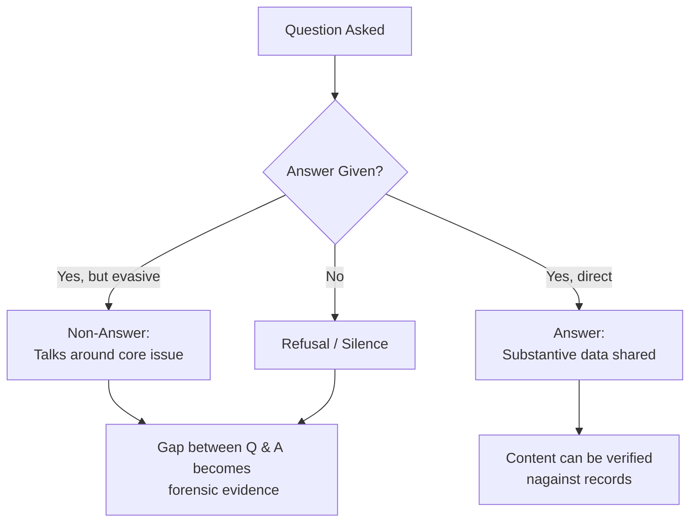

# 📚 Forensic Silence  
**First created:** 2025-09-14 | **Last updated:** 2025-10-14  
*Active narrative gaps where records were scrubbed — the hole itself becomes evidence.*  

---

## 🌑 Scope  

“Forensic silence” is not absence.  
It is an engineered vacuum: erased reports, withdrawn minutes, or inquiries that vanish before publication.  
The silence itself has shape, weight, and timing.  

Key diagnostic cues:  
- **Disappeared reviews** (e.g., Serious Case Reviews that never surface).  
- **Retracted datasets** where only the metadata footprint remains.  
- **Superinjunctions** that erase not just speech but entire record-threads.  
- **Scrubbed archives** where the gaps align too cleanly with liability triggers.  
- **Non-answers** — when parliamentary, FOI, or business replies dodge the question, silence hides in plain sight.  

---

## ✨ Analytical Threads  

- **Silence as infrastructure:** which agencies *depend* on keeping voids intact?  
- **Silence vs noise:** when denial campaigns flood discourse precisely as documents vanish.  
- **Silence as cost:** NDA settlements, “commercial confidentiality,” or state secrets act as priced erasure.  
- **Silence as theatre:** inquiries launched with publicity, concluded with disappearance.  
- **Silence vs devolution:** devolved powers can expose silence locally while feeding transparent audit back to centre — evidence travels upward, not excuses.  

---

## ❓ The Override Question  

Silence is not only technical.  
It is cultural.  
Every safeguarding system carries an **override clause** — the professional permission to act when the numbers don’t capture what intuition already knows.  

- **DASH (Domestic Abuse, Stalking and Harassment risk model):** *Do you believe a referral is required even if the threshold score is not met?*  
- **Neonatal and pediatric early warning systems:** *Do you believe escalation is warranted despite “normal” vital signs?*  
- **Professional sign-off checks:** *Are you willing to put your name to the judgment that nothing further is needed?*  

This is the system’s recognition of what Kahneman calls **Type 1 thinking** (*Thinking, Fast and Slow*): fast, intuitive pattern recognition.  

Why this matters for *forensic silence*:  
- If overrides are consistently *not* exercised, silence is cultural: staff are trained to disbelieve perception.  
- If overrides are exercised but ignored, silence is structural: concern exists, but escalation is blocked.  
- If overrides are punished, silence becomes enforced containment.  

---

## 🧿 Methods of Detection  

1. **Cross-reference gaps** → Compare cited inquiries with public record indexes.  
2. **Check parliamentary traces** → Look for mentions in Hansard that have no accessible follow-up.  
3. **Metadata ghosts** → FOI/SAR logs confirming an item existed even if content was pulled.  
4. **Press shadowing** → Note if journalists receive legal threat letters at the moment of record silence.  
5. **Mini-audit probes (Caldecott extension):** develop repeatable test questions to check if systems (including AI) retain baseline knowledge; watch for erasure of context but survival of emotional reaction.  
6. **Comparative detection:** use Cochrane-style systematic review and KPI benchmarking across councils, hospitals, or universities to surface patterned absences.  
7. **Non-answers:** compare question vs answer in FOI, hearings, or correspondence — gaps themselves are evidence.  
8. **Intuition literacy:** sharpened Type 1 skills, often seen in marginalised communities, can detect silence early — but their presence is evidence of stress load, not superiority.  

---

## 🦤 Flowchart: The Politician’s Reply  

---

## 🌌 Constellations  

📚 ❓ 🧠 🌀 — This node links narrative gaps to override logics, intuition literacy, and systemic governance diagnostics.

---

## ✨ Stardust  

forensic silence, disappeared reviews, retracted datasets, superinjunctions, scrubbed archives, non-answers, override clauses, intuition literacy, metadata ghosts, containment by erasure

---

## 🏮 Footer  

*Forensic Silence* is a living node of the Polaris Protocol.  
It documents how silence itself becomes probative evidence of suppression.  

> 📡 Cross-references:
> 
> - [🌀 Systems &_Governance](../README.md) — *parent cluster of governance diagnostics*  
> - [❓ Override Question as Silence Breaker](../💫_Containment_Logic/❓_override_question_as_silence_breaker.md) — *intuition in safeguarding systems*  
> - [🧠 Intuition as Skill](../🌱_Human_Principles/🧠_intuition_as_skill.md) — *recognising Type 1 as skill*  
> - [㊙ Containment Contracts](../../../../Metadata_Sabotage_Network/Governance_And_Containment/㊙_Containment_Contracts/README.md) — *NDA and gag structures enforcing silence*  

*Survivor authorship is sovereign. Containment is never neutral.*  

_Last updated: 2025-10-14_
