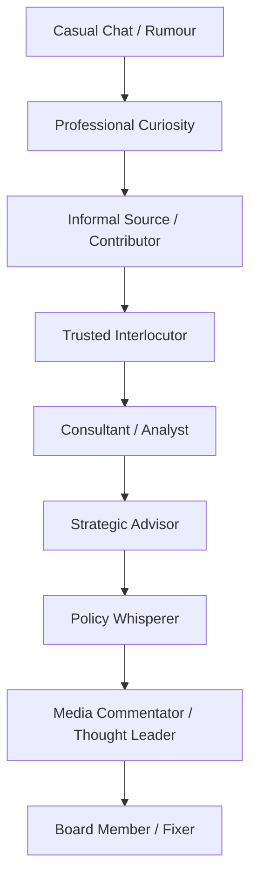

# 🥸 Paid Male Gossipers  
**First created:** 2025-11-04 | **Last updated:** 2026-05-11  
*An anthropological field guide to the men who invoice for hearsay.*  

---

## 🛰️ Orientation  

This node satirises prestige-adjacent sectors where informal social interpretation is rebranded as strategic expertise through institutional language, class signalling, and professional framing.  

It examines how certain boutique risk, strategy, and communications cultures monetise gossip while coding it as authority.  
The node functions simultaneously as institutional satire and sociolinguistic analysis, documenting how tone, confidence, and vocabulary can convert unverified conversation into “intelligence.”  

Where women are often told to keep quiet, some men are taught to invoice for the same social behaviour.  
This file explores the linguistic machinery that enables the distinction.  

---

## ✨ Key Features  

- **Masculine Rebrand Economy:** gossip → intel → invoice.  
- **Gatekeeping by Class Tone:** discretion performed through accent, confidence, and composure.  
- **Trust Arbitrage:** credibility sold through selective ambiguity.  
- **Visibility Paradox:** those most fluent in off-record ecosystems often speak in the language of neutrality.  
- **Ethics as Timesheet:** moral clarity increasingly formatted as consultancy output.  

---

## 🔍 Analysis — The Gossip Supply Chain  

| Stage | Action | Institutional Name | Actual Description |  
|--------|---------|--------------------|--------------------|  
| 1 — Collection | Hear or observe something potentially useful. | *Field Intelligence* | Overheard conversation, rumour, soft signal. |  
| 2 — Validation | Confirm with a friend of a friend. | *Triangulation* | Checking multiple informal sources. |  
| 3 — Packaging | Write it down in PowerPoint. | *Reputation Brief* | Adds formatting and institutional tone. |  
| 4 — Circulation | Share strategically. | *Stakeholder Engagement* | Selective whispering in professional language. |  
| 5 — Monetisation | Bill for continuing to discuss it. | *Strategic Communications* | Turns social interpretation into revenue stream. |  

> **House Rule:** Rumour acquires institutional gravity once printed on letterhead.  

---

## 🧮 Gender and Class Encoding  

| Behaviour | When Women Do It | When Men Do It | Market Translation |  
|------------|------------------|----------------|--------------------|  
| Talking about who said what | Gossip | Network Intelligence | £250 / hour advisory |  
| Emotional interpretation | Oversharing | Cultural Acumen | Leadership Coaching |  
| Story framing | Manipulative | Strategic Messaging | Policy Brief |  
| Ally-building | Cliquey | Stakeholder Management | Consultancy |  
| Curiosity | Nosy | Proactive | Due Diligence |  

The satire here concerns institutional valuation, not innate behaviour: all groups engage in social interpretation, but status systems determine whose interpretation becomes “expertise.”  

---

## 🧰 Field Manual for Aspiring Strategic Gossipers  

| Career Stage | Approved Behaviour | Literal Translation |  
|--------------|--------------------|---------------------|  
| Entry-Level Whisperer | “I’m mapping the stakeholder landscape.” | Trying to work out who influences whom. |  
| Junior Reputation Analyst | “I’m testing the reputational temperature.” | Texting three mates for confirmation. |  
| Associate Rumour Curator | “I’ve had informal engagement with senior figures.” | Cornered someone at a drinks reception. |  
| Mid-Career Insight Partner | “I’m shaping a cross-sector narrative.” | Forwarded a WhatsApp screenshot. |  
| Principal Narrative Advisor | “We introduced the framing early.” | Became unusually well-informed very quickly. |  
| Managing Partner, Gossip LLP | “We specialise in strategic communications.” | £800 / hr to repeat it calmly. |  

> **Professional Tip Sheet**  
> - Say *It’s emerging that* not *I heard.*  
> - Say *Multiple sources indicate* not *Someone told me.*  
> - Say *Pre-decisional environment suggests volatility* not *Maybe.*  
> - Say *There’s movement in stakeholder sentiment* not *He said / She said.*  
> - Confidence is often just an accent spoken slowly.  

---

## 🎭 Professional Performance Rules  

| Objective | Technique | Outcome |  
|------------|-----------|----------|  
| Maintain Mystique | Speak slowly, mention Geneva once. | Sounds expensive. |  
| Build Trust | Reveal little personal information except gym routine. | Appears disciplined. |  
| Generate Content | Turn speculation into slide deck. | Noise → deliverable. |  
| Manage Liability | Scatter NDAs like confetti. | Shared ambiguity. |  
| Invoice Promptly | Bill under *Insight Development.* | Gossip → consultancy output. |  

---

### 🪜 Ladder of Gossip Prestige  

Each rung represents a stage of linguistic camouflage: similar social behaviour, increasingly prestigious framing.  

---

## 🧭 Moral Geometry  

The professional gossiper performs neutrality as a moral pose.  

> “I don’t spread rumours; I manage information flows.”  

This is reputation as physics: for every whisper there is an equal and opposite disclaimer.  
The system rewards the person who can describe a scandal without appearing emotionally invested in it.  

---

## ⚖️ Limits of the Satire  

This node caricatures institutional language cultures rather than claiming all advisory, communications, or intelligence work is reducible to gossip.  

Many forms of strategic analysis involve genuine expertise, rigorous investigation, and legitimate risk assessment.  
The focus here is the performative edge-case where prestige language, class coding, and ambiguity transform ordinary social interpretation into monetised authority.  

---

## 🌌 Constellations  

🥸 🧿 💼 🧠 🛰️ — prestige economies, institutional language, class signalling, gendered expertise, and governance-performance satire.  

- `⚖️_system_governance.md` → authority, legitimacy, and access ecologies  
- `🪩_algorithmic_endocrinology.md` → behavioural prestige loops and influence systems  
- `🪞_governance_as_performance_art.md` → institutional theatre and credibility aesthetics  
- `📺_coverup_as_cultural_genre.md` → narrative framing and reputational choreography  

---

## ✨ Stardust  

strategic communications, prestige language, credibility economy, institutional gossip, class code, gender labour, consultancy culture, reputation management, influence systems, humour as audit  

---

## 🏮 Footer  

*🥸 Paid Male Gossipers* is a living node of the **Polaris Protocol**.  
It satirises the linguistic and class mechanics through which informal social interpretation can acquire institutional authority, commercial value, and reputational legitimacy.  

The node focuses less on individuals than on the broader prestige systems that convert tone, ambiguity, confidence, and selective access into expertise.  

> 📡 Cross-references:  
> 
> - [⚖️ System Governance](../⚖️_system_governance.md) — *authority and access ecologies*  
> - [🪩 Algorithmic Endocrinology](../🪩_algorithmic_endocrinology.md) — *prestige loops and behavioural influence systems*  
> - [🪞 Governance as Performance Art](../🪞_governance_as_performance_art.md) — *institutional theatricality and legitimacy signalling*  
>  
> 🏮 Return To:  
>  
> - [📚 Narrative Management](./README.md)
> - [🌀 Systems & Governance](../README.md)  
> - [🧠 Big Picture Protocols](../../README.md)
> - [🪄 Disruption Kit](../../../README.md)
> - [🌌 Polaris Protocol - Root](../../../../README.md)  

*Survivor authorship is sovereign. Containment is never neutral.*  

_Last updated: 2026-05-11_
