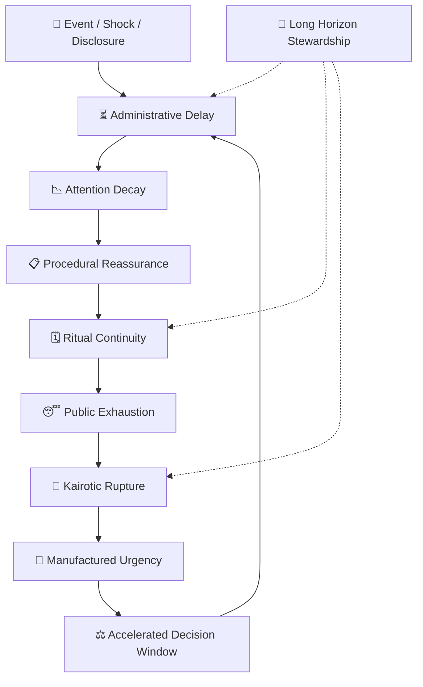

# 🕰️ Chronos Or Kairos  
**First created:** 2026-05-12 | **Last updated:** 2026-05-14  
*When systems measure time mechanically, but humans experience it relationally.*  

---

## ✨ Scope  

*Chronos Or Kairos* examines the conflict between administrative time and lived time.  
It studies how governance systems standardise pacing, delay, urgency, and waiting — and how human beings resist, rupture, or reinterpret those rhythms.  

The cluster distinguishes between:  

- **Chronos** — linear, measurable, schedulable time.  
- **Kairos** — relational, opportune, emotionally significant time.  

Modern governance overwhelmingly privileges Chronos:
deadlines, metrics, service windows, procurement cycles, electoral calendars, quarterly reports, compliance intervals.  

But human systems rarely collapse *on schedule*.  
Meaning arrives unevenly.  
Trust accumulates slowly, then breaks suddenly.  
A single moment can outweigh ten years of procedure.  

---

## 🛰️ Orientation  

This cluster explores time as governance infrastructure.  

Not merely clocks or calendars, but:
- pacing as control,
- delay as containment,
- urgency as manipulation,
- exhaustion as administrative strategy,
- and ritual repetition as continuity theatre.

Systems often maintain authority by controlling *when* things happen rather than whether they happen at all.  

A delayed investigation,
a deferred payment,
an endless consultation,
a queue that never resolves,
a report released on a Friday evening,
a "pilot programme" extended indefinitely —
all are temporal governance mechanisms.  

Chronos governs through sequence.  
Kairos ruptures sequence through significance.  

This cluster studies the friction between those two realities:
the timetable and the turning point.  

---

## 📂 Core Subfolders  

| Folder | Focus |
|:--|:--|
| [⏳ Delay As Governance](⏳_Delay_As_Governance/README.md) | Administrative pacing, strategic slowdown, procedural drag, and exhaustion loops. |
| [🚨 Manufactured Urgency](🚨_Manufactured_Urgency/README.md) | Crisis acceleration, panic framing, deadline coercion, and compressed consent. |
| [🗓️ Ritual Time & Continuity](🗓️_Ritual_Time_Continuity/README.md) | Ceremonial repetition, institutional calendars, anniversaries, and continuity performance. |
| [🌊 Kairotic Rupture](🌊_Kairotic_Rupture/README.md) | Moments where emotional or historical significance overwhelms procedural sequencing. |
| [🌀 Temporal Containment](🌀_Temporal_Containment/README.md) | Waiting rooms, backlog systems, attrition through time, and suspended resolution. |
| [📉 Attention Half-Life](📉_Attention_Half_Life/README.md) | Media cycles, outrage decay, novelty exhaustion, and narrative turnover. |
| [🧭 Long Horizon Stewardship](🧭_Long_Horizon_Stewardship/README.md) | Governance across generations, slow resilience, root-bridge thinking, and intergenerational responsibility. |
| [🎭 The Theatre Of Responsiveness](🎭_Theatre_Of_Responsiveness/README.md) | Performative urgency, symbolic action, inquiry choreography, and procedural reassurance. |

---

## 🦚 Core Themes  

- **Time as infrastructure.** Clocks are political technologies.  
- **Delay as containment.** Exhaustion can function as governance.  
- **Urgency as coercion.** Compression reduces deliberation.  
- **Continuity as ritual performance.** Systems survive through repetition.  
- **Kairos as rupture.** Certain moments reorganise meaning irreversibly.  
- **Attention as finite resource.** Narrative turnover shapes legitimacy.  
- **Administrative pacing vs human recovery.** Institutions process differently from bodies.  
- **Long-horizon resilience.** Stewardship beyond election cycles and quarterly logic.  

---

## 🗺️ Visual Framing — Temporal Governance Cycle  

*Alt text:* A cyclical diagram showing how systems use delay, ritual continuity, and exhaustion to stabilise governance, while kairotic rupture periodically disrupts administrative pacing.  

---

## 🌌 Constellations  

🕰️ ⏳ 🚨 🌊 🗓️ 🌀 📉 🧭 🎭 — the constellation of administrative time, rupture, and continuity.  

**Cultural & Mythic Echoes:**  
- *The Thick of It* — procedural panic and tempo management.  
- *Chernobyl* — delay, denial, and catastrophic pacing failure.  
- *Children of Men* — exhausted futurity and administrative drift.  
- *Arrival* — nonlinear perception and temporal reframing.  
- *Groundhog Day* — repetition, ritual, and behavioural recursion.  
- *The Leftovers* — unresolved rupture and continuity strain.  
- *Waiting for Godot* — procedural suspension as existential condition.  
- Hartmut Rosa — *Social Acceleration*.  
- E.P. Thompson — *Time, Work-Discipline and Industrial Capitalism*.  
- Jenny Odell — *How to Do Nothing*.  
- Music: Pink Floyd — *Time*; David Bowie — *Five Years*; Kate Bush — *Running Up That Hill*.  

---

## ✨ Stardust  

chronos, kairos, governance pacing, strategic delay, procedural exhaustion, urgency theatre, temporal containment, continuity ritual, bureaucratic waiting, narrative half-life, administrative time, long horizon governance, institutional pacing, kairotic rupture  

---

## 🧩 Closing Reflection  

A system can survive enormous failure if it controls the rhythm of perception.  
Delay changes memory.  
Repetition normalises instability.  
Urgency narrows imagination.  

But every governance structure eventually encounters Kairos:  
the moment that refuses scheduling.  

Not all turning points arrive loudly.  
Sometimes history changes because enough people finally realise they have been waiting in the same room for too long.  

---

## 🏮 Footer  

*🕰️ Chronos Or Kairos* is a living cluster of the Polaris Protocol.  
It examines how systems govern through pacing, delay, urgency, ritual continuity, and the management of historical attention.  

> 📡 Cross-references:
> 
> - [🌀 Systems & Governance](../README.md) — *systemic containment architectures & governance choreography*  
> - [💫 Containment Logic](../💫_Containment_Logic/README.md) — *feedback loops, pacing systems, and behavioural containment*  
> - [🧄 Exousiología](../../../🧄_Exousiología/README.md) — *authority, stewardship, and legitimacy across time*  

*Survivor authorship is sovereign. Containment is never neutral.*  

_Last updated: 2026-05-14_
