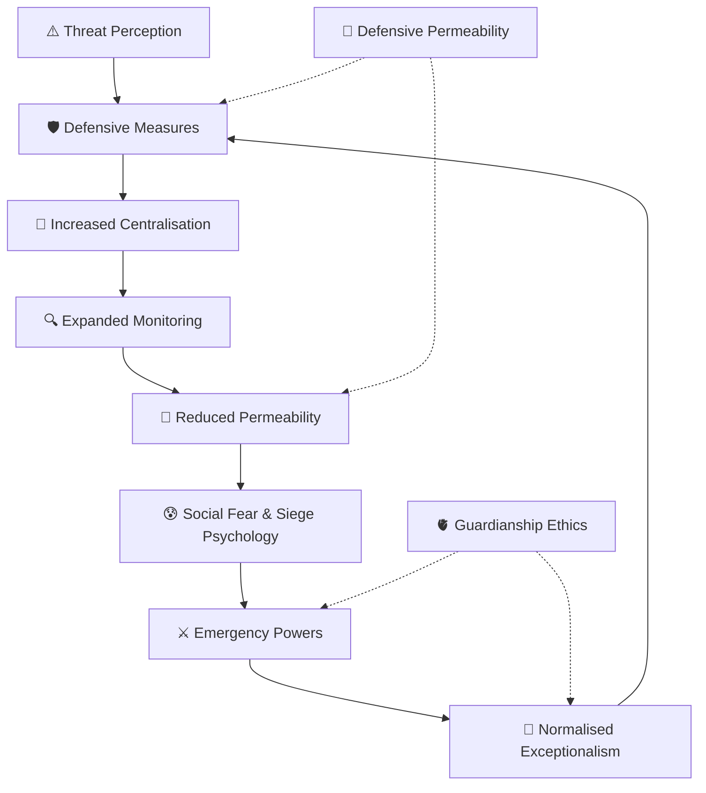

# 🛡️ Defending Realms  
**First created:** 2026-05-12 | **Last updated:** 2026-05-14  
*How systems decide what must be protected, who is allowed inside the walls, and what forms of defence eventually become indistinguishable from containment.*  

---

## ✨ Scope  

*Defending Realms* studies the governance logic of protection, defence, continuity, and territorial stewardship.  

It examines:
- how institutions define threats,
- how systems justify defensive architectures,
- how borders become psychological as well as physical,
- and how protection can drift into enclosure, paranoia, or permanent emergency governance.  

This cluster treats “realms” broadly:
- states,
- networks,
- infrastructures,
- ecosystems,
- communities,
- archives,
- identities,
- and symbolic territories.  

Not every wall is authoritarian.  
Not every openness is safe.  

The central question is not whether defence exists, but:
> what kind of defence preserves life without devouring the realm it claims to protect.  

---

## 🛰️ Orientation  

All governance systems eventually confront the problem of defence.  

What must be protected?
From whom?
At what cost?
For how long?
And who decides when emergency powers end?  

Defensive systems emerge because vulnerability is real.  
Infrastructure can fail.
Archives can burn.
Communities can be attacked.
States can collapse.
Trust can be exploited.  

But defence architectures possess their own gravity.  

Systems built to defend continuity often:
- centralise authority,
- normalise surveillance,
- expand secrecy,
- reduce permeability,
- and redefine dissent as threat proximity.  

Over time, the boundary between:
- protection,
- containment,
- and domination  
can become dangerously unstable.  

This cluster studies both:
- the necessity of defensive stewardship,
- and the risk of fortress logic consuming civic life.  

It is concerned with:
- resilient defence,
- proportionality,
- interoperability,
- legitimacy under stress,
- distributed continuity,
- and the ethics of guardianship.  

---

## 📂 Core Subfolders  

| Folder | Focus |
|:--|:--|
| [🏰 Fortress Logic](🏰_Fortress_Logic/README.md) | Defensive systems drifting into enclosure, securitisation, and siege mentality. |
| [🌉 Defensive Permeability](🌉_Defensive_Permeability/README.md) | Balancing openness, interoperability, resilience, and selective boundary control. |
| [📡 Infrastructure Defence](📡_Infrastructure_Defence/README.md) | Protection of utilities, communications, logistics, archives, and continuity systems. |
| [🧠 Narrative Defence](🧠_Narrative_Defence/README.md) | Information warfare, legitimacy protection, propaganda resistance, and psychological defence. |
| [🧱 Civil Continuity Systems](🧱_Civil_Continuity_Systems/README.md) | Disaster resilience, fallback governance, mutual aid, and continuity planning. |
| [⚔️ Emergency Powers & Drift](⚔️_Emergency_Powers_Drift/README.md) | Temporary powers becoming permanent governance architecture. |
| [🫀 Guardianship Ethics](🫀_Guardianship_Ethics/README.md) | Stewardship, restraint, legitimacy, and the moral psychology of protection. |
| [🌍 Realm Collapse & Fragmentation](🌍_Realm_Collapse_Fragmentation/README.md) | Breakdown of shared governance legitimacy and the fragmentation of civic cohesion. |

---

## 🦚 Core Themes  

- **Defence as governance function.** Protection is part of stewardship.  
- **Containment drift.** Defensive systems can become self-justifying.  
- **Fortress psychology.** Fear restructures institutional behaviour.  
- **Permeability vs rigidity.** Healthy systems regulate exchange rather than sealing entirely.  
- **Emergency normalisation.** Temporary powers tend toward permanence.  
- **Infrastructure resilience.** Continuity depends upon redundancy and maintenance.  
- **Narrative legitimacy.** Systems defend not only territory, but meaning.  
- **Guardianship ethics.** Defence without restraint mutates into domination.  

---

## 🗺️ Visual Framing — The Defence Spiral  

*Alt text:* A governance diagram showing how defensive responses can escalate into centralisation, fear, and permanent emergency governance unless balanced by permeability and ethical restraint.  

---

## 🌌 Constellations  

🛡️ 🏰 🌉 📡 🧠 🧱 ⚔️ 🫀 🌍 — the constellation of defence, stewardship, resilience, and fortress drift.  

**Related Clusters:**  
- [💫 Containment Logic](../💫_Containment_Logic/README.md)  
- [🧬 Governance Repair Shop](../🧬_Governance_Repair_Shop/README.md)  
- [📚 Narrative Management](../📚_Narrative_Management/README.md)  
- [🧄 Exousiología](../../../🧄_Exousiología/README.md)  

**Cultural & Mythic Echoes:**  
- *The Lord of the Rings* — stewardship, siege, decay, and the burden of guardianship.  
- *Battlestar Galactica* — emergency governance and survival ethics under existential threat.  
- *Attack on Titan* — walls, fear psychology, and militarised enclosure.  
- *Children of Men* — fortress states and civilisational exhaustion.  
- *Andor* — resistance, occupation, and the bureaucratic machinery of control.  
- *The Expanse* — distributed sovereignty, strategic fragility, and system-scale defence politics.  
- Thomas Hobbes — *Leviathan*.  
- James C. Scott — *Seeing Like a State*.  
- Hannah Arendt — *The Origins of Totalitarianism*.  
- Music: Muse — *Uprising*; Peter Gabriel — *Games Without Frontiers*; Bastille — *Pompeii*.  

---

## ✨ Stardust  

defence governance, fortress logic, emergency powers, guardianship ethics, defensive infrastructure, continuity systems, securitisation, permeability, narrative defence, civil resilience, realm stewardship, siege psychology, containment drift, exceptionalism  

---

## 🧩 Closing Reflection  

Every realm tells itself stories about protection.  
Walls.
Borders.
Firebreaks.
Guardians.
Watchtowers.  

Sometimes those systems preserve life.  
Sometimes they consume it.  

The danger is rarely defence itself.  
The danger emerges when fear becomes permanent infrastructure —
when the guardians cannot remember how to open the gates,
and when emergency becomes indistinguishable from ordinary life.  

A realm survives not because nothing enters,
but because it retains enough legitimacy, resilience, and trust to endure contact without collapsing.  

---

## 🏮 Footer  

*🛡️ Defending Realms* is a living cluster of the Polaris Protocol.  
It examines the governance of protection, continuity, resilience, and the unstable boundary between stewardship and containment.  

> 📡 Cross-references:
> 
> - [🌀 Systems & Governance](../README.md) — *systemic containment architectures & governance choreography*  
> - [🧬 Governance Repair Shop](../🧬_Governance_Repair_Shop/README.md) — *institutional resilience, repair, and recovery capacity*  
> - [🧄 Exousiología](../../../../🧄_Exousiología/README.md) — *authority, legitimacy, stewardship, and relational power*  

*Survivor authorship is sovereign. Containment is never neutral.*  

_Last updated: 2026-05-14_
