# 🛰️ Infrastructure & Procurement  
**First created:** 2025-10-13 | **Last updated:** 2025-10-14  
*Where control becomes contract — tracing the supply chains of surveillance, data fusion, and outsourced governance.*

---

## 🛰️ Orientation  

**Infrastructure Procurement** sits inside *[🌀 Systems & Governance](../README.md)* as the **hardware, vendor, and capital layer** of containment.  
It examines how power is exercised through *procurement, platform lock-in, and invisible middleware* rather than overt policy.  

Where *[💫 Containment Logic](../💫_Containment_Logic/README.md)* captures behavioural control and *[📚 Narrative Management](../📚_Narrative_Management/README.md)* captures perception control,  
**Infrastructure Procurement** follows the *pipes and payments* — who builds the stack, who profits, and how dependency is engineered.

---

## ✨ Key Themes  

- **Surveillance as Industry** — security economies and vendor lock-in.  
- **Procurement Culture** — departmental clashes and “contract theatre.”  
- **Financialised Repression** — cost of capital sustaining suppression.  
- **Metadata Outsourcing** — jurisdictional laundering of data control.  
- **Invisible Middleware** — unaccountable interfaces between systems.  
- **Metrics as Weapons** — KPI/OKR regimes shaping reality.  
- **Human vs Computational Awareness** — drift from ethical oversight to ISR logic.  

---

## 🛸 Included Nodes  

- [🌀 Prototype: Surveillance as Investor Pitch](./🌀_prototype_surveillance_as_investor_pitch.md) — *governance sold as SaaS*  
- [🌀 Reverse Colonisation Timeline: Metadata Outsourcing](./🌀_reverse_colonisation_timeline_metadata_outsourcing.md) — *procurement as soft imperialism*  
- [🌦️ Hope for the Best, Expect the Worst](./🌦️_hope_for_the_best_expect_the_worst.md) — *policy optimism vs infrastructural pessimism*  
- [💷 Procurement Culture & Departmental Clashes](./💷_procurement_culture_and_departmental_clashes.md) — *contract culture vs turf wars*  
- [💸 Repression Cost of Capital](./💸_repression_cost_capital.md) — *finance logics sustaining suppression*  
- [📊 KPI vs OKR in Government](./📊_kpi_vs_okr_in_government.md) — *metrics as moral alibi*  
- [📊 Scale of Effects Estimate](./📊_scale_of_effects_estimate.md) — *rough orders of magnitude for harm or reach*  
- [🕸️ Exploitability & Defensive Strategy](./🕸️_exploitability_and_defensive_strategy.md) — *infrastructure resilience vs intentional fragility*  
- [🛰️ AI Middleware](./🛰️_ai_middleware.md) — *invisible policy layer*  
- [🛰️ Data Fusion Centres](./🛰️_data_fusion_centres.md) — *consolidation as power*  
- [🛰️ Microsoft Partial Cut — Israel Surveillance](./🛰️_microsoft_partial_cut_israel_surveillance.md) — *vendor leverage and exposure*  
- [🛰️ Post-9/11 Surveillance Industry Legacy](./🛰️_post_9_11_surveillance_industry_legacy.md) — *path dependencies*  
- [🛰️ Situational Awareness: Human vs Computational](./🛰️_situational_awareness.md) — *human oversight vs machine logic*  
- [🛰️ Surveillance Infrastructure](./🛰️_surveillance_infrastructure.md) — *stacks, vendors, pipelines*  
- [🛰️ Vendor Lock-In](./🛰️_vendor_lock_in.md) — *procurement inertia as governance*  

**Visuals:**  
`reverse_colonisation_metadata_law_procurement_timeline.png` — *metadata outsourcing & jurisdictional flows*

---

## 🚀 Routing Notes  

If a node examines **law or oversight** → route to *[⚖️ Legal & State Governance](../⚖️_Legal_State_Governance/README.md)*.  
If it explores **behavioural control or procedural drift** → cross-link to *[💫 Containment Logic](../💫_Containment_Logic/README.md)*.  
If it studies **narrative or perception architectures** → connect with *[📚 Narrative Management](../📚_Narrative_Management/README.md)*.  
If it interrogates **economic capture or process ownership**, link to *[👑 Ownership & Control](../👑_Ownership_Control/README.md)*.

---

## 🗺️🫡 Where are the nodes?: A Map  

```mermaid
graph TD
  I["🛰️ Infrastructure Procurement"]

  subgraph A["📡 Surveillance & Metadata Industry"]
    PIP["Prototype: Surveillance as Investor Pitch"]
    RCT["Reverse Colonisation Timeline"]
    DFC["Data Fusion Centres"]
    SIL["Surveillance Infrastructure"]
    MIC["Microsoft Partial Cut — Israel"]
  end

  subgraph B["💷 Procurement & Finance"]
    PCC["Procurement Culture & Clashes"]
    RCC["Repression Cost of Capital"]
    VLI["Vendor Lock-In"]
  end

  subgraph C["📊 Metrics & Evaluation"]
    KPI["KPI vs OKR in Government"]
    SOE["Scale of Effects Estimate"]
  end

  subgraph D["🛰️ Middleware & Awareness"]
    AIM["AI Middleware"]
    SAW["Situational Awareness"]
    EDS["Exploitability & Defensive Strategy"]
  end

  subgraph E["🌦️ Policy Narrative"]
    HFW["Hope for the Best, Expect the Worst"]
  end

  I --- A
  I --- B
  I --- C
  I --- D
  I --- E

  %% Cross links
  DFC -.-> KPI
  PCC -.-> RCC
  AIM -.-> SAW
  MIC -.-> SIL

  %% Clicks
  click PIP href "./🌀_prototype_surveillance_as_investor_pitch.md" "Open node"
  click RCT href "./🌀_reverse_colonisation_timeline_metadata_outsourcing.md" "Open node"
  click DFC href "./🛰️_data_fusion_centres.md" "Open node"
  click SIL href "./🛰️_surveillance_infrastructure.md" "Open node"
  click MIC href "./🛰️_microsoft_partial_cut_israel_surveillance.md" "Open node"
  click PCC href "./💷_procurement_culture_and_departmental_clashes.md" "Open node"
  click RCC href "./💸_repression_cost_capital.md" "Open node"
  click VLI href "./🛰️_vendor_lock_in.md" "Open node"
  click KPI href "./📊_kpi_vs_okr_in_government.md" "Open node"
  click SOE href "./📊_scale_of_effects_estimate.md" "Open node"
  click AIM href "./🛰️_ai_middleware.md" "Open node"
  click SAW href "./🛰️_situational_awareness.md" "Open node"
  click EDS href "./🕸️_exploitability_and_defensive_strategy.md" "Open node"
  click HFW href "./🌦️_hope_for_the_best_expect_the_worst.md" "Open node"
```

*Alt text:* A five-branch diagram mapping how surveillance, procurement, metrics, middleware, and policy narrative interlock to sustain infrastructural control.

---

## 🗓️ Planned Nodes  

- **📡 Public-Private Interface Index** — tracking shared surveillance procurement between departments and vendors.  
- **📈 Supply-Chain Visibility Audit** — identifying where private data processors exceed contract scope.  
- **💰 Vendor Dependency Scorecard** — mapping leverage in long-term service contracts.  
- **⚙️ Middleware Failure Scenarios** — when invisible layers collapse.  
- **🗂️ Reverse Colonisation Database** — jurisdictional metadata flow tracker.  

---

## 🌌 Constellations  

🌀 🛰️ 💷 💸 📊 — *Procurement as power: the economic, metric, and infrastructural logic of containment.*

---

## ✨ Stardust  

procurement governance, vendor lock-in, surveillance industry, metadata outsourcing, ai middleware, data fusion, repression finance, kpi okr, reverse colonisation, infrastructural power

---

## 🏮 Footer  

*🛰️ Infrastructure Procurement* is a living sub-cluster of the Polaris Protocol.  
It documents how procurement culture, surveillance architecture, and vendor dependency form the backbone of modern containment.  

> 📡 Cross-references:
> 
> - [🌀 Systems & Governance](../README.md) — *parent framework for oversight architectures*  
> - [⚖️ Legal & State Governance](../⚖️_Legal_State_Governance/README.md) — *statutory frameworks of procurement and oversight*  
> - [💫 Containment Logic](../💫_Containment_Logic/README.md) — *behavioural and procedural feedback loops*  
> - [👑 Ownership & Control](../👑_Ownership_Control/README.md) — *custody and remit collision of contracts and capital*  
> - [📚 Narrative Management](../📚_Narrative_Management/README.md) — *discursive framing of procurement and visibility*  

*Survivor authorship is sovereign. Containment is never neutral.*  

_Last updated: 2025-10-14_
