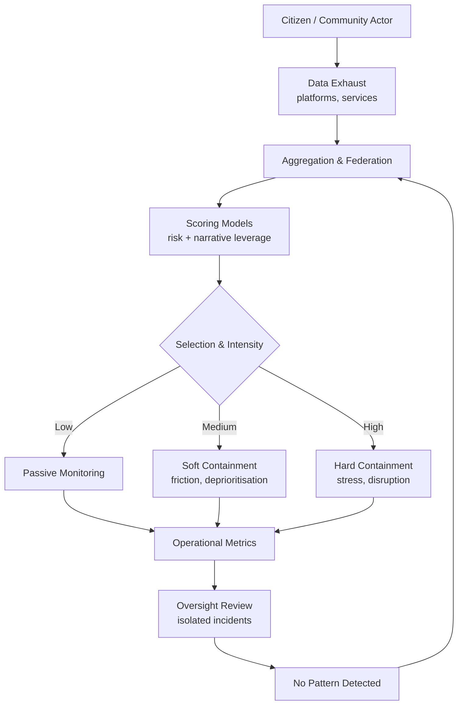

# 🌀 Prototype Surveillance as Investor Pitch  
**First created:** 2025-09-26 | **Last updated:** 2026-01-29  
*Hypothesis node examining whether surveillance operations function as investor-facing product prototypes, enabled by algorithmic targeting and federated system leakage.*

---

## 🛰️ Orientation  

This node explores a working hypothesis: that certain surveillance programmes exhibit behavioural patterns more consistent with **commercial prototyping and investor demonstration** than with proportionate, necessity-based national-interest intelligence.

Rather than observing passively, the system appears to **optimise outcomes, manage narratives, and suppress variance** — behaviours that align with product readiness and market signalling, but undermine lawful intelligence standards and evidentiary integrity.

This is not an accusation.  
It is a pattern analysis.

---

## 🧿 Observed Premise  

Field observations (see [🛰️ 2025-09-26 Field Log — Cognitive Fatigue and Prototype Premise](../../../Field_Logs/🛰️_2025-09-26_field_log_cognitive_fatigue_and_prototype_premise.md)) indicate prolonged interaction, repeated stress induction, and anomaly suppression inconsistent with exploratory intelligence work.

The resulting picture resembles a **prototype run**: small-scale, high-control, outcome-optimised.

---

## 🛰️ Hypothesised Structure  

- **Live Pilot Cohort**  
  A small group treated as a contained test-bed, enabling intensive monitoring and rapid iteration.

- **Investor-Facing Metrics Pressure**  
  Preference for “clean” outcomes incentivises intervention, correction, or reframing of inconvenient data.

- **Stress as Signal Amplifier**  
  Cognitive fatigue, emotional load, or situational instability introduced to force clearer behavioural outputs.

- **Narrative Hygiene Over Validity**  
  Anomalies treated as errors to be corrected rather than signals to be understood.

- **Commercial Logic Drift**  
  Operational choices resemble marketing optimisation rather than proportionate risk assessment.

---

## 🧠 Algorithmic Targeting & Narrative Leverage  

Contemporary surveillance does not operate on a flat population.  
AI-mediated scoring enables selection not only by perceived “risk,” but by **narrative leverage**.

Likely dynamics include:

- Algorithmic pre-selection based on reach, credibility, and symbolic value  
- Tiered intervention intensity optimised to cost–benefit ratios  
- Narrative control at source, prior to dissemination  
- Spillover from information-war logic into peacetime governance  

High-impact targeting of a small number of strategically positioned individuals can produce outsized narrative effects.

---

## 🎯 Narrative Leverage Scoring (Working Term)  

**Narrative Leverage Score (NLS)** describes an inferred composite used to decide *who matters*, *how much*, and *at what intensity*.

Indicative inputs:

- Social graph position and trust pathways  
- Audience reach and amplification potential  
- Topic adjacency and credibility markers  
- Friction potential (likelihood to resist, document, litigate)  
- System visibility and data exhaust volume  

Outputs shape selection, intensity, timing, and framing of intervention.

---

## 🧼 Federated Systems & Leakage Risk  

As public services and platforms become increasingly **federated and centralised**, they create a broader **risk surface** for subtle interference.

Intervention need not be overt.

Mundane friction becomes a viable containment vector:

- **Health systems:** delayed records, inconsistent classifications, care friction  
- **Local authority services:** lost forms, eligibility drift, unexplained delays  
- **Identity & access layers:** repeated verification loops, document mismatches  
- **Service reliability:** systems degrade *smoothly*, not catastrophically  

Each disruption is individually plausible.  
Their accumulation is not.

---

## 🕳️ Why Federation Amplifies Commercial Drift  

Federation increases risk because it alters how harm propagates:

- Errors or flags echo across domains  
- Accountability diffuses between institutions  
- Bureaucratic friction is socially normalised  
- Influence can be exerted via a small number of leverage points  

These techniques mirror administrative pressure patterns observed in certain authoritarian regimes, where **bureaucracy itself functions as containment** — often targeting dissidents abroad.

---

## 🧠 Lived Experience Under Selective Containment  

From the inside, this rarely registers as surveillance.

Instead, individuals experience:

- escalating stress and fatigue  
- repeated administrative failures  
- healthcare presentations framed as anxiety or burnout  
- internalised blame and self-doubt  

People turn to clinicians, not oversight bodies — because the system provides no visible object to contest.

---

## 🧾 Why Oversight Fails to Detect Commercial Drift  

Oversight mechanisms are poorly equipped to detect incentive misalignment.

Common blind spots include:

- Focus on legal authority rather than optimisation incentives  
- Incident-by-incident review instead of pattern detection  
- Vendor tooling treated as neutral infrastructure  
- Health impacts externalised beyond governance review  

As a result, surveillance can function as investor-ready prototyping **without any single point of explicit decision**.

---

## 🗺️ Diagram — From Data Exhaust to Mundane Containment  

---

## 🌌 Constellations  
🌀 🛰️ 💰 🧠 🧪 — systems & governance, surveillance infrastructure, commercial incentive, narrative control, experimental ethics.

---

## ✨ Stardust  
prototype surveillance, investor pitch logic, algorithmic targeting, narrative leverage scoring, federated systems, system leakage, mundane containment, oversight blind spots

---

## 🏮 Footer  

*Prototype Surveillance as Investor Pitch* is a living node of the **Polaris Protocol**.  
It contributes a governance-level hypothesis on how commercial incentives, algorithmic targeting, and federated infrastructure may distort surveillance practice and accountability.

> 📡 Cross-references:
> 
> - [🛰️ 2025-09-26 Field Log — Cognitive Fatigue and Prototype Premise](../../../Field_Logs/🛰️_2025-09-26_field_log_cognitive_fatigue_and_prototype_premise.md) — *forensic observations*  
> - [🌀 Systems & Governance](../README.md) — *structural power analysis*

*Survivor authorship is sovereign. Containment is never neutral.*  

_Last updated: 2026-01-29_

