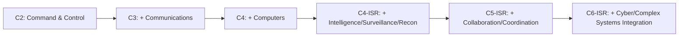

# 🛰️ Situational Awareness: Human vs Computational  
**First created:** 2025-09-30 | **Last updated:** 2026-01-28  
*How awareness is built in minds vs. machines, where failure surfaces lurk, and why a safety culture is overdue.*  

**Jump to:**  
[ 🧠 What is SA?](#what-is-sa)  
[ 🦁 Where it’s used](#industry-uses)  
[ 🐝 C2→C6-ISR arc](#c2-c6-isr)  
[ ➰ Computer SA flow](#computer-flow)  
[ 📠 Human vs Computer (table)](#human-vs-computer-table)  
[ 🐍 Risk reality check](#risk-reality)  
[ 🚨 Civilianisation](#civilianisation)  
[ 👑 Governance & roles](#governance)  

---

## 🧠 What is SA?

**Human SA** = perception → comprehension → projection (meaning-making under pressure).  
**Computational SA** = sensing → fusion/analysis → operating picture (statistics under uncertainty).  

[✨ Back to Top](#top)

---

## 🦁 Where it’s used

- **Emergency ops**: incident rooms, COPs for floods/fires.  
- **Cybersecurity**: SOC logs → anomaly detection → alerts.  
- **Aviation/transport**: sensor fusion, threat/error management.  
- **Healthcare ops**: triage scores, telemetry, dashboards.  
- **Finance**: risk engines, Monte Carlo, stress tests.  
- **Industrial ops/energy**: SCADA, IIoT fault prediction.  
- **Platforms**: content ranking, trust & safety queues.  

[✨ Back to Top](#top)

---

## 🐝 C2 → C6-ISR arc

**C2** = Command & Control  
**C3** = + Communications  
**C4** = + Computers  
**C4-ISR** = + Intelligence/Surveillance/Reconnaissance  
**C5-ISR** = + Collaboration/Coordination  
**C6-ISR** = + Cyber/Complex Systems Integration  

[✨ Back to Top](#top)

---

## ➰ Computer SA flow (with interrupts)

```mermaid
flowchart LR
  A[Sensing/Collection] -->|spoofing • outages • blind spots • sampling bias| B[Ingestion/Transport]
  B -->|latency • drops • schema drift • privacy leaks| C[Normalise & Fuse]
  C -->|unit mismatches • missing data • leakage| D[Model & Infer]
  D -->|bias • overfit • concept drift • adversarial inputs| E[Project/Forecast]
  E -->|chaos sensitivity • error amplification • under-reported uncertainty| F[COP/Dashboard]
  F -->|alert fatigue • misleading UX • silo misreads| G[Decide/Actuate]
  G -->|automation surprises • unsafe overrides • no rollback| H[Feedback/Learn]
  H -->|no ground truth • weak postmortems • perverse incentives| C
```

[✨ Back to Top](#top)

---

## 📠 Human vs Computer (table)

| Dimension | Human SA | Computational SA |
|---|---|---|
| Core engine | Meaning-making & abduction | Probabilities & patterning |
| Strength | Flexible improvisation; values | Scale, speed, vigilance |
| Blind spot | Stress, tunnel vision, bias | Semantics, context, tail risk |
| Failure cost | Local but can cascade | Systemic, fast, opaque |
| Trust lever | Training, drills, culture | Data quality, evals, guardrails |

[✨ Back to Top](#top)

---

## 🐍 Risk reality check

- **Low error ≠ low harm**: 2% of 5M = 100k affected.  
- **Tail risk**: rare events dominate damage.  
- **Chaos**: small errors amplify downstream.  
- **Reality checks**: report absolute numbers, publish confidence intervals, expected-harm calcs, kill switches.  

[✨ Back to Top](#top)

---

## 🚨 Civilianisation problem

C4/C5-ISR stacks are now used in civilian domains (policing, social care, finance, platforms).  
- **No shared doctrine**, **no uniform ROE**, **patchy oversight**, **incentives to over-deploy**.  
- Imported capability without discipline = systemic risk.  
- Civilian sectors need ISR-grade **safety culture**.  

[✨ Back to Top](#top)

---

## 👑 Governance & roles

**Pre-deployment**: Safety cases, sandbox pilots, model/data cards, red-team reports.  
**Runtime**: Tiered risk, human-on-the-loop, decision logs, alert hygiene.  
**Incidents**: Mandatory reporting, public postmortems, recertification.  

### RACI snapshot
| Actor | Accountabilities | Proof-of-work |
|---|---|---|
| Citizens/Users | Control, complaint/redress | Opt-outs, ombuds pathways |
| Operators/Teams | Runbooks, halt authority | On-call drills, overrides |
| Developers | Data sheets, evals, monitors | Pre-flight checks, red-teams |
| Product/UX | Honest consent, safe design | No dark patterns, quiet hours |
| Security/Privacy | Threat models, minimisation | Adversarial tests, DP |
| Compliance/Risk | Audit, tiering | Audit packs, logs |
| Regulators | Baselines, audits, penalties | Certs, registry, recall powers |
| Government | Rights guardrails, oversight | Laws, aid, remedy |

[✨ Back to Top](#top)

---

## 🏮 Footer  

*🛰️ Situational Awareness: Human vs Computational* is a node of the Polaris Protocol.  
It argues for aviation-grade safety culture across civilian C4/C5-ISR deployments.  

> 📡 Cross-references:
> 
> [🎊 Multi-Party Data Twinning](../../🦕_Elder_Influencers/💸_Money_Listens/👻_Transparencies_Overhead/🎊_multi_party_data_twinning.md) - *How overlapping state and corporate interests fuse datasets through intermediaries*  
> [🎥 Anomaly Incentives In Surveillance](../../🪄_Expression_Of_Norms/🧿_Watch_The_Watchers/🎥_anomaly_incentives_in_surveillance.md) - *Why surveillance architectures create incentives to keep outliers under permanent scrutiny*  
> [🧠 AI Harms Are Not New](../../🐍_Ouroborotic_Violence/🗝️_Politics_Memory_Work/🧠_ai_harms_are_not_new.md) - *Systemic analysis of AI harm as continuation of longstanding metadata architectures*  

*Survivor authorship is sovereign. Containment is never neutral.*  

_Last updated: 2026-01-28_  
