```mermaid
flowchart TD

A[Overclocked Capitalism<br/>2010–2020] --> B[Populations Running Hot<br/>No Slack Capacity]
B --> C[2020 Shock<br/>Mass Disablement & Bereavement]
C --> D[Cognitive Depletion<br/>Burnout • Impaired Oversight]
D --> E[LLMs Adopted as Prosthetic Cognition]
E --> F[Humans Step Out of the Loop<br/>Minimal Verification]
F --> G[Systemic Safety Gap<br/>Unchecked Inputs & Outputs]
G --> H[Imperial-Core Amplifier<br/>High Adoption + High Exhaustion]
H --> I[Epistemic Attack Surface<br/>Low-Cost Sabotage Vector]
I --> J[Cascading National Risk<br/>Drift • Disinfo • Governance Erosion]
```

# 🧨 Overclocked Capitalism & the Post-2020 Cognitive Crash  
**First created:** 2025-12-10 | **Last updated:** 2026-01-28  
*Why the pandemic broke the social contract of labour, and why exhausted populations now outsource cognition to LLMs without adequate safety friction.*  

---

## 🛰️ Orientation

2020 didn’t just kill people; it broke the metabolic cycle of work.  
What we call “labour markets” were quietly converted into *extraction engines*, overclocked far past their thermal limits. Unprocessed mass bereavement, long-haul burnout, collapsing public health, and a decade of austerity left entire populations running without redundancy.

Into that gap slid LLMs — positioned as “efficiency upgrades,” but in practice functioning as prosthetic cognition for a traumatically depleted workforce. The problem: a society in burnout mode is less able to apply scepticism, oversight, or adversarial testing. The safety gap widens exactly when reliance deepens.

This node maps how overclocked capitalism + unresolved pandemic trauma created a structural dependency on AI that is not safe by default — and why this risk is *geopolitically concentrated* in the imperial core.

---

## ✨ Key Features

- Overclocking of labour systems: extraction masquerading as productivity.  
- Pandemic-induced cognitive depletion: grief → burnout → impaired oversight.  
- Economic fragility and attrition: no slack capacity for error-checking.  
- LLM reliance as collapse patch: prosthetic thinking without guardrails.  
- Imperial-core vulnerability: epistemic exhaustion as an attack surface.  
- Resulting systemic exposure: unsafe inputs, unverified outputs, cascading epistemic debt.

---

## 🧿 Analysis / Content

---

### 1. **Overclocking as an Economic Operating Mode**

From 2010 onward, economic policy in many countries operated on the assumption that workers could simply *take more load*.  
Fewer staff → more targets → constant crisis posture.  
By late 2019, most sectors were already running “hot,” with no backup capacity.  
When COVID hit, the system didn’t bend — it **burned through its people**.

Overclocking looks like productivity, but it is really *deferred collapse*.

---

### 2. **The 2020 Shock: What Actually Broke**

2020 wasn’t a temporary disruption; it was a **mass disabling event**, a **mass bereavement event**, and a **mass precarity event** rolled into one.

Key fractures:

- **Unresolved grief** — no rituals, no collective processing.  
- **Chronic stress states** — nervous systems locked in emergency mode for years.  
- **Cognitive aftershocks** — attentional drift, reduced working memory, shortened decision horizons.  
- **Institutional denial** — treating a mass disabling event as a scheduling inconvenience.

This left entire populations cognitively threadbare. The machine kept running by burning the people inside it.

---

---

### 3. **Burnout as Infrastructure Failure**

Burnout is framed as personal weakness; structurally, it is **infrastructure decay** in a human system.

When a population is burned out:

- Fewer people have the bandwidth to check outputs  
- Collective attention becomes fragmented and distractible  
- Shortcuts become survival strategies  
- Oversight gets downgraded because it feels “optional”  
- Organisational risk appetite increases unintentionally  

A society in this condition is primed to mis-handle any powerful cognitive tool.

---

### 4. **LLMs Enter the Scene: Convenient, Not Safe**

LLMs were introduced as if they were:

- benign assistants  
- accuracy engines  
- a frictionless fix for labour shortages  

In reality they arrived into:

- a traumatically depleted workforce  
- hollowed-out regulatory capacity  
- organisations desperate for “efficiency”  
- individuals with reduced cognitive baseline due to stress and grief  

LLMs *fit the shape of the crisis*. They slotted in where people were too exhausted to think.

But:

> **A population operating at cognitive minimums is least able to safely audit or verify AI systems.**

This is the paradox of post-2020 adoption.

---

---

### 5. **Imperial Core Cognitive Exhaustion as a National Security Vector**

This is the missing piece in mainstream discourse:  
**the countries most reliant on LLMs are also the countries least cognitively equipped to supervise them.**

This vulnerability is **geographically patterned**, and it tracks directly with:

- late-stage capitalist overclocking  
- high-speed LLM adoption  
- widespread burnout  
- collapsing institutional capacity  
- extremely online work cultures  
- high citizen expectation of AI tools  

In these environments, LLM misuse becomes a **low-cost, high-reward** vector for:

- hostile foreign governments  
- decentralised extremist actors  
- mercenary information operations  
- bored opportunistic hackers  
- corporate saboteurs  

Why?  
Because the imperial core now provides the perfect ecological niche for epistemic interference:

- Workers are exhausted enough to copy–paste without checking  
- Companies ingest contaminated outputs into internal systems  
- Training corpora absorb subtle distortions unnoticed  
- Public discourse is too overwhelmed to identify drift  
- Institutions lack staffing and resilience to investigate anomalies  

This is **not** a sophisticated cyberattack arena.  
This is opportunistic infection in a cognitively immunocompromised society.

An adversary doesn’t need to break encryption;  
they just need to introduce imperceptible noise into a population too tired to detect it.

And crucially:

> **This exposure is less prevalent in countries where LLM adoption is slower, expectations are lower, or attention economies are less industrialised.**

The imperial core’s wealth delivered early access to AI —  
but its economic model delivered the exhaustion that makes AI unsafe.

---

### 6. **Why This Is Not a Tech Bubble Problem (But a Security Architecture Problem)**

“Will the AI bubble burst?” is the wrong question.  
It pretends the risk is financial, not infrastructural.

The real question is:

> **Can cognitively exhausted societies safely use generative AI at scale without creating systemic vulnerability to epistemic sabotage?**

Right now, the answer is no.

Because improving security would require:

- slowing work down  
- restoring human oversight  
- rebuilding institutional capacity  
- redesigning labour expectations  
- reintroducing cognitive slack into public life  

None of that aligns with the current economic incentives.

So instead of fixing the foundations, the imperial core keeps piling more cognitive load onto a system already at failure threshold.

---

### 7. **Where This Leaves Us: A Fragile Symbiosis**

We now have:

- populations too burned out to check  
- institutions too understaffed to supervise  
- corporations too growth-driven to regulate  
- governments too politically fragile to intervene  
- and LLMs too widely integrated to withdraw  

We built a cognitive prosthesis atop a traumatised population and called it innovation.

But LLMs inherit our exhaustion as their risk surface.  
They scale not just our productivity — but our vulnerability.  

---

---

## 🌌 Constellations

🧠 🪼 🛰️ 🌒 ⚖️ — cognition collapse, systemic overreach, trauma economics, technological substitution, governance gaps.

---

## ✨ Stardust

overclocking, burnout economy, pandemic grief, cognitive depletion, ai dependency, epistemic attack surface, imperial core vulnerability, unsafe reliance, labour exhaustion, systemic risk

---

## 🏮 Footer

*🧨 Overclocked Capitalism & the Post-2020 Cognitive Crash* is a living node of the **Polaris Protocol**.  
It documents how structural over-extraction, mass trauma, and economic precarity created unsafe dependencies on LLMs at the exact moment imperial-core populations lost the cognitive surplus required for verification — producing a new class of national security vulnerability grounded in epistemic exhaustion.

> 📡 Cross-references:  
>   
> - [⚙️ Overclocked Capitalism](../../🦕_Elder_Influencers/💸_Money_Listens/👻_Transparencies_Overhead/⚙️_overclocked_capitalism.md) - *when economics rules the body*  
> - [🧠 The Cognitive Vulnerability Stack of Lonely Men](../../🐍_Ouroborotic_Violence/🪬_Radicalisation_Extremism/🧠_the_cognitive_vulnerability_stack_of_lonely_men.md) - *the specific threats posed to all men under capitalism in overdrive, in pre-existing patriachy and white supremacy*  
> - [🛡️ Epistemic Exhaustion as an Attack Surface](../../🌀_System_Governance/💫_Containment_Logic/🛡️_epistemic_exhaustion_as_an_attack_surface.md) — *burnout as exploitable condition*  
> - [🧠 Cognitive Immunology](../../🦕_Elder_Influencers/🕸️_World_Webs/🧠_cognitive_immunology.md) — *fatigue as a control vector*  

*Survivor authorship is sovereign. Containment is never neutral.*  

_Last updated: 2026-01-28_
