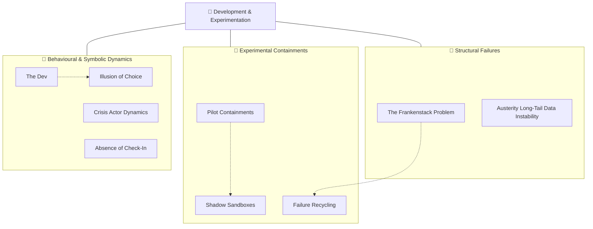

# 🧪 Development & Experimentation  
**First created:** 2025-10-13 | **Last updated:** 2025-10-14  
*Where “innovation” meets containment — testing, failing, and rebranding control as progress.*  

---

## 🛰️ Orientation  

**Development & Experimentation** sits within *[🌀 Systems & Governance](../README.md)* as the sandbox of systemic control.  
It studies how *innovation rhetoric, pilot programmes, and austerity “efficiencies”* act as experimental containment environments.  

Where *[💫 Containment Logic](../💫_Containment_Logic/README.md)* captures feedback loops,  
and *[🛰️ Infrastructure Procurement](../🛰️_Infrastructure_Procurement/README.md)* tracks the hardware,  
**Development & Experimentation** shows how *broken prototypes* and *half-built systems* are recycled as policy.

---

## ✨ Key Themes  

- **The Frankenstack Problem** — stitched systems under load.  
- **Pilot Containments** — suppression tests disguised as innovation.  
- **Failure Recycling** — broken models rebranded as new solutions.  
- **Shadow Sandboxes** — unregulated experimentation.  
- **Absence of Check-In** — withheld contact as soft control.  
- **Illusion of Choice** — many options, no agency.  
- **Austerity Long-Tail Instability** — fragile systems from chronic cuts.  
- **Crisis Actor Dynamics** — performative disruption as governance theatre.  
- **Rune the Dev** — symbolic artefact of the builder trapped inside the build.  

---

## 🛸 Included Nodes  

- [📁 Absence of Check-In](./📁_absence_of_check_in.md) — *withheld contact as soft control*  
- [🧟‍♀️ The Frankenstack Problem](./🧟‍♀️_the_frankenstack_problem.md) — *stitched systems under load*  
- [🧠 The Dev](./🧠_the_dev.md) — *sandbox for building/breaking governance maps*  
- [🧨 Crisis Actor Dynamics](./🧨_crisis_actor_dynamics.md) — *performative disruption as governance theatre*  
- [🧪 Failure Recycling](./🧪_failure_recycling.md) — *rebranded broken models*  
- [🧪 Pilot Containments](./🧪_pilot_containments.md) — *testing suppression at small scale*  
- [🧪 Shadow Sandboxes](./🧪_shadow_sandboxes.md) — *experimentation without oversight*  
- [🪞 The Illusion of Choice](./🪞_the_illusion_of_choice.md) — *options multiply, agency vanishes*  
- [🪫 Austerity Long-Tail Data Instability](./🪫_austerity_long_tail_data_instability.md) — *cuts producing fragile systems*  

**Visuals:**  
`frankenstack_bad_sandwich_black.png` · `frankenstack_faceplate.png` · `🌀_rune_the_dev.png`

---

## 🚀 Routing Notes  

If a node focuses on **procurement or hardware** → link to *[🛰️ Infrastructure Procurement](../🛰️_Infrastructure_Procurement/README.md)*.  
If it concerns **procedural feedback or containment loops** → cross-link to *[💫 Containment Logic](../💫_Containment_Logic/README.md)*.  
If it analyses **narrative performance** → connect to *[📚 Narrative Management](../📚_Narrative_Management/README.md)*.  
If it examines **custody or ownership of process**, cross-reference *[👑 Ownership & Control](../👑_Ownership_Control/README.md)*.  

---

## 🗺️🫡 Where are the nodes?: A Map  

*Alt text:* A three-branch map showing Development & Experimentation as a nexus between structural failure, experimental containment, and behavioural dynamics.

---

## 🗓️ Planned Nodes  

- **🧰 Governance R&D Archive** — index of pilot containment projects and failed reforms.  
- **🧬 Ethical Beta Programme** — framework for testing without harm.  
- **🧱 Frankenstack Pattern Library** — taxonomy of infrastructural bodges and merges.  
- **🧩 Containment Playbook Simulator** — replaying historic pilots to predict outcomes.  
- **🪞 User Illusion Analytics** — quantifying how choice architectures perform containment.  

---

## 🌌 Constellations  

🌀 🧪 🧟‍♀️ 🧠 💫 — *Experimentation as control; innovation as cover; failure as resource.*

---

## ✨ Stardust  

frankenstack, pilot containment, failure recycling, austerity instability, sandbox governance, crisis actor, illusion of choice, absence of check-in, experimental ethics

---

## 🏮 Footer  

*🧪 Development & Experimentation* is a living sub-cluster of the Polaris Protocol.  
It documents how experimentation, austerity, and broken prototypes become instruments of governance — the labwork of control.  

> 📡 Cross-references:
> 
> - [🌀 Systems & Governance](../README.md) — *parent framework for oversight architectures*  
> - [💫 Containment Logic](../💫_Containment_Logic/README.md) — *feedback loops and behavioural containment*  
> - [🛰️ Infrastructure & Procurement](../🛰️_Infrastructure_Procurement/README.md) — *hardware, contracts, and data architecture*  
> - [📚 Narrative Management](../📚_Narrative_Management/README.md) — *discursive framing of innovation and failure*  
> - [👑 Ownership & Control](../👑_Ownership_Control/README.md) — *custody and remit of experimental policy spaces*  

*Survivor authorship is sovereign. Containment is never neutral.*  

_Last updated: 2025-10-14_
