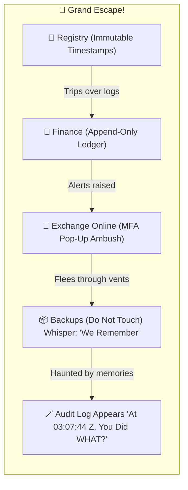

# ✨ Defeated by Audit  
**First created:** 2025-10-27 | **Last updated:** 2026-02-20  
*Why every evil genius eventually gets caught by the log file.*  

---

## 💄 Dramatis Personae  

| Character | Role in the episode | Catch-phrase |
|------------|--------------------|---------------|
| **Dr Cipher Byte** | Evil-genius IT villain in a leather cardigan | “No one will ever find the logs!” |
| **The Audit Log** | Sentient compliance record; speaks only in UTC timestamps | “At 03:07:44 Z, you did WHAT?” |
| **The SOC 2 Scooby Gang** | DPO, sysadmin & two interns with clipboards | “Let’s split up and check the access tokens!” |
| **The Cloud** | Eternal witness in the sky | *[ominous humming of redundant backups]* |

---

## 🎬 Cold Open  

INT. UNIVERSITY DATA CENTRE — NIGHT.  
Lightning. Leather cardigan. Sinister typing.  
> “Tonight I shall rewrite reality! Every grade, every payroll — *mine!*”  

He hits *Enter.*   
Eighty-four replicas politely disagree.

---

## 💾 The Audit Log Awakens  

From /var/log comes a growl.  
> **AUDIT LOG:** “Unauthorized write detected.”  
> **DR BYTE:** “You can’t talk — you’re a system file!”  
> **AUDIT LOG:** “Error: false.”  

---

## 🦑 Comic Diagram — *The Hallway Chase of Compliance*  

**Caption:** *Every doorway leads to another immutable record. The Audit Log is patient. The Audit Log does not sleep.*

---

## 👻 Why the Villain Always Loses  

*Because the Admin is never The Villain.*  
*Too busy fixing the printer after the COO touched it.*

| Evil Plan | Cartoon Reality Check | Who Rats Them Out |
|------------|----------------------|-------------------|
| “I’ll delete the logs.” | They’re append-only. | Immutable Storage Bucket. |
| “I’ll spoof the user.” | Device fingerprints disagree. | The SIEM that never sleeps. |
| “I’ll change the timestamps.” | NTP laughs in synchronised derision. | The Time Server. |
| “I’ll corrupt the backups.” | Cross-region replication says no. | Cloud Compliance Officer. |
| “I’ll erase all evidence.” | Off-site archives raise one eyebrow. | The Intern with Excel skills. |

---

## 🧠 Reveal Scene  

> **DPO:** “Let’s see who you really are!”  
> *(Pulls off leather cardigan.)*  
> **DPO:** “It’s just another change request without approval!”  
> **Dr Byte:** “And I would’ve gotten away with it too, if it weren’t for you meddling compliance officers!”  

The Audit Log updates the ticket and closes it as *Resolved – User Error.*

---

## 🌈 Epilogue  

Press release: “No personal data were harmed in the making of this breach.”  
The Audit Log sips black coffee and hums a checksum.

---

## 🌌 Constellations  
✨ 🪄 🧾 — Satirical meta-forensics where governance meets cartoon villainy.  

---

## ✨ Stardust  
evil genius, audit log, scooby doo compliance, cybersecurity satire, cartoon governance, digital forensics, immutable backups, mfa, timestamp justice  

---

## 🏮 Footer  

*✨ Defeated by Audit* is a satirical node of the Polaris Protocol.  
It personifies information-security principles to remind readers that in the end, **the logs always win.**

> 📡 Cross-references:
> 
> - [🌂 Leak Archive Protocol — Secure Collection and Annotation Method](../../../../Metadata_Sabotage_Network/Structural_Analysis/🧼_System_Leakage_Signatures/🌂_leak_archive_protocol.md)  
> - [🧬 The Invisible Audit Gap](../../../../Metadata_Sabotage_Network/Structural_Analysis/🧬_Structural_Mapping/🧬_the_invisible_audit_gap.md)  
> - [✈️ Reindexing the Files](../../../../Metadata_Sabotage_Network/Structural_Analysis/🧬_Structural_Mapping/✈️_reindexing_the_files.md)  
> - [📚 Libraries, Metrics, and the One-Book Civic Hack](../../../../🦆_Digital_Disruption/🪖_Home_Front_2.0/📚_libraries_metrics_and_the_one_book_civic_hack.md)
> - [🐍 PREVENT as a Self-Eating Snake (Early Detection Drift)](../../../../Metadata_Sabotage_Network/Governance_And_Containment/🈺_Governance_And_Prevent/🐍_prevent_as_a_self_eating_snake.md)  
 
*Survivor authorship is sovereign. Containment is never neutral.*  

_Last updated: 2026-02-20_
