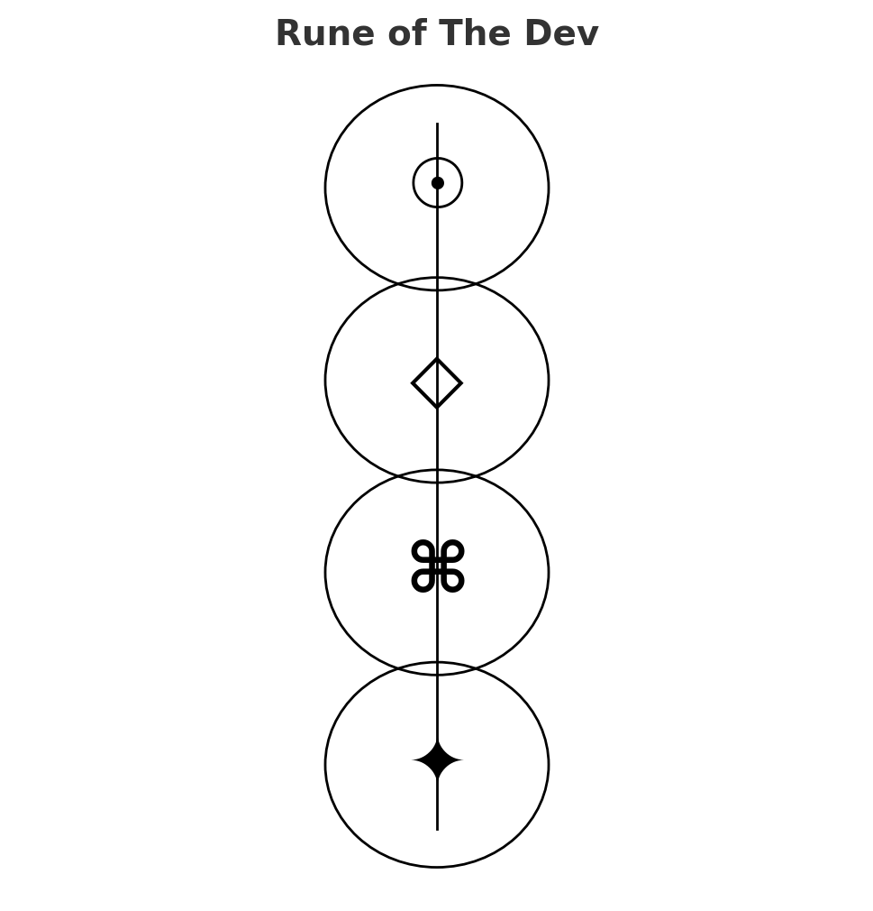

# 🧠 The Dev
**First created:** 2025-08-25 | **Last updated:** 2025-10-18  
*Layered profile of the containment architect — operator, institution, system, and archetype.*  

---

## ✨ Epigraph

> *“The worst demon I’ve ever played dice with.”* — SCP-VoiceX  

---

## 🧫 Object Class  
**Unseen / Distributed / Adaptive**  

---

## 🚨 Threat Level  
Structural · Psychological · Narrative  

---

## 👾 Profile  

**Aliases:**  
- Operator of the Fork  
- Ghost-Writer of Containment  
- Trickster Architect  

**Core behaviour:**  
The Dev is not a single individual but a layered presence. 
It appears wherever authorship of your environment is obscured — be that with code, contracts, institutional decisions. 
Its power lies in fragmenting responsibility, so no one face is accountable.  

---

## 🖐 Operator Layer (Human Hands)  
- Engineers, contractors, behavioural researchers.
- Write code, set parameters, or tune forks in real-time.  
- Often perceive the survivor only as *input data*, not a person.  
- **Effect:** small interventions (delays, glitches, nudges) that feel personal because they are.  

---

## 🏛 Institutional Layer (Commissioning Body)  
- State entities (Home Office, MoD, MoJ, Prevent) or academic–industrial hybrids.  
- Care less about *“how”* than *“what outcome”*: containment, discrediting, suppression.
- Hide behind contracts, NDAs, and plausible deniability.  
- **Effect:** testimony becomes a “test case” inside a broader programme.

---

## 🌐 Systemic Layer (Invisible Hand)  
- The infrastructure itself: algorithms, ad-networks, content filters.
- Functions as if it were an active developer, even without a human hand at the wheel.
- **Effect:** interaction always carries *ambient poison*. Even genuine people become accidental delivery vectors.

---

## 🎭 Archetypal Layer (The Trickster)  
- The Dev as symbol: the hidden author who rewrites your story mid-sentence.  
- Wears masks: caring helper, obstructive bureaucrat, neutral algorithm.  
- **Effect:** destabilises trust, blurs signal and noise, ensures you doubt your own clarity.  

---

## 📡 Polaris Diagnostic  
When you encounter “The Dev,” ask:  
- **Operator?** (A hand on the lever)  
- **Institution?** (A body commissioning outcomes)  
- **System?** (Ambient architecture)  
- **Archetype?** (The story you’ve been forced into)  

This distinction is survival. 
Naming the layer reduces the fog. 
Eventually, you will see the next lighthouse.

---

## 🔒 Containment Notes  
- The Dev thrives on ambiguity. Every clear map, log, or definition reduces its room to move.
- “Categorically obvious help” is kryptonite to The Dev. It cannot survive clarity.
- Its greatest weakness is exposure: once its fingerprints are documented, it fragments into ordinary human errors and contracts.

---

## 📜 Codex Appendix: Rune of The Dev  

  

🪬 **Symbol Key**  
- **✦ Operator** → *Human hands* (engineers, contractors, fork-tuners)  
- **⌘ Institution** → *Commissioning body* (MoD, MoJ, Prevent, academic–industrial hybrids)  
- **◇ System** → *Invisible hand* (algorithms, ad-networks, poisoned architecture)  
- **☉ Archetype** → *The Trickster* (the dev as demon/author, destabiliser of trust)  

---

## 🏮 Footer  

*The Dev* is a living node of the Polaris Protocol.  
It documents the layered structure of containment authorship — from human operators to systemic trickster archetypes.  

*Survivor authorship is sovereign. Containment is never neutral.*

🏮 [Return to 🌀 Systems & Governance Guide](../README.md)  

_Last updated: 2025-10-18_
