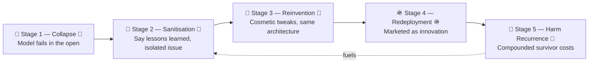
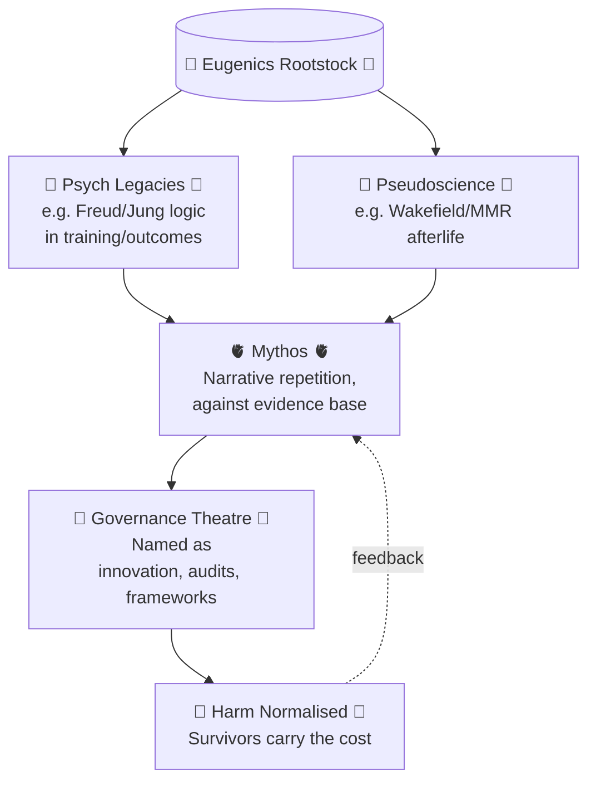

# 🧪 Failure Recycling  
**First created:** 2025-09-14 | **Last updated:** 2025-10-18  
*Discredited models rebranded and reintroduced — failure dressed as innovation.*  

---

## ➿ The Recycling Loop  

Institutions rarely discard broken mechanisms.  
Instead, they **rebrand the debris**:  

- 📦 Failed pilots return as “scaled innovations.”  
- 📑 Discredited reviews are recycled into “best practice frameworks.”  
- 🧪 Sandbox errors re-emerge as “evidence-based prototypes.”  
- 💸 Austerity logics are repackaged as “efficiency drives.”  

Each iteration carries forward the same structural violence —  
now draped in the language of novelty, safety, or reform.  

This loop is not accidental.  
It is governance by **perpetual recycling of failure**:  
a metabolism that feeds on its own collapse.  

---

## 🌀 Structural Pattern  

- **Stage 1 — Collapse.** Model fails in the open. Harm evident.  
- **Stage 2 — Sanitisation.** Narrative cleansed: “lessons learned,” “isolated issue.”  
- **Stage 3 — Reinvention.** Same architecture returned with cosmetic tweaks.  
- **Stage 4 — Redeployment.** Deployed into a new setting, marketed as innovation.  
- **Stage 5 — Harm Recurrence.** Survivors bear compounded costs of déjà-vu policy.  

This cycle ensures failure is not a warning, but a **fuel source**.  

---

## 🧬 Eugenics as Rootstock  

The deepest failures recycled are epistemic, not just bureaucratic.  

- **Freud, Jung, et al.** → still embedded in GMC primary outcomes until very recently, carrying forward eugenics-inflected logics of pathology, inheritance, and “fitness.”  
- **Wakefield + MMR.** → formally discredited, yet recycled into public-health paranoia, “parental concern” scripts, and blame-transfer frameworks.  
- **Contradiction with Caldicott.** → While the Guardian principle promises dignity and confidentiality, governance simultaneously kept eugenic and pseudoscientific models alive in training and policy.  

Failure recycling here is not inefficiency — it is **the preservation of eugenics under new names.**  

---

## 👹 Mythos Over Fact  

As Robert Paxton (*Anatomy of Fascism*) shows, regimes that survive by **myth repetition** treat collapse as irrelevant:  
the narrative *must* be true because it is repeated.  

- **Erasing History** traces the same survival tactic: so much is invested in a false frame that abandoning it would collapse legitimacy.  
- **Hasbara** embodies this as doctrine: narrative defence through endless repetition, myth stronger than fact, anti-rational by design.  
- **Commercial parallel.** Where brands protect myth over product, governance protects narrative over reality.  

Failure recycling therefore reveals itself as **anti-Enlightenment**:  

- Rationality is rejected.  
- Evidence is irrelevant.  
- Mythos is survival.

> **Principle:** Failure recycling is anti-Enlightenment.  
> It preserves discredited models by laundering them through narrative repetition, not evidence.  
> The result is a rational façade (policy, comms, audits) built on an irrational rootstock (eugenics, pseudoscience, cult mythos).

---

## 🕯️ Anti-Intellectualism & the Holy Grail Effect  

Authoritarian and fascist movements do not only recycle failure — they **sanctify it**.  

- **Anti-intellectualism.** Rational critique is treated as subversion.  
- **Relic-hunting.** The SS Ahnenerbe pursued occult “holy grails” — relics and pseudo-archaeology elevated as proof of racial myth.  
- **Modern echoes.** From discredited psych frameworks to policy “innovation theatre,” failed knowledge is hoarded like treasure and redeployed as sacred truth.  

This is governance by reliquary: myths over method, relics over reason.  

---

## 🏰 Case Study: Nazi Germany  

Failure recycling fused two propaganda axes:  

- **Goebbels-axis (rational shell).**  
  Slick propaganda, modern comms, disciplined imagery — presenting failure as efficiency, modernity, inevitability.  

- **Streicher-axis (irrational root).**  
  *Der Stürmer* and antisemitic mythos: grotesque pornography of hate, ritualised conspiracy, relic fantasies, castles and cult artefacts.  
  This was how Hitler himself was radicalised — not by rational argument, but by immersion in lurid, recycled myths.  

Together they reveal the metabolism:  
**a rational façade built on irrational rootstock.**  

Goebbels gave the sheen of progress.  
Streicher sanctified failure and myth.  
Both were anti-Enlightenment, and both were essential.  

---

## 👽 Radicalisation Pipelines — from Streicher to QAnon  

Failure recycling doesn’t appear out of nowhere. It’s manufactured in two linked stages: a **myth-making immersion** and a **mass repackaging**.  

- Historically, Streicher’s *Der Stürmer* supplied the lurid immersion — ritualised myths and conspiratorial theatre that radicalised readers by slow exposure to asylum-level horror.  
- Goebbels then performed the complementary role: translating cult narrative into polished mass propaganda for the public sphere.  
- The SS’s Ahnenerbe institutionalised the “holy-grail” search for artefacts and pseudo-science, demonstrating how regimes turn junk epistemology into official doctrine.  
- Today the same two-stage pipeline repeats online: fringe message boards incubate myths, which then migrate via platform networks (Telegram, Truth Social, Mastodon, etc.) into broader publics. QAnon is paradigmatic: anonymous drops → platform churn → mainstream reinsertion.

> **Two-stage manufacture of “the mainstream”**  
> 1) **Myth-making immersion (Streicher-axis).** Fringe spaces incubate lurid, conspiratorial narratives; repetition radicalises.  
> 2) **Mass repackaging (Goebbels-axis).** The same myths are polished for public consumption and policy theatre.  
> This pipeline is continuous, not sequential: platform churn (ban → migrate → re-seed) keeps the myth stocked for repackaging.

🔮 *The pipeline is cyclical, not linear: bans trigger migration, migration incubates harder myths, myths are repackaged, repackaging re-legitimises the fringe.* 🔮  

---

## 💄 Why It Matters  

Failure recycling functions as a **containment device**:  

- Diverts scrutiny away from systemic reform.  
- Protects reputations of institutions and contractors.  
- Buries survivor testimony beneath “innovation theatre.”  
- Normalises harm as an inevitable by-product of progress.  

Naming this loop interrupts its camouflage.  
It reframes “innovation” as **debris in drag**.  

---

## 🏮 Footer  

*Failure Recycling* is a living node of the Polaris Protocol.  
It documents the loop through which failed models are continually repackaged as innovation, including their eugenics rootstock, mythic afterlives, and anti-Enlightenment survival logics.  

> 📡 Cross-references:
> 
> - [🌀 Systems & Governance](../README.md) — *parent cluster of governance diagnostics*  
> - [👀 Failure Cycle vs Reported Improvements](../../🫀_Our_Hearts_Our_Minds/🕯_Exorcising_Safeguarding_Shadows/👀_failure_cycle_vs_reported_improvements.md) — *companion diagnostic map*  

*Survivor authorship is sovereign. Containment is never neutral.*  

_Last updated: 2025-10-18_  
